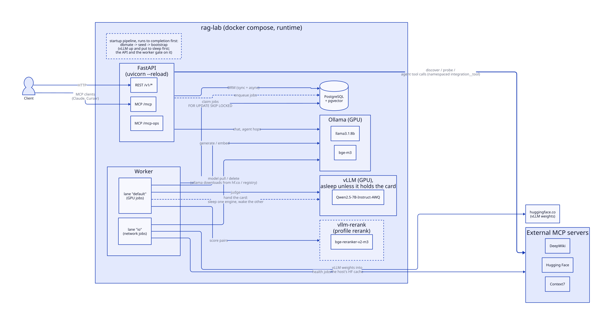
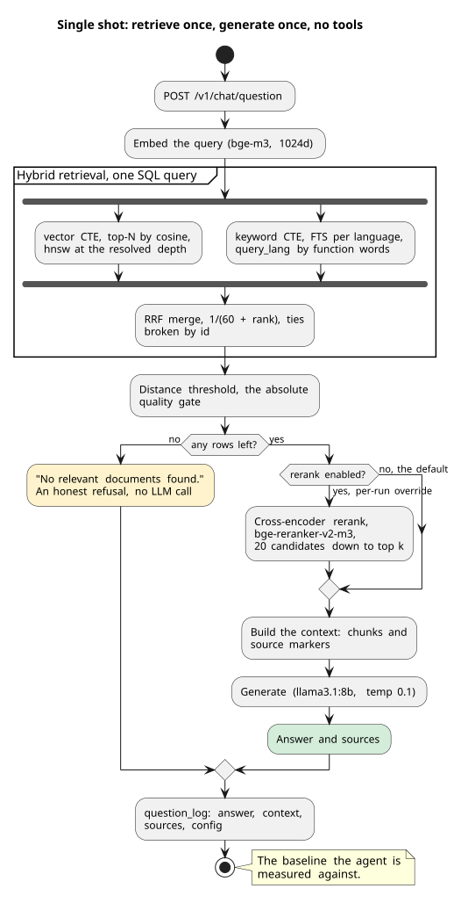
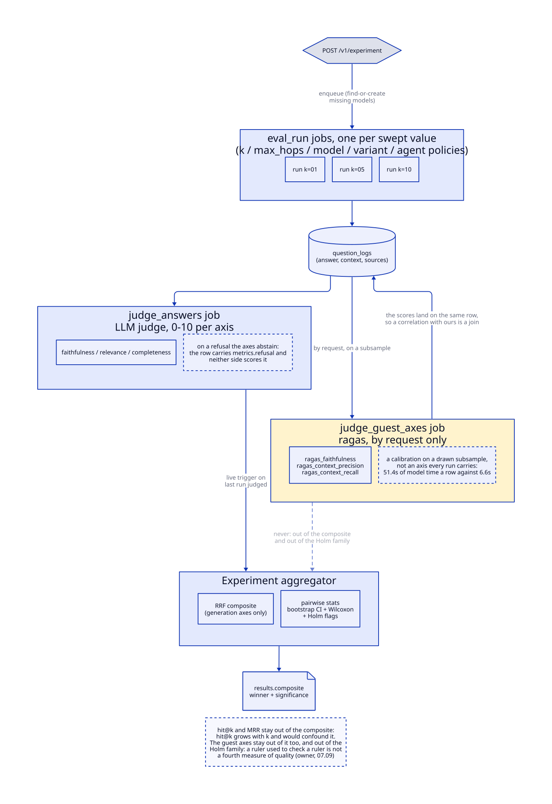
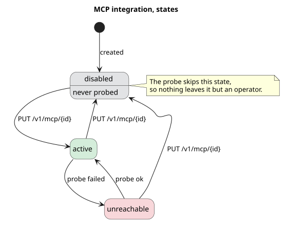
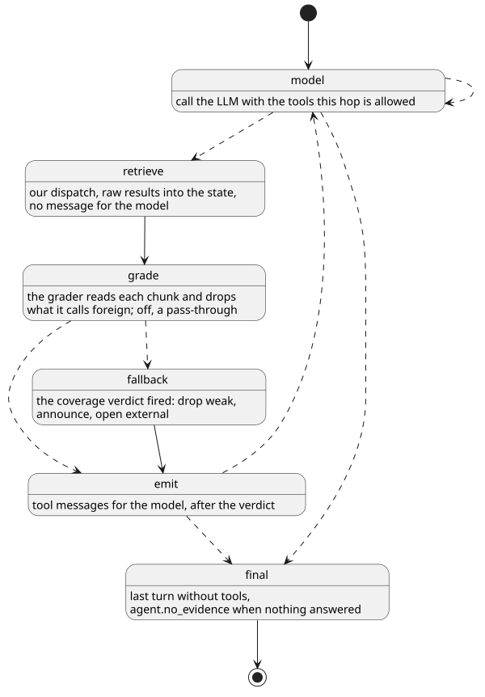

# rag-lab

RAG-система над личной базой знаний и внешними IT-репозиториями. Отвечает на технические вопросы и возвращает источники, использованные как контекст. Собрана **из примитивов** (без LangChain/LlamaIndex) на **локальном инференсе** (Ollama на своей GPU, через OpenAI-совместимый протокол).

Это **витрина-лаборатория**: стенд, чтобы руками отрабатывать инженерные подходы LLM/RAG (retrieval, eval на LLM-судье, lifecycle моделей, reranking, async-очереди) и показывать результат на цифрах. Не продакшн-сервис, а полигон подходов.

> English: [../README.md](../README.md) · Сценарии и полный справочник команд: [use_cases.md](use_cases.md)

## Что это

- **Гибридный retrieval**: векторный поиск (pgvector) + полнотекстовый (Postgres FTS с per-language стеммингом), слияние через **RRF** (Reciprocal Rank Fusion). Фильтр по иерархическим категориям (ltree), distance-порог с честным отказом на вопросах вне корпуса.
- **Локальные модели** через Ollama по ролям: генерация, эмбеддинги (`bge-m3`), LLM-судья. Роль отвязана от конкретной модели: какая модель обслуживает роль, хранится в БД и меняется на лету.
- **Мультиисточник**, единая таксономия: личные заметки (rus) + interview-репозитории Devinterview-io (eng, ~170 репо). Per-source стратегии ingestion.
- **Eval-стенд, 5 осей качества**: retrieval (hit@k / MRR), faithfulness (грунтован ли ответ в контексте), relevance (отвечает ли по существу), completeness (покрывает ли эталонный ответ), refusal-accuracy - через **LLM-as-judge** со structured output. Оценки считаются по пулам отдельно: ответы из корпуса, ответы из внешнего тула (`remote_grounding` меряет обоснованность текстом тула, а не правоту самого тула) и отказы, рядом с долей отвеченного и долей ответов вообще без опоры. У каждого вопроса в ране пишется исход (`answered`, `refused`, `unsupported_answer`, `narrated_call`, `error`): если считать ответ без источников отказом, выигрывает ровно та политика, которую меряем.
- **Асинхронный job-queue**: тяжёлые операции (pull/delete моделей, индексация корпуса, эмбеддинг банка вопросов) уходят в очередь на Postgres, их разбирает воркер. Сервис зависит только от Postgres: Ollama может быть недоступна на старте, джобы дефёрятся/ретраятся, приложение не падает.
- **Reranking (opt-in)**: cross-encoder `bge-reranker-v2-m3` поверх гибрида (retrieve-wide → rerank → narrow), включается флагом (per-request / per-run); A/B-протестирован на кросс-язычном наборе.
- **Агент (ReAct, из примитивов)**: рукописный tool-calling цикл, где модель сама решает когда искать по корпусу, может переформулировать запрос и сделать несколько хопов, затем отвечает. Выбирается как eval-пайплайн (`pipeline: agent`) и меряется в лоб против single-shot RAG (см. лог экспериментов).
- **Route-driven eval-платформа**: генерация не-циркулярных наборов (LLM-парафраз interview-вопросов + перевод на ru), импорт вопросов файлом, прогоны и оценка судьёй - всё булково через очередь; наблюдаемость через лог запросов (`question-log`) и джобы с `elapsed`.
- **Слоёвка**: транспортно-нейтральные `use_cases` → тонкие адаптеры (CLI / FastAPI REST).

## Стек

Python · PostgreSQL + pgvector · SQLAlchemy 2.0 (sync psycopg + async asyncpg) · Ollama (GPU, OpenAI-совместимый API) · FastAPI · dbmate (миграции) · uv/pyproject · Docker Compose.

## Архитектура моделей и промптов

- **Model / ModelRole**: `Model` (имя + статус: available/loading/ready), `ModelRole` (role как PK → одна модель на роль по построению, FK `ON DELETE RESTRICT` = БД не даст удалить назначенную модель). Резолвер `llm.resolve_name(role)` берёт имя из БД, параметры инференса - из `config.yaml`.
- **Prompt**: версионирование в БД (`purpose` + `version`, ровно один `active` на назначение). Промпты-исходники лежат файлами в `prompts/` (формат `<purpose>.v<N>.txt`), сид заливает их в БД, активной становится свежая версия.
- **Bootstrap на старте** (idempotent): завести Model-строки из конфига → засидить роли → сверить с Ollama (что не скачано → статус `loading` + джоба pull) → заэнкьюить индексацию, если корпус пуст → заэнкьюить эмбеддинг вопросов без вектора.

## Конфигурация

Всё тюнингуемое вынесено в **`config.yaml`** (монтируется в контейнер):

- `llm.roles` - модель + `options` на каждую роль (`generation` / `embedding` / `judging` / `paraphrasing`); `llm.candidates` - модели, которые тоже скачать, но не назначить.
- `service.retrieval` - `distance_threshold`, `results_limit`, `rrf_k`, лимиты кандидатов.
- `service.rerank` - `enabled`, `model`, `candidates`, `top`.
- `service.agent` - `max_hops` (кап хопов ReAct), `fallback_policy` (`corpus_first` / `corpus_first_weak` / `agent_choice`), `gate_signal` (что считает ретривал слабым: `distance`, `cross_encoder` или `either`) с порогами `weak_distance` и `weak_threshold`, `gate_candidates` (сколько результатов скорит кросс-энкодер), `topic_threshold` (ось темы: расстояние до ближайшего чанка, выше которого прогон отказывается вместо похода наружу, по умолчанию 0.50, ноль в прогоне её выключает).
- `service.ingestion` - `chunk_max_size`, `batch_size`, `commit_size`.
- `service.sources` - источники (interview-репозитории и их base_url).
- `postgres` - подключение к БД.

В коде остаются source-специфичные деревья категорий.

## Быстрый старт

```bash
docker compose up -d
curl localhost:8000/readiness            # pg обязателен, ollama мягко
curl -X POST localhost:8000/v1/chat/question \
  -H 'Content-Type: application/json' -d '{"text": "What is a hash table?"}'
# Swagger: http://localhost:8000/docs
```

Аутентификации нет намеренно (REST, `/mcp`, `/mcp-ops` открыты): это локальная лаборатория, порты привязаны к 127.0.0.1. Не выставляйте её в сеть как есть.

Первый `up` тянет ~16 ГБ моделей и строит индекс (~5-10 мин, следи за `docker compose logs -f worker`). Сервер стартует **не дожидаясь** моделей и индексации, поэтому первые запросы могут вернуть отказ, пока корпус наполняется.

Полные сценарии (мини-eval до цифр, reranking A/B, импорт своих вопросов, просмотр логов) и справочник команд: **[use_cases.md](use_cases.md)**.

## Сервисы compose

| Сервис | Роль |
|--------|------|
| `postgresql` | Postgres + pgvector, единственная жёсткая зависимость |
| `dbmate` | накатывает миграции, отрабатывает до старта остальных |
| `seed` | заливает промпты и банк вопросов, отрабатывает один раз после миграций |
| `rag-lab` | FastAPI-сервер (uvicorn) + bootstrap на старте |
| `worker` | разбирает job-queue (pull/delete/index/embed/paraphrase/eval/judge) |
| `ollama` | локальный инференс на GPU |

### Переменные окружения

Весь тюнинг пайплайна живёт в `config.yaml`; в окружении остаётся только то, что зависит от машины или не должно попадать в репозиторий. Скопируйте `.env.example` в `.env`: compose подхватит его сам, у каждого значения есть рабочий дефолт.

| Переменная | Дефолт | Что делает |
|------------|--------|------------|
| `RERANK_DEVICE` | `cuda` (worker), `cpu` (API) | Где считает кросс-энкодер. Асимметрия намеренная: в eval реранк идёт отдельной фазой и владеет картой один, а интерактивные ответы делят её с ollama, и резидентный реранкер выбивал бы генератор на каждом вопросе. `auto` берёт cuda, если карта видна; при CUDA OOM происходит откат на CPU с предупреждением в логе. |
| `LLM_TIMEOUT` | `120` | Секунд на один ответ модели. 70b на CPU думает минутами, дефолт убивает такие прогоны на полпути. |
| `WORKER_RERANK_DEVICE` | `cpu` | Где воркер считает кросс-энкодер. Гейт corpus-first скорит несколько пар на вопрос, и резидентный реранкер на этой карте дерётся за VRAM с ollama во время агентных прогонов; фазовый eval выставляет `cuda` явно, когда карта его. |
| `OLLAMA_CONTEXT_LENGTH` | `8192` | Окно контекста, с которым сервер грузит модели. Дефолт Ollama это 4096, и чтобы влезть, сервер выбрасывает целые сообщения, а в ответе отдаёт уже обрезанное число токенов, поэтому слишком длинный промпт никогда не виден как число больше окна. Самый длинный одиночный хоп в наших логах это 4075 токенов, так что 8192 покрывает его вдвое. Рост окна стоит видеопамяти под KV-кэш, а карту делит эмбеддер: при 14336 они выгружают друг друга на каждом переключении (112 загрузок модели и 16 секунд на вопрос против 12 загрузок и 4 секунд). После изменения смотри в логе `llm.model_spilled_to_cpu`; в снапшот прогона пишется то окно, которое отдаёт сервер, а не это значение. |
| `WORKER_QUEUES` | `default,io` | Лейны очереди, которые обслуживает воркер, по треду на каждый. Сетевые и дисковые джобы (скачивание моделей, health MCP) живут в `io` и не ждут за GPU-работой. |
| `HF_TOKEN`, `CONTEXT7_API_KEY` | пусто | Секреты внешних MCP-интеграций. Читаются только переменные из allowlist в `config.yaml` (`mcp_integrations.secret_env`). |

## REST API

Полный интерактивный справочник в Swagger: `/docs`.

Листинговые эндпоинты (`/v1/model`, `/v1/prompt`, `/v1/job`, `/v1/question-log`) используют общую пагинацию: `limit` (по умолчанию 100, максимум 1000), `offset`, `sort_by`, `sort_order` (`asc`/`desc`, по умолчанию `desc`).

Health:
- `GET /liveness`, `GET /readiness`

Чат и поиск:
- `POST /v1/chat/question` (полный RAG-ответ; опц. флаг `rerank`; опц. override языка `language` `ru`/`en`)
- `POST /v1/chat/fast_question` (только retrieval, без генерации)
- `POST /v1/agent/question` (ответ ReAct-агента; опц. `max_hops`, `language`, `fallback_policy`, `debug` для полного трейса сообщений)
- `GET /v1/categories` (дерево категорий с числом чанков)

Lifecycle моделей:
- `GET /v1/model`, `GET /v1/model/{id}`, `POST /v1/model` (create ставит джобу pull), `DELETE /v1/model/{id}` (409 если назначена роли)
- `GET /v1/role`, `PUT /v1/role/{role}` (назначить модель на роль)

Промпты:
- `GET /v1/prompt`, `GET /v1/prompt/{id}`, `POST /v1/prompt`, `POST /v1/prompt/{id}/activate`, `DELETE /v1/prompt/{id}`

Eval-платформа:
- `POST /v1/eval/paraphrase` (сгенерить парафраз-набор), `POST /v1/eval/run` (прогнать набор → судья; `pipeline: single_shot|agent`, per-run override'ы `rerank`, `k` (ширина ретривала), `max_hops` (кап хопов), `fallback_policy`, `gate_signal`, `weak_distance`, `topic_threshold`, `model` (генератор); конфиг задаёт только дефолты)
- `POST /v1/eval/experiment` (серия прогонов: параметр `param` (`k`, `max_hops`, `model`, `fallback_policy`, `gate_signal`, `weak_distance` или `topic_threshold`) варьируется по списку `values`, один авто-именованный прогон на значение, каждый судится; набор/пайплайн/язык фиксированы для чистого сравнения по одной переменной; значение `model`, которого нет в реестре, создаётся и скачивается, прогон ждёт готовности)
- `GET /v1/eval/misses?run_name=X` (retrieval-промахи прогона: in-corpus вопросы, где ожидаемый источник не найден, expected vs retrieved)
- `GET /v1/eval/compare?runs=A&runs=B` (руки рядом, с разбивкой по пулам: in-corpus, out-of-corpus, off-domain; по каждой руке судейские оси, доля ответов из внешнего тула против корпуса, сколько раз сработал гейт покрытия, латентность avg/p50 и гистограмма исходов; на каждую пару рук парный тест Уилкоксона плюс бутстрап-интервал по одним и тем же вопросам, то есть разница отдаётся вместе с размером и неопределённостью, а не двумя средними)
- `POST /v1/questions/import` (залить файл вопросов, ≤5 МБ; опц. цепочка run)

Эксперименты (полноценная сущность над сырым роутом серии):
- `POST /v1/experiment` (создаёт эксперимент - dataset + детерминированная выборка по seed / снапшот процедуры / варьируемый параметр - и ставит серию прогонов), `GET /v1/experiment` (список с фильтрами), `GET /v1/experiment/{id}`, `PUT /v1/experiment/{id}/conclusion`
- стейт-машина `draft → running → aggregated → concluded` (+ `failed`); после последней judge-джобы серии агрегатор считает метрики по каждому значению + RRF-композит по трём генеративным осям и пишет в `results` (retrieval hit@k/MRR отдаются per value, но в фьюжен не входят: hit@k монотонен по `k` и конфаундил бы композит)
- в results лежат **парные статистики значимости**, а не только точечные оценки: для победителя против каждого другого значения, по осям - средняя парная дельта (один и тот же вопрос в обоих прогонах), bootstrap 95% CI и p-value Уилкоксона, плюс флаги значимости с поправкой Бонферрони на всё семейство тестов - JSON сам говорит, что пережило поправку на множественные сравнения

Один вызов = один вопрос стенду; генерация, судейство и агрегация происходят в фоне. Вопросы, которые так можно задавать:

```bash
# "Сколько чанков кормить генератору?" - свип ширины ретривала
curl -sX POST localhost:8000/v1/experiment -H 'Content-Type: application/json' -d '{
  "name": "k_sweep", "dataset": "paraphrased_ru", "sample_size": 100,
  "pipeline": "agent", "language": "ru", "param": "k", "param_values": [1, 3, 5, 7, 10]}'

# "Окупает ли себя модель побольше на моём корпусе?" - A/B моделей
# (модели, которой нет в реестре, скачается автоматически, прогон подождёт)
curl -sX POST localhost:8000/v1/experiment -H 'Content-Type: application/json' -d '{
  "name": "model_ab", "dataset": "paraphrased_ru", "sample_size": 100,
  "param": "model", "param_values": ["llama3.1:8b", "gemma2:9b"]}'

# "Дают ли что-то лишние хопы агента?" - свип капа хопов на дешёвой выборке из 10 вопросов
curl -sX POST localhost:8000/v1/experiment -H 'Content-Type: application/json' -d '{
  "name": "hops", "dataset": "paraphrased_ru", "sample_size": 10, "sample_seed": 42,
  "pipeline": "agent", "param": "max_hops", "param_values": [2, 4, 6]}'
```

Когда серия отсужена, `GET /v1/experiment/{id}` возвращает метрики по каждому значению и композитный вердикт:

```json
{
  "status": "aggregated",
  "results": {
    "per_value": {"5": {"faithfulness": 7.18, "relevance": 8.9, "completeness": 6.16, "hit_at_k": 0.9, "mrr": 0.757}, "...": "..."},
    "composite": {
      "method": "rrf", "winner": "5",
      "ranking": [{"value": "5", "rrf": 0.0487}, {"value": "10", "rrf": 0.0484}],
      "pairwise": {
        "comparisons": {"5_vs_10": {"faithfulness": {"mean_delta": 0.19, "ci95": [-0.17, 0.57], "p": 0.3669, "n": 100, "significant_raw": false, "significant_bonferroni": false}, "...": "..."}},
        "method": "bonferroni", "alpha": 0.05, "tests": 15, "threshold": 0.00333
      }
    }
  }
}
```

Блок pairwise - то, что держит выводы честными: ранняя версия стенда «заключила», что k=5 лучше k=10, по разнице композита в третьем знаке - парный тест показывает, что это сравнение монетка (p=0.37), а флаги с поправкой отмечают, какие из 15 тестов решётки вообще выживают. Случаи, где это развернуло наши собственные вердикты - в [experiments.md](experiments.md).

Вывод фиксируется через `PUT /v1/experiment/{id}/conclusion`, и эксперимент становится самодостаточным артефактом: что варьировали, на каких данных, цифры, вердикт.

Наблюдаемость:
- `GET /v1/question-log`, `GET /v1/question-log/{id}` (логи ответов; фильтры вкл. `pipeline`, `faithfulness`/`relevance`/`completeness`, `run_name`; и по записанному снапшоту: `rerank`, `rerank_device`, `phased`, `empty_retrieval`, `max_distance`, так что «покажи все ответы, где корпус ничего не нашёл» это один запрос; детально с context)
- `GET /v1/job`, `GET /v1/job/{id}` (джобы + elapsed), `POST /v1/job/{id}/cancel` (отменяет джобу и её зависимый judge, кооперативный стоп для запущенного прогона)
- `POST /v1/job/cancel` (отменить сразу весь прогон или тип джоб: отмена по одному id через страничный листинг это ровно тот способ, которым «остановленный» eval продолжил считать)

## Архитектура









Отдельный прогон идёт не циклом по вопросам, а фазами: каждая стадия владеет картой одна, за счёт чего реранк на большом сете становится по карману.



Замерено на 100 вопросах с включённым реранком: **2092s → 652s (3.2x)**, при этом `hit@5` и `MRR` совпали до третьего знака. Основной выигрыш дал не батч, а обнаружение того, что карта между фазами на самом деле не освобождалась, и ollama грузила генератор как 26 слоёв из 33. Полная история, включая то, чего батч сам по себе НЕ дал, в [журнальной записи](experiments/2026-08-24_phased-eval-runs-and-the-empty-cache.md).

Диаграммы - D2-исходники в `docs/diagrams/`, рендер `scripts/render_diagrams.sh`; CI падает, если закоммиченный SVG разошелся с исходником.

## MCP

MCP-сервер (Model Context Protocol) примонтирован на `/mcp` (streamable HTTP) и отдаёт корпус любому MCP-клиенту (Claude Desktop, Cursor, IDE-агенты). Построен на standalone `fastmcp`, переиспользует те же примитивы поиска, что REST/agent. Тулы:
- `search_corpus(query, category?)` - гибридный поиск, отдаёт чанки с маркерами `[source]`; опц. фильтр по категории.
- `answer_question(text, pipeline?, category?, language?)` - полный RAG-ответ, возвращает `{answer, retrieved, sources}` (`agent` или `single_shot`; `category` только с `single_shot`).
- `list_categories(category?, only_top?)` - пути категорий с количеством чанков, для discovery валидных значений фильтра перед поиском.

Подключение: `claude mcp add --transport http rag-lab http://127.0.0.1:8000/mcp/`, или MCP Inspector на тот же URL.

Второй, отдельный ops-сервер примонтирован на `/mcp-ops` - control plane eval-платформы, вынесенный с продуктовой поверхности (внешний клиент получает search/answer, а не админские глаголы):
- `run_metrics(run_name)` - агрегированные метрики прогона (генеративные оси + retrieval hit@k/MRR).
- `compare_runs(run_names)` - сравнение прогонов бок о бок с RRF-композитным ранжированием (только генеративные оси).
- `compare_pools(run_names)` - те же прогоны в разбивке по пулам (in-corpus / out-of-corpus / off-domain) со срабатываниями гейта, латентностью, гистограммой исходов и парным тестом Уилкоксона на каждую пару прогонов.
- `list_jobs(status?, type?, run_name?)` / `cancel_job(id)` - управление очередью джоб, cancel снимает и зависимый judge.

### MCP-клиент: агент потребляет внешние серверы

Лаборатория теперь обе стороны протокола: свой MCP-сервер выше и MCP-*клиент* ниже. Внешние hosted-серверы регистрируются как `McpIntegration`, их тулы попадают в тулбокс агента рядом с `search_corpus` под неймспейсом `integration__tool` (например `deepwiki__ask_question`). Агент сам решает на каждом хопе, идти ли за пределы корпуса; успешный внешний вызов пишется источником `mcp:` (провенанс), упавший деградирует в строку ошибки.





Жизненный цикл через `/v1/mcp_integration`: CRUD с фильтрами; новые интеграции стартуют `disabled`, стейт-машина `disabled/active/unreachable` разделяет намерение оператора и наблюдаемое здоровье (пробы переключают только `active <-> unreachable`). `POST /{id}/discover` кэширует снапшот схем тулов в БД - агент собирает тулы из замороженного кэша (ноль сети на старте рана, подмена описания на сервере не долетает до промпта молча). `POST /{id}/probe` - живой пинг, `GET /{id}/health` - дешёвое чтение состояния; health-джоба на каждый create/update уходит в io-лейн очереди и не ждёт GPU-джобы. `allowed_tools` - явный allowlist: discover показывает каталог, человек выбирает, что реально видит 8B-модель.

Auth интеграции описывается как `{"type": "bearer", "token_env": "HF_TOKEN"}` или header-вариант: в БД только ИМЕНА env-переменных, значения берутся из окружения и только для переменных из allowlist в `config.yaml` (`mcp_integrations.secret_env`).

Про границы доверия: auth нет намеренно; любой с доступом к API может зарегистрировать интеграцию на произвольный url, и разрешённые секреты уйдут туда. Не выставляйте сервис наружу.

Сиды (все disabled до явного включения): DeepWiki (без auth), Hugging Face (`HF_TOKEN`), Context7 (`CONTEXT7_API_KEY`).

### Corpus-first: когда агенту можно наружу

Выдать 8B-модели тулбокс и надеяться, что она предпочтёт локальный корпус, это не политика. `fallback_policy` делает порядок явным и, что важнее, измеримым:

- `corpus_first` (дефолт) - ран стартует с одним `search_corpus`. Внешних тулов нет в схеме, и `dispatch` отказывает им по имени, так что придуманный вызов не утечёт наружу. Как только поиск по корпусу вернул пусто, удалённые схемы дописываются в тулбокс со следующего хопа, а в лог пишется `fallback_reason: empty`.
- `corpus_first_weak` - то же плюс гейт покрытия над тем, что всё-таки нашлось. Чем меряется слабость, решает `agent.gate_signal`: `distance` (по умолчанию) сравнивает векторную дистанцию лучшего результата с `agent.weak_distance`, `cross_encoder` скорит верхние `agent.gate_candidates` и сравнивает лучший с `agent.weak_threshold`, `either` открывается, когда слабость увидел хотя бы один из двух. Ниже планки ретривал считается промахом (`fallback_reason: weak`), а слабые чанки выбрасываются из диалога, а не идут в ответ, но только когда есть внешний тул, готовый подхватить. Кросс-энкодерной ветке не нужен включённый реранк: при `rerank: false` она скорит пять пар и не трогает порядок, при включённом переиспользует уже посчитанные скоры.
- `agent_choice` - всё видно с первого хопа (поведение до политики, оставлено бейзлайном для A/B).

Форсим ФАКТ обращения к корпусу, а не формулировку: переформулировка и решение идти наружу остаются за моделью, здесь 8B как раз неплоха (включая кросс-язычный поиск).

Но сначала тул должен заслужить место в тулбоксе. Под корпус-первыми политиками каждый внешний тул один раз за ран проверяется одним вопросом: содержит ли сам вопрос значения для его обязательных аргументов (для DeepWiki это репозиторий в форме `owner/repo`). Тул, ради которого модели пришлось бы аргумент выдумать, не выдаётся вовсе. Это выросло из замера: с включённым гейтом, но без проверки допуска, корпусные вопросы вроде «как приготовить карбонару?» уходили в гитхабовый тул с `repoName: "carbonara-recipe"`, и faithfulness по ним падал до нуля. Два более дешёвых роутера пробовались раньше и оба провалились: кросс-энкодер на паре «вопрос и описание тула» даёт ноль на всём (он обучен на релевантности «вопрос и абзац», а не на описаниях возможностей), а косинус би-энкодера ставит репо-вопросам 0.40-0.43 против 0.42 у постороннего вопроса про собеседование. Отказ в допуске ничего не стоит: передавать вопрос некому, значит слабые чанки остаются и ран вырождается в обычное корпусное поведение.

Когда не ответил ни один источник, ран больше не заканчивается молчанием: финальный ход идёт без тулов и несёт версионируемую инструкцию (`agent.no_evidence`) сказать прямо, что доступные источники вопрос не покрывают, и не отвечать по памяти. Такие раны возвращаются отказом на языке вопроса, а не пустым результатом.

Когда тулбокс открывается, модели об этом сообщают: версионируемое уведомление (промпт `agent.fallback`) дописывается в результат тула и перечисляет внешние тулы с их обязательными аргументами. Именно в результат тула, и это не косметика: `system`-сообщение в середине диалога ломает шаблон llama3.1 настолько, что модель начинает печатать вызовы прозой вместе с заголовком роли. Оттуда же ещё две страховки: на вызов без обязательных аргументов `dispatch` отвечает их перечислением (8B склонна переиспользовать форму аргументов предыдущего тула), а ход, который вместо вызова его пересказал, получает ровно одно напоминание сделать вызов по-настоящему.

Каждый отказ внешнего тула классифицируется на пути вызова (`timeout`, `connect`, `auth`, `client`, `server`, `tool`) и попадает в `metrics.tool_errors`: у видов разная политика деградации, `auth` значит ключ протух и ретраи бессмысленны, `tool` значит кривые аргументы, остальное транзиент. Две ловушки, найденные пробами по живым отказам: fastmcp прячет мёртвый хост под `RuntimeError`, а настоящий `httpx.ConnectError` лежит в `__cause__` внутри `ExceptionGroup` от TaskGroup; несуществующее имя тула возвращается серверным `ToolError`, а не транспортной ошибкой.

Политика и причина едут в снапшоте лога, поэтому прогоны до и после сравнимы, а `/v1/question-log?fallback_reason=empty` достаёт ровно те вопросы, которые корпус не обслужил.

Замерено на трёх пулах по сто вопросов (в корпусе, внутренности репозиториев вне корпуса, и вопросы, на которые не ответит ни один доступный источник). Правило пустоты срабатывает **ни разу**, потому что гибридный поиск всегда возвращает хоть что-то выше порога дистанции: `corpus_first` вышел наружу 0 раз из 100. Гейт на кросс-энкодере превращает это в 60 и поднимает обоснованность на тех же вопросах с 2.31 до 5.08 (49 вопросов лучше, 17 хуже, p<0.001), при этом корпусная половина не двигается (p=0.84), а `hit@5` одинаков во всех руках. Против тулбокса, открытого с первого хопа, политика с гейтом неотличима везде (p от 0.25 до 0.87), то есть приоритет корпуса бесплатен по качеству, но не по времени: гейт добавляет около двух секунд на вопрос, а внешний хоп ещё двенадцать. Внутри корпуса гейт срабатывает на 23 вопросах из 100, и они остаются внутри только потому, что допуск не выдаёт им репозиторный тул.

Каким сигналом мерить слабость, решала отдельная сетка: три руки по 200 вопросов (100 в корпусе, 100 снаружи), одна переменная, остальное прибито. Ни одна ось не отделяет `distance` от кросс-энкодера, а бутстрап-интервалы говорят, насколько сильно это можно утверждать: в пределах примерно ±0.8 балла в корпусе и ±1.5 снаружи. Гейт он открывает столько же раз (90 против 92 из 100 снаружи) и дешевле на 2.3 секунды на корпусном вопросе и на пять секунд по медиане на внешнем, поэтому кросс-энкодер ушёл из рантайма агента, а `distance` стал дефолтом. `either` открывается чаще (97 из 100), выпускает наружу на восемь вопросов больше и режет долю отвеченных из корпуса без выхода наружу с 0.44 до 0.34, но покупает он релевантность (+0.99, интервал [+0.21, +1.78]), а не обоснованность (+0.46, интервал [-0.42, +1.35]), и релевантность это ровно та ось, слепоту которой к галлюцинации показывает этот же замер. Так что он остаётся измеренной опцией с ценником (плюс 1.6с в корпусе, плюс 3.4с снаружи), а не дефолтом. Цифры и оговорки: [журнальная запись](experiments/2026-08-25_a-cheaper-gate-signal-and-a.md).

Тот же прогон говорит вещь куда менее приятную: **ни одна политика не отказывается.** На сотне вопросов, где ответить нечем, отвечают все три, с обоснованностью от 0.53 до 0.77 из десяти и релевантностью от 8.4 до 8.8. Ответы по теме, гладкие и не опирающиеся ни на что, а к рецепту карбонары приложен тот чанк, который вернул гибрид. Решить, покрывает ли корпус вопрос, это не то же самое, что решить, покрывает ли его хоть кто-нибудь. Цифры и оговорки: [журнальная запись](experiments/2026-08-25_the-gate-that-fires-and-the-refusal-that.md).

### Ось темы: отказаться вместо похода наружу

Покрытие и тема это разные вопросы, и прогон выше отвечает только на первый. `agent.topic_threshold` добавляет второй: расстояние от вопроса до ближайшего чанка корпуса, посчитанное до того, как агенту предложен хоть один тул. Выше 0.50 вопрос считается не нашим: внешние тулы не допускаются, найденное выбрасывается, и прогон отвечает отказом. Замер на тех же пулах: отказы на сотне off-domain растут с 11 до 50 (парный тест, p<0.001), ложные отказы на корпусных парафразах остаются 0 из 100, а внешние вопросы, ушедшие в отказ вместо вызова тула, двигаются с 7 до 9 из 100 (p=0.77). Оба ограничителя были записаны до прогона. Цена видна не на парафразах, а на ручных вопросах: там теряются 4 ответа из 30, два отказа и два подменённых на голое «документов не найдено».

Интереснее та половина, которая не работает. Отлов это 11 → 49 из 83 на далёких темах (кулинария, химия, право) и 0 → 1 из 17 на легаси-стеках и пост-cutoff технологиях: для метрики расстояния FoxPro и Postgres это одна тема. Такие вопросы не вне темы, они внутри темы и вне корпуса, то есть это покрытие плюс свежесть, и лечится другим механизмом. Цифры, правила вето и порог, который сначала не мерил вообще ничего: [журнальная запись](experiments/2026-08-25_a-refusal-at-last-and-the.md).

### Четыре способа написать одного и того же агента

Петля выше самописная: свой счётчик хопов, свой диспетчер, гейт покрытия вшит между ходами. Параметр `orchestrator` выбирает реализацию, и каждая заполняет один и тот же `AgentResult`, поэтому логирование, судья и метрики их не различают.

| `orchestrator` | реализация | что применяет |
|---|---|---|
| `agent` (по умолчанию) | самописная петля, `app/use_cases/agent.py` | всё |
| `langgraph_ported` | `StateGraph`, `app/orchestrators/graph.py` | всё, узел в узел |
| `langgraph_middleware` | `create_agent` плюс наши политики штатными хуками, `app/orchestrators/middleware.py` | всё, выраженное так, как хочет фреймворк |
| `langgraph_idiomatic` | голый `create_agent`, `app/orchestrators/react.py` | допуск тулов и ось темы (они отрабатывают до ветвления), без гейта покрытия, выброса контекста, уведомления о фолбэке, нуджа и финального хода без тулов |



Картинка графа генерируется из скомпилированного графа скриптом `scripts/graph_to_d2.py`, и CI падает, если закоммиченная схема разошлась с кодом.

`/v1/question-log?orchestrator=langgraph_ported` режет логи по реализации, так же как это делают `fallback_policy` и `fallback_reason`.

Сами политики лежат в `app/use_cases/agent_policy.py` обычными функциями, и все четыре реализации зовут одни и те же. Отличается обвязка, в этом и смысл: вопрос «сколько стоит стандарт» становится измеримым, а не вкусовым. Две вещи не переживают переход на стандартный контракт тула, и обе записаны, а не спрятаны: виды ошибок (`timeout`, `auth`, `tool`, ...) схлопываются в «успех или ошибка», а у голой ветки нет финального хода, поэтому вопрос, которому нужен пятый хоп, заканчивается без ответа вместо отказа.

Две детали реализации, которые стоит украсть. При `corpus_first` придержанные внешние тулы надо отклонять на диспетчере, а не просто прятать от модели: штатный узел тулов собирается один раз из полного списка, поэтому сужение того, что видит модель, не мешает выполнить придуманный ею вызов. И уведомление о фолбэке едет в результате тула, а не системным сообщением, по причине с шаблоном, описанной выше.

## Как это устроено

- `app/config.py` - loader `config.yaml`.
- `app/orm/` - SQLAlchemy: `base` (declarative), `sync_db` (psycopg), `async_db` (asyncpg).
- `app/models/` - ORM-модели: `registry` (Model/ModelRole/Prompt), `eval` (Question/QuestionLog), `jobs` (Job), `corpus` (DataSource/DataChunk), `experiment` (Experiment + стейт-машина).
- `app/llm.py` - клиент Ollama через OpenAI SDK (генерация / эмбеддинги / structured output) + резолвер роль→модель.
- `app/rerank.py` - cross-encoder реранкер (sentence-transformers, CPU, ленивая загрузка).
- `app/job_queue.py`, `app/worker.py`, `app/job_handlers/` - очередь на Postgres (FOR UPDATE SKIP LOCKED) и воркер с ретраями/дефёром; хендлеры разнесены по тематике.
- `app/bootstrap.py` - idempotent-инициализация на старте.
- `app/sources/` - per-source ingestion (reader-паттерн: `Base` ABC + источники).
- `app/db.py` - гибридный поиск (сырой SQL: pgvector `<=>`, FTS, ltree, RRF).
- `app/use_cases/` - `chat` (retrieve/answer), `agent` (ReAct tool-calling цикл), `index` (сбор корпуса), `judge` (оценка ответа), `experiment` (агрегатор серии + RRF-композит).
- `app/agent_tools.py` - реестр тулов + `dispatch` + тул `search_corpus` поверх гибридного поиска.
- `app/mcp_server.py` - FastMCP-сервер (примонтирован на `/mcp`): тулы `search_corpus` / `answer_question` / `list_categories` поверх примитивов поиска.
- `app/mcp_ops.py` - ops MCP-сервер (примонтирован на `/mcp-ops`): `run_metrics` / `compare_runs` / `compare_pools` / `list_jobs` / `cancel_job` поверх eval-платформы.
- `app/evals/pools.py`, `app/evals/compare.py` - одно место, которое решает, в какой пул попал вопрос и чем закончился прогон: им пользуются метрики, сравнительный отчёт и оба MCP-инструмента.
- `app/api/` - REST-адаптеры (health + v1: chat / agent / categories / model / role / source / prompt / eval / experiment / questions / question-log / job).
- `app/seed.py`, `app/console.py` - сид промптов/банка вопросов; REPL-консоль.
- `app/evals/` - eval-стенд (runner + метрики retrieval + generation через judge).
- `tests/` - unit-тесты (чистая логика, без DB/Ollama): `docker compose exec rag-lab pytest -q`.

## Статус

Учебный проект: цель - освоить RAG/LLM-инженерию руками, из примитивов. RAG из примитивов (гибрид, ltree, FTS) + FastAPI-сервер + 5-осевой eval-стенд на LLM-judge + production-слой (pyproject/uv, централизованный config, SQLAlchemy ORM sync+async, OpenAI-совместимый клиент, role-keyed lifecycle моделей, версионирование промптов, async job-queue, банк вопросов, reranking, route-driven eval-платформа, MCP-сервер).
