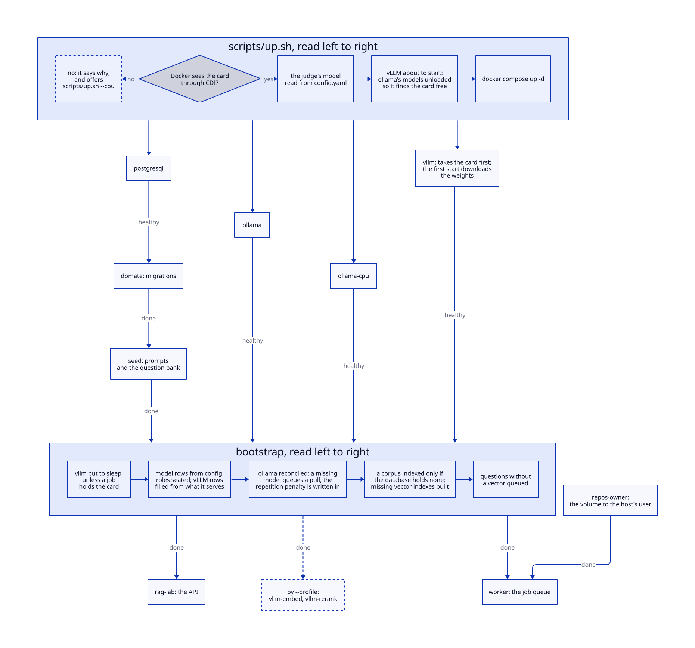

# rag-lab

[](https://github.com/rikitikitav1/rag-lab/actions/workflows/ci.yml)

rag-lab это стенд для замера того, как разные факторы влияют на ответы RAG-системы: модель и движок, на котором она работает, нарезка корпуса, настройки поиска, агент вместо простого ответа, судья. Он показывает, от чего на самом деле зависит качество ответов и во что обходится каждое изменение.

Любое такое сравнение здесь это эксперимент: несколько вариантов системы, которые отличаются одним параметром (на схеме это плечи, arms), отвечают на один и тот же набор вопросов, и судья оценивает каждый ответ отдельно. Разницу между вариантами сравнивают с разбросом между двумя прогонами одного и того же варианта: всё, что меньше этого разброса, считается шумом. Если варианты различаются чем-то ещё, кроме сравниваемого, стенд это записывает и об этом говорит.

<details>
<summary>Схема: что может сравнить эксперимент</summary>



</details>

> English: [../README.md](../README.md) · Сценарии: [use_cases.md](use_cases.md) · Журнал экспериментов: [experiments.md](experiments.md) · Что отсекает preflight: [preflight.md](preflight.md) · Что роль требует от модели: [model_requirements.md](model_requirements.md)

## Зачем стенд

Собрать RAG может любой, и он работает до первой замены: другая модель, другая квантизация, другой движок, новый промпт судьи, новая нарезка корпуса. Каждая такая замена меняет саму линейку. Без стенда команда сравнивает средний балл до и после, видит «7.3 против 7.1», считает это результатом и выкатывает. Со стендом вопрос «стало лучше или это шум» решается минут за сорок, и ответ получается числом с известным уровнем шума.

Ещё это единственный способ увидеть, что чужие настройки по умолчанию делают с вашими числами. Сервер применяет штраф за повторы, о котором в запросе ни слова; кэш префикса отвечает на первый вызов не так, как на следующие; OpenAI-совместимый API молча отбрасывает параметр; флаг грамматики JSON меняет часть оценок, а средние при этом стоят на месте. На дашборде этого не видно. Это видно только там, где стенд записывает, что было отправлено, что стояло на сервере и что вернулось, и говорит об этом, прежде чем сравнивать варианты, которые хоть в чём-то из этого расходятся.

Кому это не нужно: продукту с одной моделью, которую никто не собирается менять. Там хватит десятка вопросов и внимательного взгляда. А тем, кто меняет модель или движок чаще раза в квартал, нужно, и обычно они понимают это, когда «улучшение» уже уехало в прод.

## На какие вопросы отвечает

- **Окупается ли модель побольше?** Генератор на 70b ответил лишь немного лучше, чем 8b, и работал в 23 раза медленнее (ему пришлось работать на процессоре). Почти того же прироста для 8b удалось добиться реранком контекста. [Запись](experiments/2026-07-28_generator-a-b-llama3-1-8b.md)
- **Стоит ли реранк места на видеокарте?** На смешанном наборе вопросов он улучшает ранжирование. По умолчанию он выключен: агенту нужен генератор, который умеет вызывать инструменты, а такая модель вместе с реранкером на видеокарту (дальше просто карта) не помещается. [Запись](experiments/2026-08-29_generator-grid-4b-against-8b.md)
- **Как нарезать корпус?** Две нарезки могут жить рядом, у каждой свой индекс, поэтому новую нарезку сравнивают со старой, а не переезжают на неё вслепую. Чистка нарезки улучшила поиск, третий уровень заголовков ничего не дал. [Две нарезки](experiments/2026-08-26_a-corpus-you-can-keep-two-of.md) · [чистка](experiments/2026-08-27_hygiene-that-moved-the-number.md) · [третий уровень](experiments/2026-08-28_a-third-heading-level-in-the-cut.md)
- **Самописный агент или стандартный?** Агент, перенесённый на LangGraph, повёл себя так же, как самописный, в пределах обычного разброса самописного, и только после этого самописный убрали. [Запись](experiments/2026-08-26_the-same-agent-written-four-ways.md)
- **Окупается ли фильтрация найденных кусков через LLM?** Прежде чем найденные куски попадут к генератору, отдельный вызов модели читает каждый кусок рядом с вопросом и выбрасывает те, что считает не относящимися к делу. Это шаг оценки найденных документов, который есть и в Corrective RAG (Yan и др., 2024), и в Self-RAG (Asai и др., 2023), в том виде, в каком его делают оба архивных туториала LangGraph по этим статьям; сам LangGraph относит обе статьи к self-reflective RAG. На английском наборе (820 вопросов) `llama3.1:8b` по подсказке сохранила нужный раздел в 97.6% строк, где поиск его нашёл, и выбросила на типичной строке 44% кусков из посторонних файлов. Планка требовала не меньше 95% и не меньше половины, оба числа по нижней границе интервала, и ни одна настройка фильтра не взяла обе сразу. Сто вопросов, отвеченных с фильтром и без, осуждённые в одной резидентности, сдвинули обоснованность меньше, чем та же рука отличается от самой себя, поэтому он выключен по умолчанию и стоит 4.4 секунды на вопрос, когда включён. Слепая разметка сотни кусков, которые планка считает посторонними, подтверждённая кросс-энкодером и пересечением заголовков, показала, что по теме вопроса от 39 до 48 из ста: значит пол требовал большой доли того, что вообще можно было выбросить. [Запись](experiments/2026-09-19_a-grader-that-does-not-buy-it.md)
- **Окупается ли переписывание вопроса, когда поиск выглядит слабым?** Если ближайший найденный кусок далеко или пять кусков, которые путь отдаёт генератору, лежат вплотную друг к другу, отдельный вызов модели переписывает вопрос и поиск повторяется: так поступает Corrective RAG (Yan и др., 2024), когда считает поиск неверным. Признак слабости это собственное калиброванное расстояние стенда, он срабатывает на 136 из 820 английских вопросов с точностью 0.42 против «нужного раздела нет в первой пятёрке». Замена первой пятёрки на пятёрку переписанного запроса вернула нужный раздел на 22 строках и потеряла его на 14: нетто +8 строк, +0.0098, полоса [-0.0049, +0.0244] всё ещё накрывает ноль, а по предикату «нашёлся ли нужный файл вообще» сдвиг ровно нулевой. Чтобы отличить такой эффект от нуля, нужно около 1850 вопросов. После этого узел убран: такой выигрыш не окупает второй вызов модели и второй поиск на каждой шестой строке. Запись хранит замер и числа триггера. [Запись](experiments/2026-09-20_a-rewrite-that-does-not-clear-the-bar.md)
- **Можно ли доверять судье?** Судьи разного размера одинаково оценивают полноту ответа и по-разному его обоснованность, поэтому оценки сравнимы только в рамках одного судьи. Наш судья и RAGAS (стандартная библиотека оценки, здесь она работает вторым, гостевым судьёй) согласуются умеренно (ранговая корреляция 0.5 на вопросах из корпуса); RAGAS из них шумнее, а на отказах они расходятся по определению. [Два судьи](experiments/2026-07-29_judge-vs-judge-qwen2-5-7b.md) · [наш против RAGAS](experiments/2026-09-06_our-judge-against-the-standards.md)
- **Влияет ли движок на оценку?** Одни и те же ответы, оценённые судьёй на vLLM и на ollama, во многих случаях получили разные оценки, но списать это на движок нельзя: у модели ещё и другая квантизация. Поэтому стенд отказывается сравнивать варианты, которые оценивал судья на разных движках. [Запись](experiments/2026-09-09_the-same-rows-judged-by-two-engines.md)

## Почему числам можно верить

- **Сравнение по каждому вопросу, с интервалом.** Все варианты отвечают на одни и те же вопросы, поэтому у каждой разницы есть доверительный интервал и поправка на множественные сравнения. Раньше «победитель» порой выигрывал меньше, чем составляет обычный разброс. [Запись](experiments/2026-07-28_paired-significance-testing-lands-in-the.md)
- **Измеренный уровень шума.** Вариант прогоняют дважды, судью тоже, и у шума есть число; разница меньше него считается шумом, а не результатом. Та же проверка показала, что флаг пакетной инвариантности vLLM (`VLLM_BATCH_INVARIANT`, проход судьи в 8.7 раза медленнее) здесь ничего не даёт. [Запись](experiments/2026-09-09_what-batch-invariance-costs-on-an-awq-judge.md)
- **Исход у каждого вопроса, оценка по группам.** Каждый ответ помечается: ответил по источникам, ответил без единого источника, отказался, исчерпал шаги. Вопросы из корпуса, вне корпуса и не по теме оцениваются отдельно. Так обнаружили агента, который не отказывался вообще никогда. [Запись](experiments/2026-08-25_the-gate-that-fires-and-the-refusal-that.md)
- **Прогон записывает свои приборы.** Модели, промпты, настройки движка и вариант корпуса сохраняются вместе с каждым прогоном. Так проверили переписанного агента: записанные прогоны проиграли через новый код без повторных обращений к модели, и все воспроизводимые строки совпали. [Запись](experiments/2026-09-07_the-phases-split-and-the-replay-that-checked-it.md)
- **Что обязано совпасть у двух плеч.** Прежде чем читать разницу, сравнение проверяет, что оба плеча мерил один прибор, и называет поле, которое разошлось, если это не так. [Таблица](api.md#what-two-arms-must-share)

Насколько каждый прибор сдвигается сам по себе, если прогнать его дважды на одном и том же материале. Вердикт это одна оценка судьи по одной оси одного ответа; перезагрузка модели это её выгрузка с сервера и повторная загрузка.

| Прибор | Сдвиг между двумя проходами | Запись |
|---|---|---|
| судья Qwen2.5-7B на ollama, после перезагрузки модели | 14% оценок, 58% текстов обоснования | [запись](experiments/2026-09-07_what-the-standard-was-worth.md) |
| судья Qwen2.5-7B-AWQ на vLLM, после перезагрузки модели | 0 из 388 вердиктов | [запись](experiments/2026-09-09_what-batch-invariance-costs-on-an-awq-judge.md) |
| тот же судья в одной загрузке, JSON без свободных пробелов | 0 из 275 вердиктов | [запись](experiments/2026-09-13_the-judge-that-looped-on-whitespace.md) |
| DeepSeek-V4-Flash судьёй, проходы с разницей в часы | 154 из 573 вердиктов, 27% | [запись](experiments/2026-09-14_a-cloud-judge-on-the-same-answers.md) |
| генератор Qwen2.5-7B-AWQ на vLLM, два прогона | 78 из 285 вердиктов, 27%; 8 из 100 ответов совпали | [запись](experiments/2026-09-13_the-same-generator-on-two-engines.md) |
| генератор qwen2.5:7b на ollama, два прогона | 101 из 300 вердиктов, 34%; 2 из 100 ответов совпали | [запись](experiments/2026-09-13_the-same-generator-on-two-engines.md) |
| генератор llama3.1:8b на ollama, два прогона | около балла на строку; 4% ответов совпали | [запись](experiments/2026-09-13_a-bigger-model-at-the-same-retrieval.md) |
| генератор DeepSeek-V4-Flash, два прогона | 0 из 50 ответов совпали; обоснованность сдвинулась в 18 из 44 | [запись](experiments/2026-09-13_a-bigger-model-at-the-same-retrieval.md) |
| человек-оценщик (автор), те же пары на следующий день | тот же выбор в 5 из 7 | [запись](experiments/2026-09-13_fifteen-pairs-the-owner-judged.md) |

Разница меньше собственного сдвига прибора читается как шум.

## Что внутри

Под стендом обычная RAG-система: она отвечает на технические вопросы по личной базе знаний и набору открытых IT-репозиториев и показывает, на какие источники опиралась. Поиск написан вручную из базовых частей, чтобы каждый шаг можно было измерить; там, где у индустрии есть стандарт и он справляется лучше, стенд переходит на него и измеряет цену перехода (агент работает на LangGraph, markdown режет `MarkdownHeaderTextSplitter`). Модели работают локально на одной видеокарте, которую ollama и vLLM передают друг другу через очередь заданий, или на процессоре; облачную модель можно подключить как удалённый движок.

- **Варианты корпуса.** Один и тот же корпус можно нарезать несколькими способами сразу, у каждой нарезки свой индекс, поэтому перенарезку сравнивают, а не делают безвозвратно. [Запись](experiments/2026-08-26_a-corpus-you-can-keep-two-of.md)
- **Гибридный поиск.** Векторный поиск (pgvector) и полнотекстовый (Postgres FTS со стеммингом для каждого языка) объединяются через RRF. Результаты можно фильтровать по категориям, а порог по расстоянию позволяет системе сказать «в корпусе про это ничего нет» вместо того, чтобы гадать.
- **Модели по ролям.** Ролей восемь: шесть своих (генерация, эмбеддинги, судья, перефразирование, реранк, грейдер кусков) и две для гостевого судьи RAGAS, его модель и его эмбеддер. Какая модель занимает роль, хранится в базе и меняется без перезапуска. Каждая роль стоит на своём движке: ollama или vLLM, на видеокарте или на процессоре, либо облачный API.
- **Несколько источников, одно дерево категорий.** Личные заметки на русском, 173 репозитория с вопросами для собеседований на английском и три источника документации (`system-design-primer`, `redis-doc`, `cheatsheets`), у каждого свои правила, что считать заголовком, а что мусором.
- **Пять мер качества.** Поиск (нашёлся ли нужный файл и нужный раздел), а также оценки LLM-судьи: обоснованность (опирается ли ответ на контекст), релевантность, полнота относительно эталонного ответа и умение отказаться, когда ответа нет. Оценки считаются отдельно для вопросов из корпуса, вне корпуса и не по теме, и у каждого вопроса записан исход. Если система отказалась или ответила без единого источника, судья балл не ставит; такие строки считаются по исходу.
- **Очередь заданий.** Тяжёлая работа (скачивание моделей, индексация, прогоны и оценка наборов вопросов) идёт через очередь в Postgres, её разбирает воркер. Само приложение зависит только от Postgres: если сервер моделей пропал, задания ждут, а приложение не падает; стенд в compose поднимает API только после серверов моделей.
- **Реранк.** Кросс-энкодер (`bge-reranker-v2-m3`) может переупорядочить найденное до того, как оно попадёт генератору. По умолчанию он выключен, потому что не помещается на карту рядом с генератором агента; прогон может его включить, когда поднят его сервер, а чат нет: реранкер и генератор были бы двумя движками на одной карте. Что он даёт ранжированию и ответам, сказано в вопросах выше.
- **Агент на LangGraph.** Модель сама решает, когда искать, может переформулировать вопрос и поискать ещё раз, потом отвечает. Правила вокруг неё (когда поиск считается слабым, когда вопрос не по теме, какие инструменты можно звать) наши и измерены. Любой набор вопросов можно прогнать через агента или через простой проход «нашёл и ответил» и сравнить.
- **Всё через API.** Сборка наборов вопросов (перефразирование и перевод вопросов для собеседований), импорт своих, прогоны и оценка это вызовы API, которые идут через очередь; каждый запрос и каждое задание пишутся в журнал со временем выполнения.

## Стек

Python · PostgreSQL + pgvector · SQLAlchemy 2.0 (sync psycopg + async asyncpg) · Ollama и vLLM (OpenAI-совместимые API, одна карта передаётся между ними) · FastAPI · dbmate (миграции) · uv/pyproject · Docker Compose.

Оси стандарта приходят из **ragas**, версия прибита как `0.4.3` в группе зависимостей `eval` и ставится в образы обоих сервисов, поэтому гостевой проход идёт внутри очереди, а не рядом с ней в хостовой оболочке. `langchain-community` прибит ниже `0.4`, потому что тот релиз выкинул `chat_models.vertexai`, который ragas импортирует.

Из семейства LangChain пять пакетов: **langgraph** исполняет агента как `StateGraph`, **langchain** даёт `create_agent` для варианта агента на стандартном `create_agent`, который меряет, сколько стоит стандартная версия, **langchain-text-splitters** решает, что считать заголовком markdown, а **langchain-core** и **langchain-ollama** импортирует напрямую этот вариант. Ретривал, очередь, eval-стенд и политики корпуса наши; версия сплиттера записывается в отчёт о нарезке, потому что разбор теперь внешний код, и обновление lock-файла иначе сдвинуло бы нарезку молча.

## Архитектура моделей и промптов

- Какая модель занимает каждую из семи ролей, записано строкой в базе и меняется на лету; прежде чем посадить модель на роль, её спрашивают, умеет ли она то, что роли нужно ([model_requirements.md](model_requirements.md)).
- Промпты версионируются в базе из файлов в `prompts/`, у каждого назначения одна активная версия, а новую включают осознанно.
- Каждый ответ записывает модели и версии промптов, которые его дали и оценили, поэтому два прогона сравниваются по тому, что на самом деле отработало, а не по тому, что заказали.

Модель данных, сервер реранкера и что делает bootstrap на старте: [design.md](design.md#models-prompts-and-what-a-run-records) (на английском).

## Конфигурация

У каждого вида настройки один дом:

- `config.yaml` (монтируется в контейнер): конвейер, то есть роли и их модели, поиск, реранк, агент, нарезка, полнотекстовый поиск, варианты корпуса и источники. У значения, выбранного замером, рядом записаны причина и файл замера, и каждый прогон пишет использованные значения в свой снимок.
- `.env`: то, что зависит от машины или не должно лежать в репозитории (таймауты, доли видеокарты, ключи); [`.env.example`](../.env.example) перечисляет каждую переменную со значением по умолчанию.
- база данных: какая модель занимает роль, версии промптов и строки движков; меняется на лету через API.
- `datasets/`: наборы вопросов и источники корпуса. Прогон кладёт сюда же свой замер и замороженный пул кандидатов, и они в гит не идут: до читателя число доезжает таблицей в записи журнала, а имя файла и номер задания это его адрес.
- код: деревья категорий источников и пределы протокола.

## Быстрый старт

Хосту нужны Docker Compose v2, драйвер NVIDIA и NVIDIA Container Toolkit со спецификацией CDI: `docker info` должен перечислять `nvidia.com/gpu=all` среди найденных устройств CDI (проверено на Docker Engine 29.0, Compose 2.40, toolkit 1.20). Если нет, спецификацию пишет `sudo nvidia-ctk cdi generate --output=/var/run/cdi/nvidia.yaml`, а служба `nvidia-cdi-refresh` из toolkit держит её свежей после смены драйвера. Карта приходит в контейнеры через CDI, а не через хук рантайма, потому что на хосте с cgroup v2 и драйвером systemd каждый `systemctl daemon-reload` (snapd и автообновления делают его сами) отбирал карту у работающих контейнеров.

```bash
scripts/up.sh                            # проверяет карту, потом docker compose up -d
curl localhost:8000/readiness            # 503 только без Postgres; иначе "ok" или "degraded" с ролями, чей движок лежит
curl -X POST localhost:8000/v1/chat/question \
  -H 'Content-Type: application/json' -d '{"text": "What is a hash table?"}'
# Swagger: http://localhost:8000/docs
```

`scripts/up.sh`, а не голый `docker compose up -d`: на хосте без карты он говорит, почему стенд не поднимется, вместо «unresolvable CDI devices» от Docker, выгружает модели ollama до старта `vllm` и передаёт `vllm` судью, которого называет `config.yaml`. `scripts/up.sh --cpu` поднимает стенд без карты, все роли на процессорной ollama: [stand_modes.md](stand_modes.md), режим 8.

<details>
<summary>Схема: как поднимается стенд</summary>



</details>

Аутентификации нет намеренно (REST, `/mcp`, `/mcp-ops` открыты): это локальная лаборатория, порты привязаны к 127.0.0.1. Не выставляйте её в сеть как есть.

Первый `up` тянет модели ролей (на ollama около 15 GiB: `llama3.1:8b`, `gemma2:9b`, `bge-m3` и `qwen2.5:7b` для гостя RAGAS; судья на vLLM около 5.2 GiB) и образ vLLM (около 21.5 ГБ диска), потом строит индекс (~5-10 мин, следите за `docker compose logs -f worker`). Сервер дожидается `bootstrap`, а тот ждёт healthy у `vllm` (на первом старте до часа, пока тот качает судью) и у ollama; скачивания и индексации, которые те шаги ставят в очередь, он **не** ждёт, поэтому первые запросы могут вернуть отказ, пока корпус наполняется.

Источник `notes` читает `~/working_docs/notes` на хосте, этот каталог монтируется в контейнеры только на чтение. На машине без него Docker создаст пустой каталог, и источник ничего не проиндексирует.

Практические сценарии (мини-eval до чисел, A/B реранка, импорт своих вопросов, чтение логов): **[use_cases.md](use_cases.md)**. Это девять сценариев, а не индекс роутов; полный справочник это Swagger на `/docs`, он генерируется из кода и отстать от него не может.

Другие раскладки стенда (реранк, эмбеддер или генератор на vLLM, процессор, судья на ollama, застрявшая карта), по шагам и с тем, как вернуться обратно: **[stand_modes.md](stand_modes.md)**.

Первое сравнение: [сценарий 2](use_cases.md#scenario-2-mini-eval-from-scratch-to-numbers) доводит маленький набор с нуля до чисел, а [сценарий 9](use_cases.md#scenario-9-parameter-series-measure-a-retrieval-lever) перебирает один рычаг экспериментом.

## Архитектура

<details>
<summary>Схема: Архитектура</summary>


</details>

Как карта переходит между движками и куда ведёт неудачная передача: [stand_modes.md](stand_modes.md).

Диаграммы это исходники D2 и PlantUML в `docs/diagrams/`, рендер `scripts/render_diagrams.sh`; CI падает, если закоммиченный SVG разошёлся с исходником. Структурные и поведенческие виды в UML и C4, сгенерированный граф агента и пояснительные рисунки остаются в D2.

## Сервисы compose

| Сервис | Роль |
|--------|------|
| `postgresql` | Postgres + pgvector, единственная жёсткая зависимость |
| `dbmate` | накатывает миграции, отрабатывает до старта остальных |
| `seed` | заливает промпты и банк вопросов, отрабатывает один раз после миграций |
| `bootstrap` | готовит модели, роли и задания индексации, отрабатывает до старта остальных; ждёт `vllm` и усыпляет его до того, как ollama загрузит роль |
| `rag-lab` | FastAPI-сервер (uvicorn) |
| `repos-owner` | отдаёт том `repos_data` пользователю хоста до старта воркера, отрабатывает один раз |
| `worker` | разбирает очередь заданий от пользователя хоста, шестнадцать типов, каждый со своими опциями перечислен в [docs/api.md](api.md#the-queue) |
| `ollama` | локальный инференс на GPU: генератор, эмбеддер, парафразер и модель гостя RAGAS |
| `ollama-cpu` | вторая ollama на процессоре, для роли, которой не нужна карта (по умолчанию эмбеддер гостя RAGAS); поднята всегда, потому что ollama грузит модель на первом вызове и отдаёт память после keep-alive |
| `vllm` | судья (`Qwen/Qwen2.5-7B-Instruct-AWQ`); на старте берёт карту первым и засыпает, когда карта нужна другому движку; порт на хост не опубликован |
| `vllm-rerank`, `vllm-embed`, `vllm-cpu` | под профилями compose `rerank`, `embed` и `cpu`: роль реранка, эмбеддер на vLLM, vLLM на процессоре; поднимаются только с `--profile`, потому что vLLM, пока работает, держит свою долю карты или всю модель в памяти хоста (19 ГБ на 7B на процессоре); как переключать: [stand_modes.md](stand_modes.md) |

### Переменные окружения

Скопируйте [`.env.example`](../.env.example) в `.env`, compose подхватит его сам; что делает каждая переменная, написано рядом с ней. Что меняется от одного режима стенда к другому: [stand_modes.md](stand_modes.md).

## REST API

Полный справочник это Swagger на `http://localhost:8000/docs`. [api.md](api.md) раскладывает роуты по группам, а [use_cases.md](use_cases.md) проходит по ним сценариями (оба на английском).

## MCP

В API смонтированы два MCP-сервера: `/mcp` для корпуса (`search_corpus`, `answer_question`, `list_categories`) и `/mcp-ops` для самого стенда (прогоны, сравнения, задания, движки). Агент при этом сам клиент внешних MCP-серверов. Подробно: [mcp.md](mcp.md).

## Устройство агента и корпуса

Почему агент и корпус устроены именно так, со ссылкой на запись журнала у каждого решения: [design.md](design.md). Там corpus-first и проверка покрытия, ось темы, гигиена нарезки, глубина обхода индекса, две реализации агента и модель данных моделей, промптов и прогонов.

## Как это устроено

Где в коде какая часть: [code_map.md](code_map.md). Логика живёт в транспортно-нейтральных `use_cases` за тонкими переходниками (CLI, REST на FastAPI, MCP).
