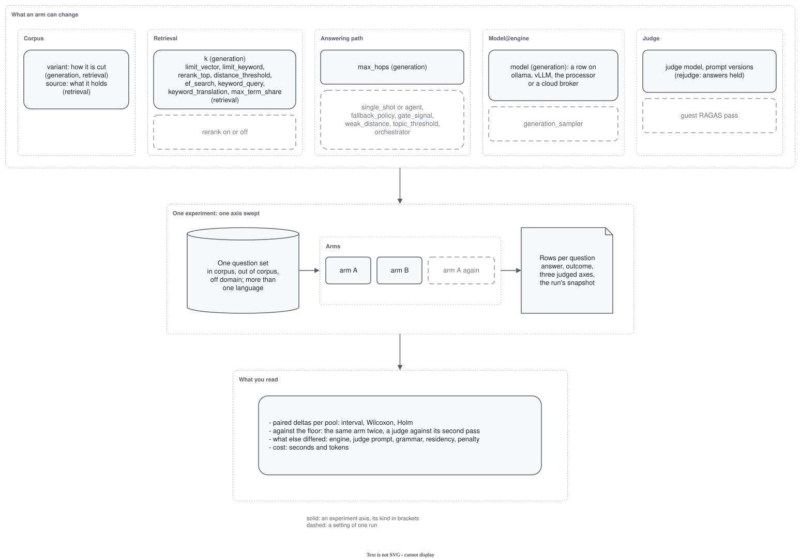
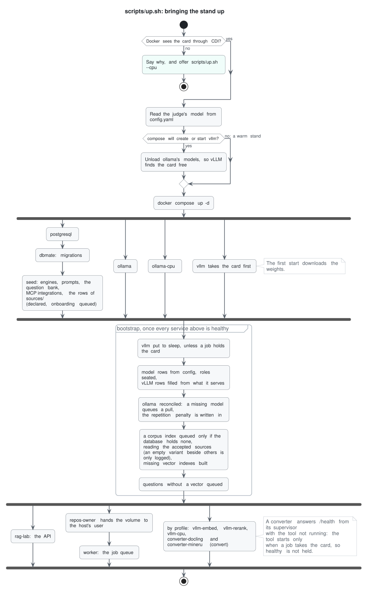
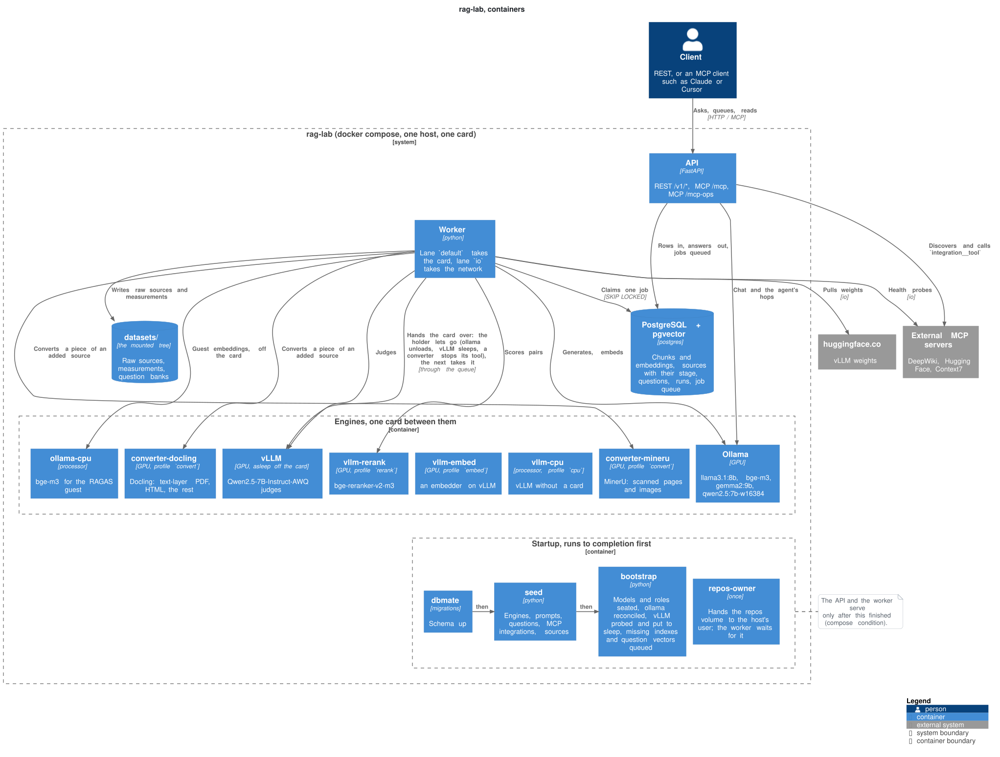

# rag-lab

[](https://github.com/rikitikitav1/rag-lab/actions/workflows/ci.yml)

rag-lab это стенд для замера того, как разные факторы влияют на ответы RAG-системы: модель и движок, на котором она работает, нарезка корпуса, настройки поиска, агентный режим и модель-судья. Он помогает понять, от чего зависит качество ответов и какой ценой даётся каждое изменение.

Каждое сравнение здесь считается экспериментом. Несколько вариантов системы, или arms на схеме, отличаются одним параметром и отвечают на один и тот же набор вопросов. Судья оценивает каждый ответ отдельно. Разницу между вариантами сопоставляют с разбросом двух прогонов одного варианта: меньшую разницу считают шумом. Если варианты отличаются ещё чем-то, стенд фиксирует это и сообщает при сравнении.

<details>
<summary>Схема: что может сравнить эксперимент</summary>



</details>

> English: [../README.md](../README.md) · Как книги становятся корпусом: [intake.md](intake.md) · Как добавить источник, по шагам: [add_a_source.md](add_a_source.md) · Наборы вопросов: [question_sets.md](question_sets.md) · Сценарии: [use_cases.md](use_cases.md) · Журнал экспериментов: [experiments.md](experiments.md) · Что отсекает preflight: [preflight.md](preflight.md) · Что роль требует от модели: [model_requirements.md](model_requirements.md)

## Зачем стенд

Собрать RAG-систему несложно, но оценить изменения уже труднее. Новая модель, квантизация, движок, промпт судьи или нарезка корпуса меняют условия измерения. Без стенда команда сравнивает средние баллы, видит «7.3 против 7.1», принимает разницу за улучшение и выпускает изменение. Со стендом можно примерно за сорок минут проверить, отличается ли результат от шума.

Стенд также показывает, как на результаты влияют настройки по умолчанию на стороне сервера, движка или API. Например, сервер может применить не указанный в запросе штраф за повторы, кэш префикса может изменить ответ на первый вызов, OpenAI-совместимый API может молча отбросить параметр, а грамматика JSON может сдвинуть часть оценок при неизменном среднем. На обычном дашборде таких деталей не видно. Стенд сохраняет отправленные параметры, состояние сервера и полученный ответ, а затем предупреждает о различиях между сравниваемыми вариантами.

Стенд не нужен продукту, в котором используют одну модель и не планируют её менять: для такой системы достаточно проверить десяток вопросов вручную. Он пригодится, если команда регулярно меняет модели или движки и хочет отличать реальный сдвиг в оценках от шума. Иначе это часто выясняется уже после выпуска изменения.

## На какие вопросы отвечает

- **Окупается ли модель побольше?** Генератор на 70b ответил лишь немного лучше, чем 8b, и работал в 23 раза медленнее (ему пришлось работать на процессоре). Почти того же прироста для 8b удалось добиться реранком контекста. [Запись](experiments/2026-07-28_generator-a-b-llama3-1-8b.md)
- **Стоит ли реранк места в видеопамяти?** На смешанном наборе вопросов он улучшает ранжирование. По умолчанию он выключен: агенту нужен генератор, который умеет вызывать инструменты, а такая модель вместе с реранкером в 8 ГБ видеопамяти не помещается. [Запись](experiments/2026-08-29_generator-grid-4b-against-8b.md)
- **Как нарезать корпус?** Две нарезки могут жить рядом, у каждой свой индекс, поэтому новую нарезку сравнивают со старой, а не переезжают на неё вслепую. Чистка нарезки улучшила поиск, третий уровень заголовков ничего не дал. [Две нарезки](experiments/2026-08-26_a-corpus-you-can-keep-two-of.md) · [чистка](experiments/2026-08-27_hygiene-that-moved-the-number.md) · [третий уровень](experiments/2026-08-28_a-third-heading-level-in-the-cut.md)
- **Самописный агент или стандартный?** Агент, перенесённый на LangGraph, повёл себя так же, как самописный, в пределах обычного разброса самописного, и только после этого самописный убрали. [Запись](experiments/2026-08-26_the-same-agent-written-four-ways.md)
- **Окупается ли фильтрация найденных кусков через LLM?** Прежде чем найденные куски попадут к генератору, отдельный вызов модели читает каждый кусок рядом с вопросом и выбрасывает те, что считает не относящимися к делу. Это шаг оценки найденных документов из Corrective RAG (Yan и др., 2024) и Self-RAG (Asai и др., 2023), сделанный так, как его делают архивные туториалы LangGraph по этим статьям (сам LangGraph относит обе статьи к self-reflective RAG). Мы проверили `llama3.1:8b` с подсказкой на английском наборе (820 вопросов). Она сохранила нужный раздел в 97.6% строк, где поиск его нашёл. На типичной строке она выбросила 44% кусков из посторонних файлов. Планка требовала не меньше 95% и не меньше половины, оба числа по нижней границе интервала, и ни одна настройка фильтра не взяла обе сразу. Потом сто вопросов ответили с фильтром и без и оценили, пока модель судьи оставалась загруженной. Обоснованность сдвинулась меньше, чем генератор расходится сам с собой. Поэтому фильтр по умолчанию выключен, а включённый стоит 4.4 секунды на вопрос. Наконец, сотню кусков, которые планка считает посторонними, разметили вслепую, и кросс-энкодер с пересечением заголовков эту разметку подтвердили: по теме вопроса от 39 до 48 из ста. Выходит, планка требовала большой доли того, что вообще можно было выбросить. [Запись](experiments/2026-09-19_a-grader-that-does-not-buy-it.md)
- **Окупается ли переписывание вопроса, когда поиск выглядит слабым?** Триггер такой: ближайший найденный кусок далеко или пять кусков, которые путь отдаёт генератору, лежат вплотную друг к другу. Тогда отдельный вызов модели переписывает вопрос и поиск повторяется, как в Corrective RAG (Yan и др., 2024), когда тот считает поиск неверным. «Далеко» здесь означает собственное калиброванное расстояние стенда. Оно срабатывает на 136 из 820 английских вопросов с точностью 0.42 против «нужного раздела нет в первой пятёрке». В эксперименте первую пятёрку заменяли на пятёрку переписанного запроса. Нужный раздел вернулся на 22 строках и потерялся на 14: нетто +8 строк, +0.0098, интервал [-0.0049, +0.0244] всё ещё накрывает ноль. По тому, нашёлся ли нужный файл вообще, сдвиг ровно нулевой. Чтобы отличить такой эффект от нуля, нужно около 1850 вопросов. После этого узел убран: такой выигрыш не окупает второй вызов модели и второй поиск на каждой шестой строке. Запись хранит замер и числа триггера. [Запись](experiments/2026-09-20_a-rewrite-that-does-not-clear-the-bar.md)
- **Помогает ли схема рассуждения маленькой модели вызывать инструменты?** Вместо прямого вызова инструмента `llama3.1:8b` заполняла схему, где название инструмента указывалось в поле действия. Такой подход предлагает Schema-Guided Reasoning. На 200 вопросах вне корпуса доля ответов, в которых модель только описала вызов или исчерпала все шаги, выросла с 0.745 до 0.990. Схема устранила описанные вызовы, но после этого агент чаще достигал лимита шагов. Доля ответов без источника выросла с 4.5% до 11.5%, а релевантность на вопросах из корпуса упала с 9.1 до 5.6 из десяти. Этот вариант удалили. [Запись](experiments/2026-09-23_a-schema-that-makes-the-loop-worse.md)
- **Окупается ли вырезать шум из оставленных кусков?** Corrective RAG идёт дальше выброса целых кусков: оставленные режет на полоски в несколько предложений, оценивает каждую и склеивает оставшиеся. Тем же подсказанным грейдером на полосках по три строки контекст стал на четверть короче, ответ почти вдвое дольше, а обоснованность на 200 вопросах сдвинулась на −0.07 [−0.33, +0.17], внутри шума контроля против самого себя. По нашей разметке четверть вырезанного пришлась на нужный раздел. Код удалён. [Запись](experiments/2026-09-23_a-strip-that-does-not-buy-the-answer.md)
- **Можно ли доверять судье?** Судьи разного размера одинаково оценивают полноту ответа и по-разному его обоснованность, поэтому оценки сравнимы только в рамках одного судьи. Наш судья и RAGAS (стандартная библиотека оценки, здесь она работает вторым, гостевым судьёй) согласуются умеренно (ранговая корреляция 0.5 на вопросах из корпуса); RAGAS из них шумнее, а на отказах они расходятся по определению. [Два судьи](experiments/2026-07-29_judge-vs-judge-qwen2-5-7b.md) · [наш против RAGAS](experiments/2026-09-06_our-judge-against-the-standards.md)
- **Влияет ли движок на оценку?** Одни и те же ответы, оценённые судьёй на vLLM и на ollama, во многих случаях получили разные оценки, но списать это на движок нельзя: у модели ещё и другая квантизация. Поэтому стенд отказывается сравнивать варианты, которые оценивал судья на разных движках. [Запись](experiments/2026-09-09_the-same-rows-judged-by-two-engines.md)

## Почему числам можно верить

- **Сравнение по каждому вопросу, с интервалом.** Все варианты отвечают на одни и те же вопросы, поэтому у каждой разницы есть доверительный интервал и поправка на множественные сравнения. Раньше «победитель» порой выигрывал меньше, чем составляет обычный разброс. [Запись](experiments/2026-07-28_paired-significance-testing-lands-in-the.md)
- **Измеренный уровень шума.** Вариант прогоняют дважды, судью тоже, и у шума есть число; разница меньше него считается шумом, а не результатом. Та же проверка показала, что флаг пакетной инвариантности vLLM (`VLLM_BATCH_INVARIANT`, проход судьи в 8.7 раза медленнее) здесь ничего не даёт. [Запись](experiments/2026-09-09_what-batch-invariance-costs-on-an-awq-judge.md)
- **Исход у каждого вопроса, оценка по группам.** Каждый ответ помечается: ответил по источникам, ответил без единого источника, отказался, исчерпал шаги. Вопросы из корпуса, вне корпуса и не по теме оцениваются отдельно. Так обнаружили агента, который не отказывался вообще никогда. [Запись](experiments/2026-08-25_the-gate-that-fires-and-the-refusal-that.md)
- **В каждом прогоне сохраняются параметры измерения.** Вместе с прогоном записываются модели, промпты, настройки движка и вариант корпуса. Так проверили обновлённого агента: старые прогоны воспроизвели новым кодом без повторных обращений к модели, и все строки, которые можно было воспроизвести, совпали. [Запись](experiments/2026-09-07_the-phases-split-and-the-replay-that-checked-it.md)
- **Условия прогона фиксируются заранее.** Закрывающий прогон ссылается на предрегистрацию. В записи базы указаны набор вопросов, варианты сравнения, основные показатели и ограничения. Очередь не принимает неизвестное имя предрегистрации. Итоговые значения вычисляются из этой записи через ops-сервер MCP, поэтому нельзя выбрать показатель для отчёта уже после того, как стали известны результаты. [Инструменты](mcp.md)
- **Число переживает корпус, на котором его мерили.** Сброс тома базы стирает прогоны, а переиндексация их оставляет, но они описывают старую нарезку, поэтому число до пересборки читается из записи журнала и файла замера в `datasets/measurements/`, а не со стенда. Наборы вопросов остаются; сито отказывает паре, чьего раздела в новом корпусе нет, и прогон её не задаёт.
- **Что обязано совпасть у двух вариантов.** Прежде чем читать разницу, сравнение проверяет, что оба варианта мерил один прибор, и называет поле, которое разошлось, если это не так. [Таблица](api.md#what-two-arms-must-share)
- **Собственный шум каждого прибора измерен.** Судей, генераторы и человека-оценщика прогоняли дважды на одном материале; разница меньше собственного сдвига прибора читается как шум. Локальный судья на vLLM повторяет свои вердикты в точности, облачный сдвинул 27% из них. [Таблица](measurement.md#how-much-each-instrument-moves-on-its-own)

## Что внутри

Под стендом обычная RAG-система: она отвечает на технические вопросы по открытым IT-репозиториям, документации и книгам и показывает, на какие источники опиралась. Поиск написан вручную из базовых частей, чтобы каждый шаг можно было измерить; там, где у индустрии есть стандарт и он справляется лучше, стенд переходит на него и измеряет цену перехода (агент работает на LangGraph, markdown режет `MarkdownHeaderTextSplitter`). Модели работают локально на одном GPU или на процессоре, облачную модель можно подключить как удалённый движок. ollama и vLLM работают на этом одном GPU по очереди: очередь заданий передаёт его от одного движка другому.

- **Варианты корпуса.** Один и тот же корпус можно нарезать несколькими способами сразу, у каждой нарезки свой индекс, поэтому перенарезку сравнивают, а не делают безвозвратно. [Запись](experiments/2026-08-26_a-corpus-you-can-keep-two-of.md)
- **Гибридный поиск.** Векторный поиск (pgvector) и полнотекстовый (Postgres FTS со стеммингом для каждого языка; язык куска определяется по его собственному алфавиту, так что английский SQL в русской книге стеммится как английский) объединяются через RRF. Результаты можно фильтровать по категории или тегу, по источнику и по версии, а порог по расстоянию позволяет системе сказать «в корпусе про это ничего нет» вместо того, чтобы гадать. Слова русского вопроса могут войти в ключевой поиск третьим ранжированием, переведёнными на английский, за ручкой `retrieval.keyword.translation.enabled`; она выключена до своего A/B.
- **Модели по ролям.** У каждой модели своя роль: генерация, эмбеддинги, судья, перефразирование, реранк, грейдер кусков, автор и читатель наборов вопросов и две роли гостевого судьи RAGAS, его модель и его эмбеддер ([список](../app/models/registry.py)). Какая модель занимает роль, хранится в базе и меняется без перезапуска. Каждая роль стоит на своём движке: ollama или vLLM, на GPU или на процессоре, либо облачный API.
- **Несколько источников, одно дерево категорий.** 173 репозитория с вопросами для собеседований на английском, источники документации (`system-design-primer`, `redis-doc`, `cheatsheets`, `arangodb-docs`, `nginx-org-en`, `nginx-org-ru`) две книги-примера, `eloquent-javascript` на английском и `postgresql-internals-18` на русском, и `cloud-native-docker-k8s`, русская книга с полки владельца, чьего файла в репозитории нет, у каждого свои правила, что считать заголовком, а что мусором.
- **Добавление источника.** Новый источник сначала объявляется: имя, откуда берутся файлы (список URL, папка, git-репозиторий или страницы сайта) и, по желанию, язык и лицензия. Если язык не назван, его определяют по тексту источника, а источнику совсем без текстового слоя язык нужно объявить. Потом он превращается в сырой: markdown, который ещё не проиндексирован, с отчётом о пригодности и без эталона для сравнения. Куда пойдёт файл, зависит от его вида: markdown остаётся как есть, страница PDF без текстового слоя или картинка идёт в MinerU, HTML, страница PDF со слоем и офисные файлы в Docling, а любой другой файл (стили, шрифт) пропускается и называется в отчёте. EPUB пропускается и называется в отчёте, если источник не включил чтение по главам в порядке чтения (EPUB пока встречался один). Каждый конвертер это отдельный движок, и GPU он получает в свою очередь. Затем отчёт проверяет качество: сверяет конвертацию с собственным текстовым слоем файла по участкам страниц и прогоняет гейты нарезки по главам. Если доля текста с нарушениями выше объявленной границы, источник помечается плохим с причинами. Останавливать его не останавливают. Почему конвертеров два: [запись](experiments/2026-09-25_two-converters-one-per-regime.md)
- **Пять мер качества.** Поиск (нашёлся ли нужный файл и нужный раздел), а также оценки LLM-судьи: обоснованность (опирается ли ответ на контекст), релевантность, полнота относительно эталонного ответа и умение отказаться, когда ответа нет. Оценки считаются отдельно для вопросов из корпуса, вне корпуса и не по теме, и у каждого вопроса записан исход. Если система отказалась или ответила без единого источника, судья балл не ставит; такие строки считаются по исходу.
- **Очередь заданий.** Тяжёлая работа (скачивание моделей, индексация, прогоны и оценка наборов вопросов) идёт через очередь в Postgres, её разбирает воркер. Само приложение зависит только от Postgres: если сервер моделей пропал, задания ждут, а приложение не падает; стенд в compose поднимает API только после серверов моделей.
- **Реранк.** Кросс-энкодер (`bge-reranker-v2-m3`) может переупорядочить найденное до того, как оно попадёт генератору. По умолчанию он выключен (`rerank.enabled`), потому что не помещается на GPU рядом с генератором агента. Прогон может его включить, когда поднят его сервер. Чат не может: реранкер и генератор оказались бы двумя движками на одном GPU сразу. Что он даёт ранжированию и ответам, сказано в вопросах выше.
- **Агент на LangGraph.** Модель сама решает, когда искать, может переформулировать вопрос и поискать ещё раз, потом отвечает. Правила вокруг неё (когда поиск считается слабым, когда вопрос не по теме, какие инструменты можно звать) наши и измерены. Любой набор вопросов можно прогнать через агента или через простой проход «нашёл и ответил» и сравнить.
- **Всё через API.** Сборка наборов вопросов (перефразирование и перевод вопросов для собеседований), импорт своих, прогоны и оценка это вызовы API, которые идут через очередь; каждый запрос и каждое задание пишутся в журнал со временем выполнения.

## Стек

Python · PostgreSQL + pgvector · SQLAlchemy 2.0 (sync psycopg + async asyncpg) · Ollama и vLLM (OpenAI-совместимые API, работают по очереди на одном GPU) · Docling и MinerU (конвертеры документов, у каждого свой образ) · pypdfium2 (собственный текстовый слой PDF) · FastAPI · dbmate (миграции) · uv/pyproject · Docker Compose.

Оси стандарта приходят из **ragas**, версия прибита как `0.4.3` в группе зависимостей `eval` и ставится в образы обоих сервисов, поэтому гостевой проход идёт внутри очереди, а не рядом с ней в хостовой оболочке. `langchain-community` прибит ниже `0.4`, потому что тот релиз выкинул `chat_models.vertexai`, который ragas импортирует.

Группа зависимостей `data` (datatrove, datasketch, spacy) нужна пробе сторонних фильтров корпуса в режиме «только пометить» и не стоит ни в одном образе.

Из семейства LangChain взяты пять пакетов:

- **langgraph** исполняет агента как `StateGraph`;
- **langchain** даёт `create_agent`, на нём собран второй вариант агента, который меряет, сколько стоит стандартная версия;
- **langchain-core** и **langchain-ollama** этот вариант импортирует напрямую;
- **langchain-text-splitters** решает, что считать заголовком markdown.

Поиск, очередь, eval-стенд и политики корпуса реализованы в проекте. Версия внешнего сплиттера записывается в отчёт о нарезке, чтобы обновление lock-файла не меняло её незаметно.

## Архитектура моделей и промптов

- Какая модель занимает каждую роль, записано строкой в базе и меняется на лету; прежде чем посадить модель на роль, её спрашивают, умеет ли она то, что роли нужно ([model_requirements.md](model_requirements.md)).
- Промпты версионируются в базе из файлов в `prompts/`, у каждого назначения одна активная версия, а новую включают осознанно.
- Каждый ответ записывает модели и версии промптов, которые его дали и оценили, поэтому два прогона сравниваются по тому, что на самом деле отработало, а не по тому, что заказали.

Модель данных, сервер реранкера и что делает bootstrap на старте: [design.md](design.md#models-prompts-and-what-a-run-records) (на английском).

## Конфигурация

У каждого типа настроек есть своё место:

- `config.yaml` и файлы в `config/` монтируются в контейнеры и вместе образуют конфигурацию. В `config.yaml` заданы поиск, реранк, агент, нарезка, полнотекстовый поиск, варианты корпуса и движки. Каждый файл в `config/` отвечает за отдельную область: `roles.yaml` задаёт роли, назначенные им модели и начальные версии промптов для пустой базы; `roles.cpu.yaml` заменяет эти назначения для режима без GPU; `intake.yaml` описывает добавление источников, включая маршрутизацию файлов и настройки конвертеров; `ingest_quality.yaml` задаёт проверки нарезки; `evals.yaml` хранит наборы вердикта и статистические пороги, `categories.yaml` дерево категорий. Один раздел нельзя задавать в нескольких файлах. Для настроек, выбранных по результатам замеров, указаны причина и файл с результатами. Каждый прогон сохраняет применённые значения в своём снимке.
- `.env`: то, что зависит от машины или не должно лежать в репозитории (таймауты, доли видеопамяти, ключи); [`.env.example`](../.env.example) перечисляет каждую переменную, которую задают руками, со значением по умолчанию; те, что задают compose или образ, перечислены в [`config_inventory.md`](config_inventory.md).
- база данных: какая модель занимает роль, версии промптов и строки движков; меняется на лету через API.
- `datasets/`: наборы вопросов, источники корпуса и результаты конвертации сырых источников (`datasets/raw_sources/`). Сырые файлы, замеры прогонов и замороженные пулы кандидатов не добавляются в Git. Результаты экспериментов публикуются таблицами в журнале, а имя файла и номер задания помогают найти исходный замер.
- база хранит объявление каждого источника: происхождение, язык, лицензию и правила, нужные только ему (дерево категорий, пропускаемые файлы, семейства вето); индекс читает принятые строки. `sources/<имя>.yaml` служит сидом для источников со свободной лицензией, двух книг-примеров и одной книги с полки владельца: сид записывает файл в строку, файл при этом главнее, а новая строка проходит тот же путь, что и источник, объявленный вручную. `formats/<имя>.yaml` содержит общие правила формата, например разделы DocBook или уровни заголовков LaTeX. Новый источник сначала регистрируют через `POST /v1/source`.
- код: разбор, который файлом не сказать, и пределы протокола.

## Быстрый старт

Хосту нужны Docker Compose v2, драйвер NVIDIA и NVIDIA Container Toolkit со спецификацией CDI: `docker info` должен перечислять `nvidia.com/gpu=all` среди найденных устройств CDI (проверено на Docker Engine 29.0, Compose 2.40, toolkit 1.20). Если нет, спецификацию пишет `sudo nvidia-ctk cdi generate --output=/var/run/cdi/nvidia.yaml`, а служба `nvidia-cdi-refresh` из toolkit держит её свежей после смены драйвера. GPU приходит в контейнеры через CDI, а не через хук рантайма. Причина: на хосте с cgroup v2 и драйвером systemd каждый `systemctl daemon-reload` (snapd и автообновления делают его сами) отбирал GPU у работающих контейнеров.

```bash
scripts/up.sh                            # проверяет GPU, потом docker compose up -d
curl localhost:8000/readiness            # 503 только без Postgres; иначе "ok" или "degraded" с ролями, чей движок лежит
curl -X POST localhost:8000/v1/chat/question \
  -H 'Content-Type: application/json' -d '{"text": "What is a hash table?"}'
# Swagger: http://localhost:8000/docs
```

`scripts/up.sh`, а не голый `docker compose up -d`: на хосте без GPU он говорит, почему стенд не поднимется, вместо «unresolvable CDI devices» от Docker, выгружает модели ollama до старта `vllm` и передаёт `vllm` судью, которого называет `config/roles.yaml`. `scripts/up.sh --cpu` поднимает стенд без GPU, все роли на процессорной ollama: [stand_modes.md](stand_modes.md), режим 8.

<details>
<summary>Схема: как поднимается стенд</summary>



</details>

Аутентификации нет намеренно (REST, `/mcp`, `/mcp-ops` открыты): это локальная лаборатория, порты привязаны к 127.0.0.1. Не выставляйте её в сеть как есть.

Первый `up` тянет модели ролей (`config/roles.yaml`) и образ vLLM. Сид объявляет источники из `sources/` и ставит их онбординг в очередь; индекс читает только принятые источники, поэтому корпус наполняется после того, как их примут (`POST /v1/source/{id}/accept`; при вердикте `ok` и включённом `intake.quality.auto_accept_ok` это делает сам онбординг) и задание `index_data` их проиндексирует (следите за `docker compose logs -f worker`). Сервер дожидается `bootstrap`, а тот ждёт healthy у `vllm` (на первом старте до `start_period` его healthcheck, пока тот качает судью) и у ollama; скачивания, онбординга и индексации, которые те шаги ставят в очередь, он **не** ждёт, поэтому первые запросы могут вернуть отказ, пока корпус наполняется.

Практические сценарии (мини-eval до чисел, A/B реранка, импорт своих вопросов, чтение логов, добавление источника): **[use_cases.md](use_cases.md)**. Это десять сценариев, а не индекс роутов; полный справочник это Swagger на `/docs`, он генерируется из кода и отстать от него не может.

Другие раскладки стенда (реранк, эмбеддер или генератор на vLLM, процессор, судья на ollama, GPU, который не освободился), по шагам и с тем, как вернуться обратно: **[stand_modes.md](stand_modes.md)**.

Первое сравнение: [сценарий 2](use_cases.md#scenario-2-mini-eval-from-scratch-to-numbers) доводит маленький набор с нуля до чисел, а [сценарий 9](use_cases.md#scenario-9-parameter-series-measure-a-retrieval-lever) перебирает один рычаг экспериментом.

### Что нужно машине

Стенд собран и проверен на одной машине: ноутбуке с RTX 4070 и 8 ГБ видеопамяти, 32 потоками процессора и 62 ГБ оперативной памяти. На более слабых машинах его не проверяли. Генератор, эмбеддер, судья и конвертеры используют один GPU по очереди, а очередь заданий передаёт его между ними. Для запуска без GPU предусмотрен режим на процессоре, но он работает медленнее.

- GPU: NVIDIA с 8 ГБ видеопамяти, отданный через CDI. С меньшим объёмом работает только `scripts/up.sh --cpu`, все роли на процессоре со своим таймаутом (`LLM_TIMEOUT_CPU`) ([stand_modes.md](stand_modes.md), режим 8).
- Память: спящий судья держит около 13 ГБ памяти хоста; `vllm-cpu`, если поднят, держит там всю модель, около 19 ГБ на 7B.
- Диск: около 50 ГБ на стенд по умолчанию и ещё около 39 ГБ на профиль `convert` (прочитано вручную в сентябре 2026); том ollama растёт с каждым скачиванием.
- Процессор: на нём идут OCR Docling на сканах и режим процессора.

## Архитектура

<details>
<summary>Схема: Архитектура</summary>



</details>

Как GPU переходит между движками и куда ведёт неудачная передача: [stand_modes.md](stand_modes.md).

В `docs/diagrams/` лежат два типа схем. Структурные и поведенческие схемы написаны на PlantUML в нотациях UML и C4. Скрипт `scripts/render_diagrams.sh` собирает из них SVG, а CI проверяет, что SVG соответствует исходнику. Схема графа агента тоже относится к этому типу: она строится по скомпилированному графу. Пояснительные схемы хранятся в формате `.drawio.svg`, который включает исходник draw.io. Их можно редактировать в draw.io или расширении для VS Code.

## Сервисы compose

| Сервис | Роль |
|--------|------|
| `postgresql` | Postgres + pgvector, единственная жёсткая зависимость |
| `dbmate` | накатывает миграции, отрабатывает до старта остальных |
| `seed` | заливает движки, промпты, банк вопросов, интеграции MCP и строки `sources/`, ставит в очередь онбординг строк сида, которые ещё в стадии объявления; отрабатывает один раз после миграций |
| `bootstrap` | готовит модели, роли и задания индексации, отрабатывает до старта остальных; ждёт `vllm` и усыпляет его до того, как ollama загрузит роль |
| `rag-lab` | FastAPI-сервер (uvicorn) |
| `repos-owner` | отдаёт том `repos_data` пользователю хоста до старта воркера, отрабатывает один раз |
| `worker` | разбирает очередь заданий от пользователя хоста, все её типы, каждый со своими опциями перечислен в [docs/api.md](api.md#the-queue) |
| `ollama` | локальный инференс на GPU: генератор, эмбеддер, парафразер, грейдер, читатель сита и модель гостя RAGAS |
| `ollama-cpu` | вторая ollama на процессоре, для роли, которой не нужен GPU (по умолчанию эмбеддер гостя RAGAS); поднята всегда, потому что ollama грузит модель на первом вызове и отдаёт память после keep-alive |
| `vllm` | судья (`Qwen/Qwen2.5-7B-Instruct-AWQ`); на старте первым занимает GPU и засыпает, когда GPU нужен другому движку; порт на хост не опубликован |
| `converter-docling`, `converter-mineru` | под профилем compose `convert`: Docling и MinerU, каждый за супервизором, который запускает инструмент только пока держит GPU; конвертация занимает GPU для движка нужного ей инструмента, образы закреплены вместе с запечёнными в них моделями |
| `vllm-rerank`, `vllm-embed`, `vllm-cpu` | под профилями compose `rerank`, `embed` и `cpu`: роль реранка, эмбеддер на vLLM, vLLM на процессоре; поднимаются только с `--profile`, потому что vLLM, пока работает, держит свою долю видеопамяти или всю модель в памяти хоста (19 ГБ на 7B на процессоре); как переключать: [stand_modes.md](stand_modes.md) |

### Переменные окружения

Скопируйте [`.env.example`](../.env.example) в `.env`, compose подхватит его сам; что делает каждая переменная, написано рядом с ней. Что меняется от одного режима стенда к другому: [stand_modes.md](stand_modes.md).

## REST API

Полный справочник это Swagger на `http://localhost:8000/docs`. [api.md](api.md) раскладывает роуты по группам, а [use_cases.md](use_cases.md) проходит по ним сценариями (оба на английском).

## MCP

В API смонтированы два MCP-сервера: `/mcp` для корпуса (`search_corpus`, `answer_question`, `list_categories`, `list_tags`) и `/mcp-ops` для самого стенда (прогоны, сравнения, задания, движки, добавление источника). Агент при этом сам клиент внешних MCP-серверов. Подробно: [mcp.md](mcp.md).

## Устройство агента и корпуса

Почему агент и корпус устроены именно так, со ссылкой на запись журнала у каждого решения: [design.md](design.md). Там corpus-first и проверка покрытия, ось темы, гигиена нарезки, глубина обхода индекса, две реализации агента и модель данных моделей, промптов и прогонов.

## Как это устроено

Где в коде какая часть: [code_map.md](code_map.md). Логика живёт в транспортно-нейтральных `use_cases` за тонкими переходниками (CLI, REST на FastAPI, MCP).

## Лицензия

Код под [лицензией MIT](../LICENSE). Документы, из которых собран корпус, остаются под своими лицензиями.
