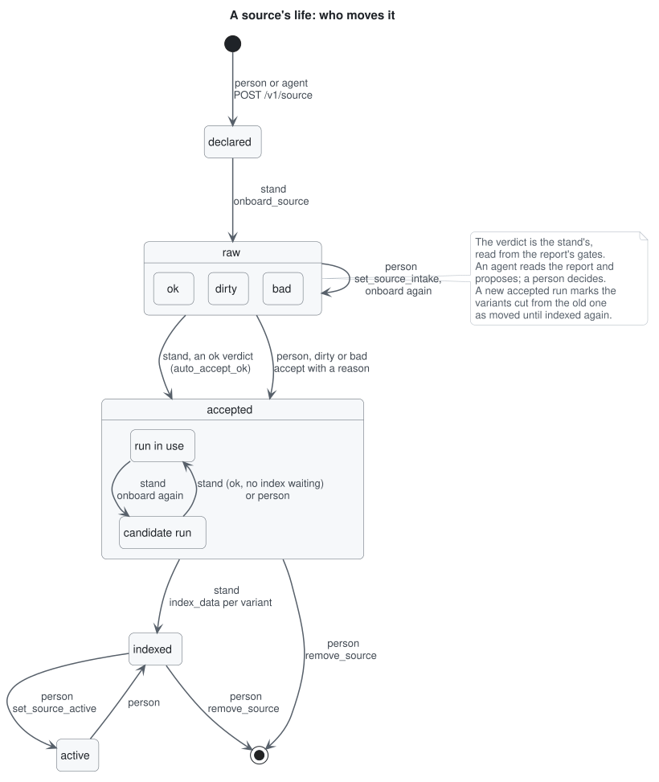
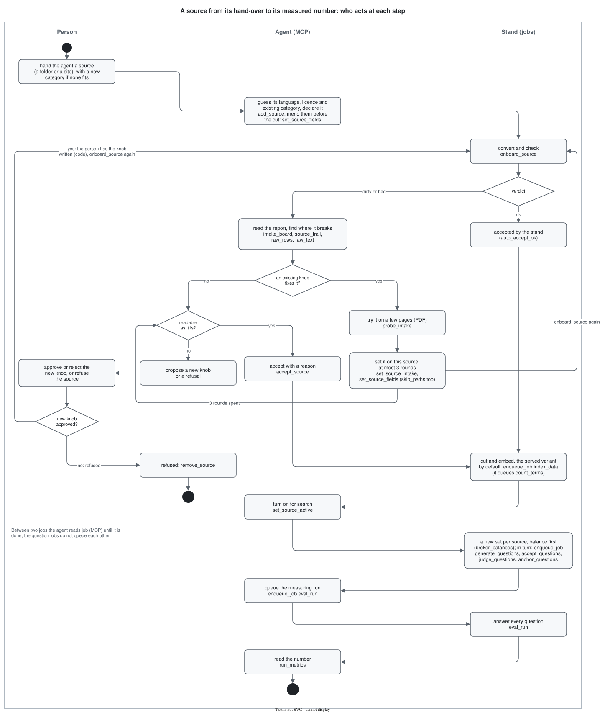

# Adding a source

A source is anything the corpus reads: a PDF book, a scan, a documentation site, a repository of markdown. This page walks one source from its declaration to questions about it, and marks at every step who acts:

- **person**: three decisions only: hands the agent a source (a folder or a site; the agent finds its language, licence and category), approves or rejects a new knob the agent proposes, or refuses the source;
- **agent**: everything else through the MCP tools (an LLM client such as Claude Code): it reads the reports, finds where a source breaks, turns the knobs that already exist on that one source and onboards it again, leaves paths out, accepts a `dirty` or `bad` source with a reason, turns it on, writes and checks its questions and measures it; a knob that does not exist yet it proposes to the person;
- **stand**: code and config, through a job in the queue.

How a file is converted and how it checks itself is in [intake.md](intake.md); this page is the path around it.



## The doors

Every step has a REST route and an MCP tool of the `rag-lab-ops` server ([mcp.md](mcp.md)); the routes are listed in [api.md](api.md).

| step | REST | MCP | who |
|---|---|---|---|
| declare | `POST /v1/source` | `add_source` | person or agent |
| onboard | `POST /v1/source/{id}/onboard` | `onboard_source` | stand (job) |
| where every source stands, by who it waits for | | `intake_board` | agent reads |
| one source in a screen | `GET /v1/source/{id}` | `source_trail`, `source` | agent reads |
| the report's rows, the converted text | | `raw_rows`, `raw_text` | agent reads |
| try a knob on a few pages | job `probe_intake` | `probe_intake` | agent |
| set a source's existing knobs | `PUT /v1/source/{id}/intake` | `set_source_intake` | agent |
| set a declared field in place | `PUT /v1/source/{id}/skip_paths`, `/markup`, `/section_roots` | `set_source_fields` (`skip_paths`, `markup`, `markup_values`, `section_root_by_path`) | agent |
| accept | `POST /v1/source/{id}/accept` | `accept_source` | agent, or stand for `ok` |
| index | job `index_data` | `enqueue_job` | stand |
| turn on for search | `PUT /v1/source/{id}` | `set_source_active` | agent |
| remove | `DELETE /v1/source/{id}` | `remove_source` | person refuses, agent calls |
| questions | jobs `generate_questions`, `accept_questions`, `judge_questions`, `anchor_questions`, `embed_questions` | `enqueue_job` | stand, set name by a person |
| measure | `POST /v1/eval/run` | `preregister`, `enqueue_job`, `run_metrics`, `close_preregistration` | stand, the promise by a person or agent |
| follow a job | `GET /v1/job/{id}` | `job`, `list_jobs`, `queue_stats` | agent reads |

`intake_board` answers "what waits for whom": every source by stage and verdict, and the ones waiting for a person, for a door or for the queue, each with its next step. `source_trail` shows one source: its stage, verdict and reasons, the files it left out and why, chunks per variant, its last jobs and what waits next.

## The path in MCP calls



The same path as one sequence for an agent; the sections below say what each step decides. Each `enqueue_job` answers a job id: read it with `job` until it is `done` rather than waiting in a loop, and read a failed one's `error` before queuing anything after it.

| # | call | what to read in the answer |
|---|---|---|
| 1 | `add_source(declaration={"name": "<name>", "folder": "datasets/inbox/books/<name>", "language": "ru", "categories": ["<category>"], "licence": "..."})` | the row, `declared`; a refusal names the field |
| 2 | `onboard_source(name="<name>")` | the job id |
| 3 | `source_trail(name="<name>")` | the verdict and its reasons; `dirty` or `bad` go to section 4 with a person |
| 4 | `accept_source(name="<name>", reason="...")` | skipped when the stand accepted an `ok` itself; a `bad` needs the reason |
| 5 | `enqueue_job(type="index_data", options={"source": "<name>", "variant": "<served variant>"})` | `lower_copies_dropped` and chunks in the job's result |
| 6 | `set_source_active(name="<name>", active=true)` | the source answers in search from here; a run over a source left off is refused |
| 7 | `enqueue_job(type="generate_questions", options={"source": "<name>", "set_name": "<set>"})`, then `accept_questions`, `judge_questions`, `anchor_questions` with the same options, each after the one before is `done` (none queues the next; generation queues `embed_questions` itself) | the pairs kept, refused and left open per job |
| 8 | `preregister(name="<promise>", ...)`, then `python scripts/preflight_grid.py` in the worker ([preflight.md](preflight.md), no MCP tool) | the promise, written before the run; the preflight's failures, each against its known reason |
| 9 | `enqueue_job(type="eval_run", options={"run_name": "<run>", "set_name": "<set>", "prereg": "<promise>", "purpose": "closing", "judge": false})`; a measurement with no promise leaves out `prereg` and `purpose` | the job id; a taken run name, a set with nothing accepted or a gold in a source left off are refused |
| 10 | `run_metrics(run_name="<run>")`, then `close_preregistration(name="<promise>", runs={"arm": "<run>"})` | `hit_at_k` with `n`, and the promise read against its bar |

## 1. Declare (person or agent)

A declaration names the source, one origin and, optionally, its language, licence and trust:

```bash
curl -X POST localhost:8000/v1/source -H 'content-type: application/json' -d '{
  "name": "react-docs", "language": "en", "licence": "CC BY 4.0",
  "folder": "datasets/inbox/git/react-docs", "categories": ["react"],
  "skip_paths": ["src/content/blog/*"]}'
```

- Origins: `urls` (files to fetch), `folder` (already on disk), `git`, `git_family`, or a site's `pages` (with the CSS `main` that holds the text and `drop` for its furniture, or a `sitemap` with address patterns).
- `skip_paths` leaves whole paths under the root out, each named in the report; `skip` matches file stems only.
- `trust` (`official`, `book`, `notes`) decides which copy stays when two sources hold a text word for word. Left out, it is read from the origin: the book shelf is `book`, the interview banks are `notes`, the rest `official`.
- Fields that replace a source-specific reader: `tags`, `tag_from_name`, `tags_by_path` and `tags_from_frontmatter` (tags in place of the file's folders), `skip_when_frontmatter` (a page whose frontmatter key holds the value is not read), `section_root_from_filename` and `section_root_by_path` (where a page's heading path starts), `markup` (`hugo` or `mdn`, rendered before the cut) with `markup_values` (the site parameters it prints). `skip_paths`, `markup`, `markup_values` and `section_root_by_path` can be set on an existing row in place; the rest go through a new declaration or the source file.
- The door refuses a malformed declaration before any job: a missing folder, an unknown category, an origin it cannot read.

The row starts `declared` and inactive. Sources the stand ships with come from `sources/*.yaml` through the same model.

## 2. Onboard (stand)

One `onboard_source` job reads every file through the engine its kind picks: markdown as it is, a PDF with a text layer and HTML to Docling, a scan to MinerU. You never choose the engine. The output is a raw folder: one markdown per file, the pieces and a report. Nothing is indexed yet.

## 3. The verdict (stand)

The report carries a verdict, `ok`, `dirty` or `bad`, computed from the conversion's signals per piece and the chunker's gates per chapter (`intake.quality` in `config/intake.yaml`).

- `ok` is accepted by the stand when `intake.quality.auto_accept_ok` is on, marked `accepted_by: auto`.
- `dirty` and `bad` wait for a person.
- A source already accepted gets the new run as a candidate beside the one in use. An `ok` candidate replaces it at once, unless an `index_data` job for that source waits in the queue: then it stays a candidate until a person accepts it. Do not queue a re-onboard and an index of the same source in one batch.

## 4. When it comes out dirty or bad (the agent fixes it, a person approves a new knob)

The agent's order of reading:

1. `intake_board`: who waits for a person, with the bad share and the top reasons.
2. `source_trail <name>`: the reasons, the files left out, the last jobs.
3. `raw_rows(name, kind="sections")`: every chapter with its words and the gates it breached (`kind="pieces"` for the conversion's signals per page range). Group the breaching words by folder: in practice the breach sits in one place.
4. `raw_text(name, file, heading)`: the converted markdown of the worst places, before the cut.

The agent tries the knobs that already exist first: `probe_intake` on the worst pages (PDF only; its job result holds the defects before and after), then `set_source_intake` or `set_source_fields` (`markup`, `markup_values`, `section_root_by_path`, `skip_paths`) on this source and `onboard_source` again, since a knob is read only by the next onboarding. At most `intake.quality.agent_knob_rounds` (3) rounds: then both doors refuse. Every knob stays on the row with the verdict it met (`knobs_tried`, shown by `source_trail` and `intake_board`), and an `ok` the stand accepts after them carries them as `accepted_after_knobs`. A source with a file under `sources/` takes its knobs in that file, so for it every knob is a person's commit. Then the agent picks one of four outcomes; only the second needs a person:

| what the breach is | what to do | door |
|---|---|---|
| a part of the source that is not text worth retrieving (a generated API reference, release notes, a blog) | leave the paths out and onboard again | `set_source_fields` with `skip_paths`, then `onboard_source` |
| a conversion defect no existing knob fixes | the agent proposes a new knob with the pages it fixes; a person approves or rejects it | a code change, then the agent's loop above |
| the source's own shape (a wide table, a tutorial that repeats its code) | accept with the reason | `accept_source` with `reason` |
| not worth the corpus | the agent proposes, a person refuses the source | `remove_source` |

A knob set on one source stays that source's. Making it a stand default is a separate decision with its own measured run ([intake.md](intake.md), "How a default is chosen").

Worked example, the corpus build of 02.10.2026:

| source | verdict | where | decision |
|---|---|---|---|
| kubernetes-website | bad | the generated API reference: every resource repeats the same block of HTTP parameters | `skip_paths` on `content/en/docs/reference/kubernetes-api/*` |
| altinity-docs | dirty | release notes, whose headings are commit links longer than the text under them | `skip_paths` on `releasenotes/*` |
| react-docs | dirty | the blog, plus tutorials that show the same code step by step | `skip_paths` on the blog, the rest accepted with a reason |
| sre-workbook | dirty | one wide table whose header repeats in every chunk | accepted with a reason |

## 5. Accept (person, or stand for `ok`)

```bash
curl -X POST localhost:8000/v1/source/<id>/accept -H 'content-type: application/json' \
  -d '{"reason": "one wide table, the prose reads fine"}'
```

A `bad` verdict needs the reason, and any reason given is kept on the row. Accepting a candidate run drops the run it replaces; the variants cut from that run read as moved in the source's `drift` until it is indexed again.

## 6. Index (stand) and turn on (person)

`index_data` cuts the accepted sources into a variant (`corpus.variants` in `config.yaml`) and embeds them. A text another, more trusted source holds word for word is dropped from this one, and the job's result names how many chunks went (`lower_copies_dropped`). Which variant search reads is `corpus.variant`, a person's choice; the source answers only once `set_source_active` turns it on.

## 7. Questions (stand, with a person's set name)

A question set has two entrances:

- the stand writes pairs: `generate_questions` asks a cloud model for an English and a Russian question per section;
- pairs written outside (by an agent, by hand) are saved as `sources/questions/<set>.jsonl` and poured in by `load_questions`.

Either way the same checks follow: `accept_questions` has a reader answer each question from its gold section by a quote and settles what it can, `judge_questions` decides what the reader left open, and `anchor_questions` ties each row to the identifiers its section holds. How a set is built and read is in [question_sets.md](question_sets.md).

## 8. Measure

A closing number is preregistered first, the preflight runs, then `eval_run` and its judge. The method is in [measurement.md](measurement.md), the commands in [use_cases.md](use_cases.md).
