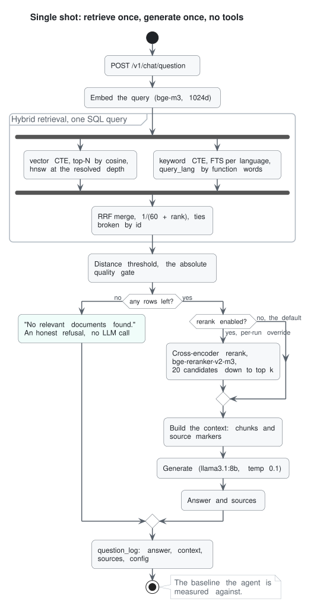
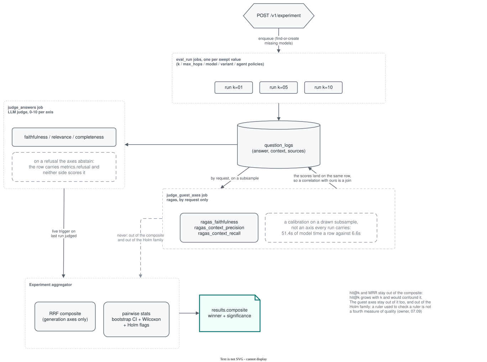
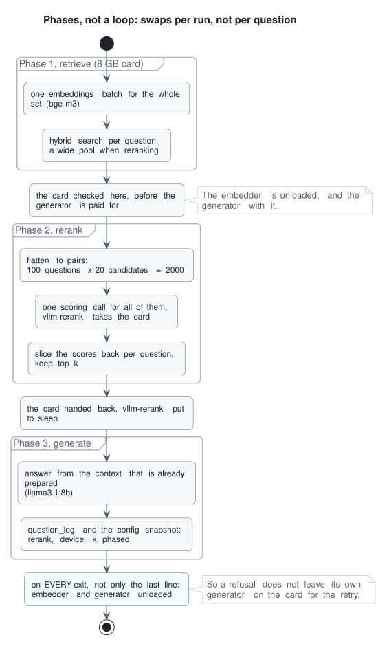

# REST API

Full interactive reference in Swagger at `/docs`.

`POST /v1/chat/question` returns 422 if a request includes an unknown field, and `POST /v1/job` refuses an unknown job type or option with 400. Neither silently ignores it.

List endpoints (`/v1/model`, `/v1/prompt`, `/v1/job`, `/v1/question-log`) share pagination: `limit` (default 100, max 1000), `offset`, `sort_by`, `sort_order` (`asc`/`desc`, default `desc`).

Health:
- `GET /liveness`, `GET /readiness` (names each role whose engine does not answer)
- `GET /v1/health/stand` shows the current state of the API, worker, GPU, models, queue and corpus configuration. It remains available during a run, so you can investigate delays without stopping the run. Main fields:
  - `code`: the code each process loaded, compared with the code on disk
  - `card`: free and total GPU memory
  - `residency`, `engines`: which models are resident and how much VRAM each holds
  - `window`: the context window the server actually serves, next to the declared one
  - `queue`: jobs counted by status, the waiting ones counted by type, `live_total`, and the first 10 live jobs with the running ones first (the full list is `GET /v1/job`)
  - `roles`: role drift between config and database
  - `corpus`, `ef_search`: the corpus variant and the search depth per variant

Chat and search:
- `POST /v1/chat/question` (full RAG answer; optional `rerank` flag; optional `language` override `ru`/`en`)
- `POST /v1/chat/fast_question` (retrieval only, no generation). Both take `filter: {category?, sources?, version?}`: a label (category, group or tag), source names, a released version of the named category (its docs plus the category's sources of no version, such as books); without a version a versioned category answers from its newest, and a version with no category, a category without versions or an unlisted version is a 422 before the search
- `POST /v1/agent/question` (agent answer; optional `max_hops`, `language`, `fallback_policy`, and `debug` for the full message trace)
- The answering endpoints do not hand over the GPU themselves. If another engine holds it, they queue a handover and return 503 with `Retry-After`. A request that needs two GPU engines returns 409. For example, chat with `rerank: true` returns 409 in the default layout, where the generator uses ollama and the reranker uses `vllm-rerank`.
- `GET /v1/categories` (the categories of `config/categories.yaml` with their group and chunk counts, `none` for chunks of no category, `only_top` for totals per group), `GET /v1/categories/tags` (tags with chunk counts, most used first; the filter takes a category, a group or a tag)

<details>
<summary>Diagram: Single-shot flow: hybrid retrieval, threshold, optional rerank</summary>



</details>

Engines and models:
- `GET /v1/engine`, `POST /v1/engine` (name, `kind` (`ollama`/`vllm`/`openai_compatible`/`converter`), `env_prefix`, `placement` (`gpu`/`cpu`/`gpu+cpu`/`remote`); a vLLM on the GPU without sleep routes is a 422), `PATCH /v1/engine/{id}` (`placement`, a 409 while the server runs where the row said, and a cloud's `balance_reader`), `GET /v1/engine/{id}/live` (asks the engine itself, in seconds), `DELETE /v1/engine/{id}` (409 while models point at it). The response shows the address resolved from the environment; a prefix with no address is a 400 before the row is written.
- `GET /v1/engine/balances` (each cloud engine's balance as its broker reports it)
- `GET /v1/model`, `GET /v1/model/{id}`, `POST /v1/model` (`engine` by name or `engine_id`; required on the default stand, where the seed registers two ollama engines, `ollama` and `ollama-cpu`; an engine that pulls gets a pull job, one that does not is asked whether it already serves the name: `ready`, 422 if it serves another, 503 if it does not answer), `PATCH /v1/model/{id}` (`quant` and the hub key of the `weights` when the server cannot say them, the `answer_parser`, and `options` of its own over the role's), `POST /v1/model/{id}/load` (202 with the queued `hand_card` job, and a load already waiting answers a second ask with its job; 422 when a vLLM serves another model, 409 for a vLLM on the processor), `DELETE /v1/model/{id}` (501 on a remote engine; 409 if the model is assigned to a role, shares its weights with another row, or is served by a running vLLM). One name may live on two engines, so the list and the response name the engine, along with `quant`, `size_bytes` and the weights row, all read off the server on the pull rather than typed.
- `GET /v1/role`, `PUT /v1/role/{role}` (assign a model to a role; the model is asked whether it can do the job first, and a 400 says what it lacks. An asleep vLLM with no tool-call probe recorded answers 202 with a `hand_card` job that wakes it, probes it and then seats the role; an engine that does not answer is a 503. `anyway: true` insists, which is how a model the server describes wrongly is still seated)
- `GET /v1/source?stage=&limit=&offset=` (a page by name, 100 by default), `PUT /v1/source/{id}` (enable/disable a corpus source; disabled sources are excluded from retrieval at runtime, no re-index - ablation / source-of-truth scoping; `stage` filters by declared, raw, accepted)
- `POST /v1/source` (declare a source to add: a name, one origin, and optionally its language and licence, a reader, its rules and its own questions, `skip_paths` (path patterns under its root left out whole at onboarding and at the index, each named in the raw report), `waived_gates` (chunker gates the source's shape breaks by nature, as a reference manual's one-line entries: its raw report does not count them and names them on each chapter), and `trust` (`official`, `book` or `notes`, read from the origin unless named) which decides the copy that stays when two sources hold a text word for word; the whole declaration is kept on the row; origins: `urls`, `folder`, `git` or `pages` with the site's `main`/`drop`/`generated`/`release` (the product's release keys the pages and its category must list it), or a site's `sitemap` with `include`/`exclude` address patterns in place of the list; `release_page` with `release_pattern` reads the release from the site on every intake, needs exactly one category, and the index keys the pages by the release the accepted run fetched; never an engine; it starts declared and inactive; a `folder` outside the stand, missing or empty is refused here, not in the queue, and so is what the index could not read, as the seed refuses it in a source file: a reader no class names, a category that is no row of the map, several categories with no `category_by_path`, versions or a site release the map does not list), `GET /v1/source/{id}` (one source with its stage, its declaration, what its raw conversion said and whether its declaration moved since a variant was cut, with the fields that moved named per variant in `drift.changed`), `POST /v1/source/{id}/accept` (raw to accepted, or an accepted source's waiting new run to the accepted one, whose replaced raw folder is deleted and whose indexed variants read as moved in `drift` until the source is indexed again; or done by onboarding itself for an `ok` verdict when `intake.quality.auto_accept_ok` is on, marked `accepted_by: auto`; `reason` required when the raw verdict is bad and kept on the row, refused while an onboard of it waits or runs; the source stays out of search until `PUT /v1/source/{id}` turns it on; the index reads accepted rows only, and `PUT /v1/source/{id}` refuses `active: true` below accepted), `DELETE /v1/source/{id}` (the source, its chunks in every variant and the stand's own folders of it; refused while a job reads it or questions have their gold in it), `DELETE /v1/source/variant/{variant}` (a variant's chunks in every source; the searched variant refused), `POST /v1/source/{id}/onboard` (queue `onboard_source` for a source at any stage; an accepted source's run goes beside the accepted one as `raw.candidate`, search keeps the accepted run until the new one is accepted, and a run with the same files, settings and route as the accepted one does nothing; `settings` per engine, optional; refused while that source's job waits or runs), `PUT /v1/source/{id}/intake` (the source's own intake knobs over `config/intake.yaml`: `settings` per tool, `mono_faces`, `mono_spread`, `reread_below_layer_f1`, `reread_settings`, `reread_cells_slack`, `splice_tables`, `seam_window`, `seam_margin`, `epub_skip`, `headings_by_number`, `man_page_titles`, `listing_callouts`, `mono_by_step`, `code_row_rules`, `outline_levels`, `html_one_title`, `epub_chapters`, `numbered_levels`, `decode_entities`, `drop_lone_pipes`, `join_layer_hyphens`, `restore_dashes`, `join_broken_words`, `unescape_bullets`, `unescape_underscores`, `picture_addresses`, `formula_text`, `demote_caption_headings`, `drop_running_headings`, `join_split_words`, `drop_inherited_members`, `drop_repeated_code`; read by its next onboarding; an empty body clears them; refused while its job waits or runs, or when the seed writes the row from a source file, where the knobs go in the file's `intake:` block), `PUT /v1/source/{id}/skip_paths`, `PUT /v1/source/{id}/markup` (`markup`: `hugo` or `mdn`, with `values`, the site parameters its markup prints such as `{"version": "v1.37"}`) and `PUT /v1/source/{id}/section_roots` (a book's heading root by file glob, where a converter read cover text as the first heading) set those declared fields on the row in place for the next onboarding or index; an empty value clears one, a field the declaration refuses is a 400, and the MCP `set_source_fields` sets the same fields

Prompts:
- `GET /v1/prompt`, `GET /v1/prompt/{id}`, `POST /v1/prompt`, `POST /v1/prompt/{id}/activate`, `DELETE /v1/prompt/{id}`

Eval platform:
- `POST /v1/eval/paraphrase` (generate a paraphrase set), `POST /v1/eval/run` (run a set → judge; `category`, `sources` and `version` scope the search as the chat doors do, single_shot only; `pipeline: single_shot|agent`, per-run `rerank`, `k` retrieval-width, `max_hops`, `fallback_policy`, `gate_signal`, `weak_distance`, `topic_threshold`, `orchestrator`, `variant` (which cut of the corpus the run reads) and `model` (generator) overrides, `judge: false` for a run whose number is read by a rule rather than by a score (a retrieval delta, a string match): no judge job follows it, and its rows carry `judge_wanted: false`, so the sweep leaves them alone while `judge_answers` named on that run still judges them, plus `allow_cpu` for a run that means to measure the processor; config only sets the defaults)
- `POST /v1/eval/experiment` (batch a parameter series: `param` (`k`, `max_hops`, `model`, `variant`, `orchestrator`, `fallback_policy`, `gate_signal`, `weak_distance` or `topic_threshold`) swept over `values`, one auto-named run per value, each judged; set/pipeline/language stay fixed for a clean single-variable comparison; a `model` value absent from the registry is created and pulled, the run waits for it)
- `GET /v1/eval/misses?run_name=X` (retrieval misses for a run: in-corpus questions where the expected source was not retrieved, with expected vs retrieved)
- `GET /v1/eval/compare?runs=A&runs=B` (arms side by side split by pool: in-corpus, out-of-corpus, off-domain, rejected; per arm the judged axes, how often the answer came from a remote tool against the corpus, how often the coverage gate fired, latency avg/p50 and the outcome histogram; per pair of arms a paired Wilcoxon plus a bootstrap interval over the same questions, so a difference is reported with its size and its uncertainty instead of two averages; and the code each arm's rows were written by, with a flag when the arms did not share one)
- `POST /v1/questions/import` (upload a questions file, ≤5 MB; optional chained run)
- `GET /v1/questions?set_name=&language=&pool=&limit=&offset=` (the questions themselves, one row each: id, pool, text, reference and marked sources; where a run's `question_ids` come from)
- `DELETE /v1/questions/set/{set_name}` (a set with its questions; 409 while the verdict names it, a job reads it, answer logs hold its questions, or another set is drawn from it)

<details>
<summary>Diagram: Eval pipeline</summary>



</details>

A run processes questions in phases rather than completing one question at a time. Each phase uses the GPU exclusively, which makes bulk reranking practical. Processing a question end to end requires the embedder, reranker and generator, which do not all fit in 8 GB of VRAM. Previously, ollama evicted and reloaded a model for every question. Phased processing needs only a few model swaps per run, and releases the GPU when the run ends. This also prevents queued runs with different generators from holding two models on the GPU at once. The reranker can process a batch: 100 questions took 31 seconds on the GPU, compared with about 16 minutes on the CPU. That is 310 ms per question for the whole rerank phase, model loading included. Reranking itself took 86 ms ([the entry](experiments/2026-08-29_generator-grid-4b-against-8b.md)).

<details>
<summary>Diagram: Phases inside one eval run</summary>



</details>

Measured on 100 questions with reranking on: **2092s → 652s (3.2x)** while `hit@5` and `MRR` stayed identical to the third decimal. Most of the win did not come from batching, it came from noticing that the GPU was never actually released between phases, so ollama had been loading the generator as 26 layers of 33. The full story, including what the batch alone did *not* buy, is in [the journal entry](experiments/2026-08-24_phased-eval-runs-and-the-empty-cache.md).

Experiments (first-class entity over the raw sweep route):
- `POST /v1/experiment` creates the experiment and queues its series of runs. The experiment records the dataset, a sample drawn deterministically from a seed, a snapshot of the procedure and the varied parameter.
- `GET /v1/experiment` (filtered list), `GET /v1/experiment/{id}` (the raw record), `GET /v1/experiment/{id}/report` (the report the MCP `experiment_results` reads: arms, judges and paired deltas, without halves and seeds; `pair` keeps one), `PUT /v1/experiment/{id}/conclusion`
- `POST /v1/experiment/{id}/arms` works on a rejudge only. It copies more arms of the same answers and judges them again, and the experiment goes from `aggregated` back to `running`. Arms are named one by one, not as a grid. The row cap counts the rows the experiment already holds. An arm added later uses the sample, the control size and the seed the experiment was created with.
- The states and the statistics in `results` are described in [Experiment states](#experiment-states) and [Significance statistics](#significance-statistics) below.

One call asks the bench a question; generation, judging and aggregation happen in the background. Questions you can ask this way:

```bash
# "How many chunks should I feed the generator?" - retrieval width sweep
curl -sX POST localhost:8000/v1/experiment -H 'Content-Type: application/json' -d '{
  "name": "k_sweep", "dataset": "paraphrased_ru", "sample_size": 100,
  "pipeline": "agent", "language": "ru", "param": "k", "param_values": [1, 3, 5, 7, 10]}'

# "Does a bigger generator earn its cost on my corpus?" - model A/B
# (a model missing from the registry is pulled automatically, the run waits)
curl -sX POST localhost:8000/v1/experiment -H 'Content-Type: application/json' -d '{
  "name": "model_ab", "dataset": "paraphrased_ru", "sample_size": 100,
  "param": "model", "param_values": ["llama3.1:8b", "gemma2:9b"]}'

# "Do extra agent hops pay off?" - hop-cap sweep on a cheap 10-question sample
curl -sX POST localhost:8000/v1/experiment -H 'Content-Type: application/json' -d '{
  "name": "hops", "dataset": "paraphrased_ru", "sample_size": 10, "sample_seed": 42,
  "pipeline": "agent", "param": "max_hops", "param_values": [2, 4, 6]}'

# "Is the judge reading the answer, or itself?" - a rejudge, where the answers are held
# still and only the judge moves. Arms are copies of one recorded run, so the corpus, the
# retrieval and the generator cannot differ between them; the only axes are the judge model
# and the versions of its three prompts, plus `repeat`, which changes nothing and names a
# repetition. The delta of two `repeat` arms is the judge's own noise
curl -sX POST localhost:8000/v1/experiment -H 'Content-Type: application/json' -d '{
  "kind": "rejudge", "name": "judge_noise", "source_run": "grid_gemma3_4b_ru_plain",
  "param": "repeat", "axes": {"repeat": [1, 2]}}'
```

`control_sample: N` judges the axes the arm does not move on N rows only, drawn by question
with the experiment's own seed, so a repeat costs a third of the GPU time and the axes that
carry the measurement still read every row. The rows outside the sample are marked skipped
rather than left owed, which is one-way: only a hand-built `log_ids` job reaches them again.

A rejudge answers a question the other kinds cannot: how much of a difference between two
runs was the judge rather than the answer. Nothing is generated, so an arm costs a judge
pass and no GPU time for the generator. The report drops the RRF composite (retrieval
metrics are identical across arms by construction) and gives per-arm means, paired deltas
over bootstrap seeds for every pair while the grid holds `PAIR_EVERY_UP_TO` arms or fewer (`use_cases/rejudge.py`) and
first-against-the-rest once it does not, the A/B halves, and an `answers_digest`
per arm beside the source's, so "the arms judged the same answers" is a fact of the record
rather than a claim in its description.

### Experiment states

An experiment moves `draft → running → aggregated → concluded`, or ends in `failed`. When the last
judge job of the series finishes, the aggregator computes the metrics per value and stores them in
`results`. It also computes an RRF composite over the three judged axes, the off-domain
refusal rate and the supported rate. Retrieval hit@k and MRR are reported per value but kept out of
the composite, because hit@k grows monotonically with `k` and would confound it.

### Significance statistics

`results` carries **paired significance statistics**, not only point estimates. The winner is
compared with every other value on each axis, and each comparison reports:

- the mean paired delta (the same question in both runs);
- a bootstrap 95% CI (`evals.stats.bootstrap_n` resamples, the same resampling the whole stand uses);
- a Wilcoxon signed-rank p-value;
- Holm step-down flags over the test family that the record itself names.

So the JSON says which differences survive multiple-comparison correction, and against which family
they were corrected. In the example response further down, `5_vs_10` on faithfulness has a mean delta
of 0.19, a CI of [-0.17, 0.57] and p = 0.37, and `significant_holm` is false.

## The queue

Any job type can be queued through one endpoint: `POST /v1/job` with `{"type": ..., "options": {...}}`.
This endpoint and every endpoint that queues a job of its own (`/v1/eval/*`, `/v1/source/{id}/analyze`)
answer with the whole job record: `job_id`, `type`, `queue`, `status`, `options`, `parent_id`, `apply_since`,
`created_at`. `parent_id` is the job whose handler queued this one, or null. Once a worker claims a job, the record also carries `code`: the code version of the
worker process that took it. Whether a series of runs shared one code version is then a query, not a
manual comparison of container start times with file dates. A finished job whose handler returns a
summary keeps it in `result`: `index_data` the sources it read and refused, `probe_intake` each
side's defect counts.

A failed job's `error` carries a `kind`: `refused` (the options were refused when the worker took the job), `no_handler`, `final` (the handler said retrying will not help), `exhausted` (retries ran out), `deferred_out` (it waited past the ceiling for what it needs) and `worker_died` (the worker stopped under it more than `MAX_RECLAIMS` times over its life). A job waiting out a retry or a deferral says why in `options.waiting_because`: `kind`, `error` and `retry_at`.

The worker and the cancel announce each finished job on the postgres channel `job_finished` (payload: `id`, `type`, `status`, `run_name`). `scripts/wait_jobs.py <id...>` (or `--line` for every job active when it starts) listens on it and prints one JSON line per job as it finishes, re-reading the rows when no notice comes. `scripts/restart_worker.sh` restarts the worker between jobs: it pauses the waiting line, waits for what runs, restarts and resumes the same jobs; `--then-queue FILE` then queues the JSON lines jobs of FILE behind them, so no waiter has to follow the restart. Every worker log line carries `job_id` and `job_type`.

What each type accepts is defined by a model per type in `app/job_specs.py`. The options are checked
when the job is queued, whichever endpoint or script queues it, and again when the worker takes it.
A record written straight into the table gets the same refusal. A separate endpoint exists for work
done before the job is queued, not for validation: `/eval/rejudge` copies a run, and
`/eval/guest-axes` answers based on a property of the runtime. The queue lane is set by the job type,
not by the endpoint that queued it.

An `eval_run` with `purpose: closing` names the preregistration it was made under (`prereg`). The
queue refuses a name that the database does not hold. `smoke` (the default) and `probe` need no
preregistration.

A worker whose code differs from the code on disk still claims its jobs. It writes the mismatch onto
each job record and logs it once. Refusing to claim would turn an edit made during a batch into a
queue that looks idle. The `code` field has two readings:

- `code.differs`: the tree on disk changed beside the running worker. This is a hygiene signal.
- `code.loaded_differs`: the files the worker imported that changed since it started, or `null` if
  none did. This one decides whether passes ran the same code.

The worker version is computed from file contents, so a checkout that restores the same content
changes nothing. The field says "differs" rather than "older", because a reverted tree is as much of
a mismatch as an edited one. A client reading a series should check `code.loaded_differs` on each
job, see which passes shared one code version, and decide which runs to drop. The stand does not
make that choice for it.

Every type the queue knows, what it does and what it takes:

| type | what it does | the options it reads | roles it takes the GPU for | where the result lands |
|---|---|---|---|---|
| `pull_llm_model` | pulls weights into an engine | `name`, `engine_id` | none (io lane) | the model row goes `ready` |
| `delete_llm_model` | removes weights from an engine | `name`, `engine_id` | none (io lane) | the model row |
| `index_data` | cuts the accepted sources, all or the one named, into a corpus variant and embeds them | `variant`, `source` | embedding | `data_chunks` of that variant; a chunk whose text is unchanged keeps the vector the same embedder already made; the job's `result`: sources read and refused, `phases` per source (`chunks`, `reused`, `embedded`, `cut_s`, `embed_s`, `write_s`), and `lower_copies_dropped` when a text another, more trusted source holds word for word was taken out of this one |
| `build_vector_index` | builds the hnsw index of a variant | `variant` | none | the index |
| `analyze_source` | reads one source and reports its ingest quality | `source`, `variant`, `mode` | none | `data_sources.ingest_quality` |
| `convert_source` | turns PDF, image or HTML files of the converter bench into markdown through one converter tool, or with `intake` through the corpus's own reading path (route, seams, reread, join), over page ranges of store files and with each input's source knobs | `settings`, `language`, `inputs`, `out`, `intake`, `root`, `pages`, `pages_per_chunk`, `sources`, `knobs` | none; it takes the GPU for the engine that runs the settings' tool | `datasets/converter_gold/files/runs/<out>/`, with `record.json` |
| `onboard_source` | turns a source into a raw one: each file through the engine its route picks (markdown as it is, a page without a text layer to MinerU, the rest to Docling), a suitability report without a gold (the conversion's signals a piece, the chunker's gates a chapter of each file whole; bad when the breaching share of text passes `intake.quality.bad_share`), the source marked `raw` with its verdict and reasons; nothing is indexed; an accepted source keeps its stage and gets the run as `raw.candidate`, and a run with the files, settings and route of the accepted one does nothing, answering `unchanged` with `refetched: false` when it read a git or url source's kept inbox rather than a new copy of the upstream | `source`, `settings`? (per engine, defaults in `intake.settings`), `fresh`? (every piece read by its tool again, no kept reading and no kept piece; stamped in the run's record, for a measure of the tool) | none; it takes the GPU for each converter it needs | `datasets/raw_sources/<source>@<settings hash>/` (markdown, Docling JSON, `record.json`, `provenance.json`) and a `raw_source` measurement; a markdown-only source is read from its own tree (`raw.root`) |
| `probe_intake` | reads pages of a source's PDF twice, with its own knobs and with the probe's over them, and scores each reading against the text layer with the checker; the source is not changed | `source`, `pages` ([first, last]), `knobs`, `file`? (for a source of several PDFs) | none; it takes the GPU for each converter it needs | the job's `result`: each side's defect counts and their totals |
| `generate_questions` | writes a source's question pairs from its sections: each section with pairs to ask is one call; a pair is kept only when its evidence is the section's own words, both questions are in their language and neither repeats the heading, and is written as two rows sharing a `pair_id` and the section's exact `gold` | `source`, `set_name`, `languages`?, `max_pairs`? (caps a probe), `kept_at_least`? (a smoke: sections in the cap's order until this many pairs are kept) | `questioning` (a cloud model); no GPU, the `io` lane, beside a converter | the job's `result`: pairs asked and kept, questions written, the prompt's version and hash, whether the source is under `evals.question_set.min_pairs`; the set's report in `datasets/measurements/` |
| `accept_questions` | reads a set's candidate pairs of one source: each question is answered from its gold section by a quote, without the generator's answer, a long section read in windows until one answers; a pair is refused when both halves find no answer, accepted when both quotes hold the evidence's words (`EVIDENCE_HELD`), and otherwise stays a candidate for the judge; each row keeps `answerable_by_reader` and `acceptance_why`, and a pair already read is skipped | `source`, `set_name`, `max_pairs`? (caps a probe), `again`? (asks the read pairs once more), `settle`? (false reads the whole set and reports without writing, to compare two passes), `every`? (reads the settled pairs too and settles them again, after the reader or its reading changed) | `accepting` (the grader's model with room to quote); the card | the job's `result`: pairs by outcome, questions by language, reasons, the set's accepted pairs and whether it is under `evals.question_set.min_pairs`; the rows in `datasets/measurements/` |
| `judge_questions` | judges the pairs acceptance left undecided: each half is shown its question, its evidence and the passage around it (`AROUND_WORDS` each side), and the judge says YES or NO; a pair is accepted when both halves are answered, refused when neither is, and otherwise stays a candidate; the status and `acceptance_why` move, the reader's `answerable_by_reader` stays | `source`, `set_name`, `max_pairs`? (caps a probe), `settle`? (false reports without writing), `every`? (reads settled pairs too), `model`? (a second judge over the role's own; a cloud one takes no card) | `judging` | the job's `result`: pairs by outcome, the judge's word by language, the set's counts; the rows in `datasets/measurements/` |
| `reparse_questions` | reads a generation's stored replies again with today's checks and writes the pairs they now hold, beside the set's own: a pair on evidence the set already quotes is refused as a repeat, and a section the export no longer holds is counted, not read; no model is asked | `source`, `set_name`, `report` (the file name of the set's `question_set` report in `datasets/measurements/`) | none | the job's `result`: pairs kept now, questions written, repeats dropped, sections gone |
| `anchor_questions` | gives a set's rows their `anchors`: the identifiers a question names by their shape (`_`, a dot between letters, `()`, `--`, a digit among letters, a case change inside, backticks) that its gold section holds, each with the number of the source's sections that hold it; generation and `reparse_questions` write the same column by the same rule | `source`, `set_name` | none | the job's `result`: rows anchored, rows with none, rows whose section is gone |
| `reanchor_questions` | moves a set's golds whose section the index no longer names to the section of the same file with the same leaf heading that holds the question's evidence, after a cleanup renamed the page's root; a gold with no such section, or with several, is left as it was; `dry` only counts | `set_name`, `variant` (the served one if left out), `dry` | none | the job's `result` and a `question_reanchor` record: questions moved (by leaf, or by the evidence alone where a re-read file respelled its headings), file gone, leaf gone, ambiguous, each section moved and each gold left with its question ids |
| `save_questions` | writes a generated set to `sources/questions/<set>.jsonl` beside the source files: each question's text, language, gold, reference answer, evidence and pair, so the set is generated once | `set_name` | none | the job's `result`: questions saved and the file |
| `load_questions` | pours a saved set back into the base on a later intake, every row a candidate for acceptance and the judge to read again, anchors read by today's rule; a pair whose section the export no longer holds is counted, not written | `source`, `set_name` | none | the job's `result`: questions written, repeats dropped, pairs of gone sections |
| `embed_questions` | embeds every question still without a vector of the current embedder | none | embedding | `questions.embedding` |
| `paraphrase_questions` | writes paraphrases of a set | `limit`, `source`, `set_name`, `seed`, `per_source`, `grow`, `originals` | paraphrasing | new questions of the paraphrased set |
| `build_veto_set` | builds the veto set from a source set | `seed`, `set_name`, `variants`, `cut_from`, `quotas` | paraphrasing | the veto question set |
| `eval_run` | answers a set through a pipeline and records a row per question, then queues the judge unless `judge: false` | the run's whole snapshot (`run_name`, `set_name`, `pipeline`, `k`, `grade_chunks`, `judge`, …) | generation, embedding, reranking | `question_logs` of that run |
| `judge_answers` | scores our three axes over a run's rows | `run_name`, `log_ids`, `sweep`, `judge_width`, `judge_model`, `judge_prompts`, `control_axes`, `control_sample`, `control_seed` | judging | verdicts on the rows |
| `judge_guest_axes` | scores the standard's axes over a subsample | `run_name`, `sample`, `seed`, `log_ids`, `judge_width`, `messages`, `guest_model` | ragas, ragas_embedding | guest verdicts on the rows |
| `judge_language` | restates a row in two languages and scores both | `run_name`, `rows`, `log_ids` | judging, generation | a measurement file |
| `compare_retrieval` | measures a grid of retrieval arms of one experiment | `experiment_id` | reranking | the experiment's `results` |
| `grade_candidates` | grades frozen candidates chunk by chunk, no generator and no judge | `candidates` (the frozen file), `form`, `top`, `limit`, `sample`, `seed`, `shuffle`, `prompt_version`, `name` | grading | a measurement file with a verdict and its probability per chunk, and the curve of both arms over the cuts |
| `check_mcp_health` | asks a remote integration whether it answers | `integration_id` | none (io lane) | the integration's health |
| `hand_card` | wakes an engine, probes it and seats a role | `engine_id`, `model`, `seat` | the seat it hands | the GPU and the role's database row |

To judge a run in place: `POST /v1/eval/judge` with `{"run_name": "<run>"}` queues our three axes
over the rows that still owe them, and refuses with 404 when the run holds no answered row or owes
nothing. `POST /v1/eval/guest-axes` queues the standard's axes over a run, and takes `sample` and
`seed`: the guests cost several times our three axes a row, so they calibrate on a drawn
subsample rather than riding every run. They ride the same judging pass and land on the same row,
so a correlation between the two is a join rather than a comparison of two copies, and they stay
out of the composite and out of our axes' Holm family: a ruler used to check a ruler is not a
fourth measure of quality. `POST /v1/eval/language-probe` restates a row's own answer
in two languages and scores both against the same context, which asks whether our faithfulness
prompt loses a point on Russian. To re-judge one run without making an experiment of it: `POST /v1/eval/rejudge` with
`{"source": "<run>", "run_name": "<copy>"}` copies the answers under a new name with the
verdicts cleared and queues the judge over them.

When the series is judged, `GET /v1/experiment/{id}` returns per-value metrics and a composite verdict:

```json
{
  "status": "aggregated",
  "results": {
    "per_value": {"5": {"faithfulness": 7.18, "relevance": 8.9, "completeness": 6.16, "hit_at_k": 0.9, "mrr": 0.757}, "...": "..."},
    "composite": {
      "method": "rrf", "winner": "5",
      "ranking": [{"value": "5", "rrf": 0.0487}, {"value": "10", "rrf": 0.0484}],
      "pairwise": {
        "comparisons": {"5_vs_10": {"faithfulness": {"mean_delta": 0.19, "ci95": [-0.17, 0.57], "p": 0.36692741, "n": 100, "holm_threshold": null, "significant_raw": false, "significant_holm": false}, "...": "..."}},
        "method": "holm", "alpha": 0.05, "tests": 15, "family": "every pair of the grid on every axis",
        "population": "every row of both runs that pairs by question_id, all pools blended: ..."
      },
      "rows_by_population": {"in_corpus_and_answered_in_every_arm": 91, "by_run": {"...": "..."}}
    }
  }
}
```

The pairwise block is what separates a result from noise: an early version of this bench "concluded" k=5 beats k=10 from a composite-score gap in the third decimal - the paired test shows that comparison is a coin flip (p=0.37), and the corrected flags mark which of the 15 grid tests survive at all. See [docs/experiments.md](experiments.md) for the cases where this reversed our own verdicts.

Before a grid starts, `scripts/preflight_grid.py` refuses the ways a run silently stops meaning
anything: an edited tree, a worker running yesterday's code, a model that spilled to the CPU, a
corpus that no longer cuts into the rows it holds, a search depth the planner has quietly stopped
walking the index at. `--verify` checks a finished run instead. Every one of those failures produces
a completed run with plausible numbers and no error anywhere, which is why the check exists rather
than a test. What each check refuses and which incident put it there:
[docs/preflight.md](preflight.md).

Record the takeaway with `PUT /v1/experiment/{id}/conclusion` and the experiment becomes a self-contained artifact: what was varied, on what data, the numbers, the verdict.

Observability:
- `GET /v1/question-log`, `GET /v1/question-log/{id}` (the row carries what it was asked and what it read: `question_text`, and on the detail row the `context` it was given. Filters incl. `pipeline`, `faithfulness`/`relevance`/`completeness`, `run_name`; and over the recorded snapshot: `rerank`, `rerank_device`, `phased`, `empty_retrieval`, `max_distance`, `answered_via_remote` - so "show me every answer where the corpus returned nothing" is one request; detail with context)
- `GET /v1/job/stats` (the queue in one screen, as the MCP `queue_stats`: waiting by type, `deferred` (waiting jobs backing off a retry or a deferral), `paused`, running, finished in `window_minutes`, means over the last day and the waiting priced at them), `GET /v1/job`, `GET /v1/job/{id}` (jobs + elapsed; filters incl. `type`, `status`, `parent_id` and `run_name`, which the MCP console could already do and the route could not), `POST /v1/job/{id}/cancel` (cancels the job and its dependent judge). A running job stops between rows: an eval run, a retrieval comparison and all three judging passes read the cancellation, and a judging pass that was cancelled does not queue its next sweep
- `POST /v1/job/cancel` (cancel a whole run or job type at once: cancelling id by id through a paginated listing is how a supposedly stopped eval quietly kept running). A `type` with no `run_name` is refused with 400 unless the call also passes `every: true` and means it. Either door takes a run's judge down with the run. The body can also carry `ids`, `parent_id` and `status` (a list, to cancel only waiting or only running jobs), and `dry_run: true` answers `would_cancel` with the ids and cancels nothing
- `POST /v1/job/pause` and `POST /v1/job/resume` (the same body as the cancel: `run_name`, `type`, `ids`, `parent_id`, `every`, `dry_run`). A pause holds waiting jobs only: they take the status `paused`, keep their ids and order, and the worker passes them by until a resume returns them to `new`. Dry runs answer `would_pause` and `would_resume`

The complete reference is Swagger at `http://localhost:8000/docs`; the scenarios that use these routes are in [use_cases.md](use_cases.md).

## What two arms must share

A difference between two arms is read only after the comparison has checked that both were measured
by one instrument. `GET /v1/eval/compare` (and the ops tool `compare_pools`) answers each check with a
field. For the first nine rows, the judge and retrieval, `residency.read_this_first` names the first
that failed, in this order; the last five are named by their own fields. Arms must also share their
questions: a run that cannot be paired question by question is a 409.

| What must match | Field in the report | What a mismatch means |
|---|---|---|
| the judge's engine, by name | `residency.one_engine_name` | not comparable: two engines take the same host and port in turn, and only the name tells them apart |
| the judge's engine, by address | `residency.one_engine` | not comparable: batching, kernels and quantisation all differ |
| retrieval: the same sources in the same ranks on shared questions | `residency.one_deterministic` | the pipeline changed underneath the arms, unless retrieval is the treatment |
| the judge's prompt version per axis | `residency.one_judge_prompt` | two rulers: the contrast measures the prompt |
| the parser that cut the judge's reply | `residency.one_judge_parser` | the scores were read from different texts |
| the rule the judge's JSON was decoded by | `residency.one_judge_grammar` | the contrast measures the grammar ([17% of verdicts moved](experiments/2026-09-13_the-judge-that-looped-on-whitespace.md)) |
| the judge's temperature and seed | `residency.one_judge_sampler` | the contrast measures the sampler |
| the judge's output budget | `residency.one_judge_budget`, `judge_cut_by_run` | matters only where a verdict ended on the limit |
| the judge's residency, one load of the model | `residency.one_residency`, `remote_judge` | across a reload the pair needs its own floor; a remote judge has no residency at all |
| the model client of the answering path | `pools.*.pairs[].isolates_orchestrator` | the pair changed the client as well as its treatment |
| the generator's repetition penalty | `one_answering_penalty` | the contrast also measures the penalty ([1.05 against 1.1](experiments/2026-09-13_the-penalty-nobody-asked-for.md)) |
| the answering engines | `answering_engines_by_run` | named, not refused: two generators on two engines is what a pair of arms is for |
| the broker key of a cloud role | `residency.one_broker_key` | one instrument billed to two accounts: the money is read per key |
| the rule outcomes are read with | `outcome_rule` | refusal shares read with another rule differ ([rule 2](experiments/2026-09-13_a-refusal-the-rule-could-not-read.md)) |

All of these passing is necessary, not sufficient: two arms with identical rows, order and prompt
still differed on 4 of 50 rows, so a pair is read against its own floor rather than against a zero.
A rejudge adds `same_answers`, which says the arms scored byte-identical answers.

## The order jobs run in

The worker runs one thread per lane (`WORKER_QUEUES`, by default `default,io`), and each thread takes
the next job of its own lane by these rules, top to bottom:

| Rule | What it does | Where it lives |
|---|---|---|
| the lane | model pulls and deletes, the MCP health check and `generate_questions` go to `io`, every other type to `default`, so a download never waits behind a run | `job_specs.LANES` |
| the priority | `hand_card` goes first, every type next, and the judges (`judge_answers`, `judge_guest_axes`, `judge_language`) last, since they wait for the runs they judge | `job_specs.PRIORITY` |
| the wait | a job that has waited longer than the limit rises ahead of everything but a handover | `job_specs.STARVED_AFTER_MINUTES` |
| the time | within one rank, the earlier `apply_since` goes first: when the job was queued, or when a retry or a deferral set it | `job_queue._turn` |
| a retry | a job that fails with anything but a final error runs again up to the attempt limit, each retry later than the one before | `worker.MAX_ATTEMPTS` |
| a deferral | a job waiting for what it needs is set back by the delay it names, up to a limit in all, then fails | `worker.MAX_DEFERRED_SECONDS` |
| a restart | a worker coming up returns its own running jobs to the queue, so a restart loses at most the call in flight | `job_queue.requeue_stale` |

To move a job that has not started, cancel it (`POST /v1/job/{id}/cancel`) and queue it again: it takes
a new place by the rules above. A job that holds its lane holds it to its end, so a cloud pass slowed
by its broker keeps every other `default` job waiting behind it.
