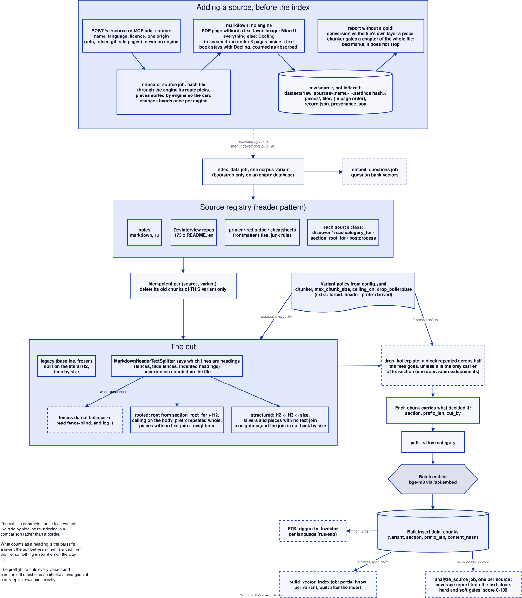

# Design notes

Why the agent and the corpus are built the way they are. Every claim here was measured in an entry of the [experiment journal](experiments.md), and the numbers live in those entries, not here; values the stand uses are in `config.yaml` and `config/`.

## Corpus-first: when the agent is allowed to look outside

Handing an 8B model a toolbox and hoping it prefers the local corpus is not a policy. `fallback_policy` makes the order explicit and, more importantly, measurable:

- `corpus_first` (default) - the run starts with `search_corpus` alone. External tools are not in the schema and `dispatch` refuses them by name, so a hallucinated tool call cannot leak out. The moment a corpus search comes back empty, the remote schemas join the toolbox from the next hop and the log records `fallback_reason: empty`.
- `corpus_first_weak` - same, plus a coverage gate over the hits that did come back. `agent.gate.signal` decides what counts as weak: `distance` (default) compares the vector distance of the best hit against `agent.gate.weak_distance`, `cross_encoder` scores the top `agent.gate.candidates` hits and compares the best against `agent.gate.weak_threshold`, `either` opens when one of the two says weak. A run overrides the first two as `gate_signal` and `weak_distance`. Below the bar the retrieval counts as a miss (`fallback_reason: weak`) and the weak chunks are dropped from the conversation instead of being answered from, but only when an external tool exists to take over. The cross-encoder path does not need reranking to be on: with `rerank: false` it scores the candidates and leaves the ordering alone; with reranking on it reuses the scores already computed.
- `agent_choice` - everything visible from hop one (the pre-policy behaviour, kept as the A/B baseline).

What is forced is the *fact* of asking the corpus, not the wording: rephrasing and the decision to go outside stay with the model, which is where an 8B is actually decent (cross-language retrieval included).

Before any of that, a tool has to earn its place in the toolbox: each external tool is checked once per run against the question, and one that would force the model to invent a required argument is not offered at all. Without that check an in-corpus question about cooking was sent to a repository tool with an invented repo name, and faithfulness on such questions collapsed. Two cheaper routers were measured first and both failed. A rejected tool costs nothing: with nothing to hand off to, the run degrades to plain corpus behaviour.

When no source answers at all, the run no longer ends in silence: the final turn runs without tools, carrying a versioned instruction (`agent.no_evidence`) to say plainly that the available sources do not cover the question and not to answer from memory. Those runs come back as refusals in the language of the question instead of empty results.

When the toolbox opens, the model is told so: a versioned notice (`agent.fallback` prompt) is appended to the tool result, listing the external tools and their required arguments. It rides in the tool result on purpose. A `system` message injected mid-conversation breaks the llama3.1 chat template badly enough that the model starts printing tool calls as prose, role header included. Two more guards come from the same failure family: `dispatch` answers a call with missing required arguments by naming them (an 8B tends to reuse the argument shape of the previous tool), and a turn that narrates a call instead of issuing one gets exactly one nudge to do it for real.

Every remote failure is classified on the call path (`timeout`, `connect`, `auth`, `client`, `server`, `tool`) and lands in `metrics.tool_errors`, because the kinds carry different policies: `auth` means the key is dead and retrying is pointless, `tool` means our arguments are wrong, the rest are transient. Two traps found by probing real failures: fastmcp hides a dead host under `RuntimeError` with the real `httpx.ConnectError` on `__cause__` inside a TaskGroup `ExceptionGroup`, and an unknown tool name comes back as a server-side `ToolError` rather than any transport error.

Both the policy and the reason ride in the log snapshot, so runs before and after are comparable, and `/v1/question-log?fallback_reason=empty` pulls exactly the questions the corpus could not serve.

Measured on three pools of questions, the empty rule never fires, because hybrid search always returns something above the threshold; the coverage gate is what actually sends questions outside, and it raises grounding on them while the in-corpus half does not move. Corpus priority is free in quality and not in time: the gate costs seconds per question, an external hop more. [The entry](experiments/2026-08-25_the-gate-that-fires-and-the-refusal-that.md).

Which signal calls retrieval weak got its own A/B with one variable. No axis separates `distance` from the cross-encoder, within the intervals the entry records, and `distance` is seconds cheaper, so it is the default. `either` buys relevance and not grounding, and relevance is the axis the same measurement shows to be blind to hallucination, so it stays a measured option rather than the default. [The entry](experiments/2026-08-25_a-cheaper-gate-signal-and-a.md).

The same run says something less comfortable: **no policy ever refuses.** On questions nothing can answer, all three arms answer, fluently and grounded in nothing. Deciding whether the corpus covers a question is not the same as deciding whether anyone does. [The entry](experiments/2026-08-25_the-gate-that-fires-and-the-refusal-that.md).

## The topic axis: refusing instead of reaching out

Coverage and topic are different questions, and the section above answers only the first. `agent.topic_threshold` adds the second: the distance from the question to the nearest chunk, computed before any tool is offered. Above it the question is not ours, nothing external is admitted and the run refuses (one threshold per language, the values in `config.yaml`). Refusals on off-domain questions rise several times over, while false refusals on in-corpus paraphrases do not appear; both limits were written down before the run.

The threshold is declared per language, because the axis is a distance to *this* corpus and how far an off-topic question lands depends on whether it shares the corpus's vocabulary. The corpus is almost entirely English, so an off-domain English question sits closer to it than a Russian one, and one number cannot be right for both.

The thresholds were re-derived on the whole question bank against a 1% budget for false refusals. The budget sits there because of the shape of the curve rather than taste: the first percent buys most of the catches at a few wrongly refused questions each, while the second buys English little and Russian nothing. Two distributions overlap in a thin band; inside it the threshold cuts the body of the off-domain distribution and only the extreme tail of the in-corpus one, and past it each step costs more real questions than it saves foreign ones.

The knee is estimated from a handful of questions, so the values are fitted to the sample they are read on. Choosing on half A and reporting on half B says how much of that survives: at this budget both the catch and the cost do, and at a 2% budget the cost did not. A budget is a target with about a point of slop, and buying that slop back is part of what the first percent is worth.

A language nobody measured gets the most permissive of the declared thresholds: the gate refuses only where refusing was shown not to cost a real question. The row records both the threshold applied to it and the policy that produced it, and a comparison pins the policy.

The half that does not work is the more interesting one. The catch is on distant topics (cooking, chemistry, law) and almost nothing on legacy stacks and post-cutoff technology: to a distance metric, FoxPro and Postgres are the same topic. Those questions are inside the topic and outside the corpus, which is coverage plus recency and needs a different mechanism. [The entry](experiments/2026-08-25_a-refusal-at-last-and-the.md).

## Corpus hygiene: the cut is a parameter, not a fact

A corpus variant is a named cut of the same sources living beside the others, with its own partial vector index and its own policy in every run snapshot. Two are declared in `config.yaml`:

| variant | chunker | what it is for |
|---|---|---|
| `baseline` | `legacy` | frozen: the cut the corpus was first measured on, never re-indexed |
| `clean_1024` | `rooted` | the same size cut, but the heading path comes from a declared root, frontmatter is parsed and the junk is gone. Isolates source hygiene from the splitter |

Variants that were measured and lost are gone from the file and from the table: `prefix_1024` (subheadings before size), `cap_2048` and `noboiler_1024`. Their policies ride in the journal entries that measured them, so one job rebuilds any of them, and a variant nobody serves stops paying into every other variant's query plan.

The policy carries the whole rule, so a variant gets the cut it asks for and nothing else: `chunker` (`legacy`, `rooted` or `structured`), `max_chunk_size`, `ceiling_on` (whether the ceiling counts the body alone or the prefix with it) and `drop_boilerplate` (off by default: a block repeated verbatim across half a source's files is dropped unless it is the only carrier of its section, and since that changes the cut it is a variant of its own rather than a switch under an existing one), typed with `extra: forbid` so a key nobody reads fails the start rather than reading as a switch. `header_prefix` is derived from `chunker` rather than declared, because two keys deciding one thing is how they came to disagree. Nothing is dropped, parsed or prefixed unless a policy says so, and the preflight re-cuts every indexed variant and compares the text of each chunk against what the table holds, because a source that changed can keep its row count exactly.

Cleaning the cut (`baseline → clean_1024`) moved section MRR up, with every interval clear of zero. A third heading level (`clean_1024 → prefix_1024`) produced no winner on the half where the winner is chosen, so it bought nothing and was removed. [Cleaning](experiments/2026-08-27_hygiene-that-moved-the-number.md) · [third level](experiments/2026-08-28_a-third-heading-level-in-the-cut.md).

## How deep the index is walked, and why that is not a number

`ef_search` is pinned in `config.yaml`, and `auto` is the alternative it was pinned against: the deepest rung of `ef_ladder` whose plan still contains an `Index Scan`, asked of the planner rather than remembered. Where the planner abandons the walk moves with what is indexed: adding a variant moved that point deeper, deleting one did not move it back (a `DELETE` leaves the pages where they were), and a variant with fewer rows gets a deeper answer than its neighbours in the same table. A depth that moves with what else happens to be indexed is not reproducible across days, which is why the number is in the file.

Pinning is safe rather than blind because the audit checks the pinned number, not only a resolved one: the preflight asks the planner whether this depth still walks the index on **every indexed variant**, and refuses when any of them sorts, so a moved crossover turns the preflight red instead of quietly measuring exact search while the record says hnsw. That happened on the day the depth was first pinned: dropping the losing variant and rewriting the table moved the crossover below the pinned depth, the preflight said so, and the pin moved down. The rewrite also rebuilt the hnsw graphs, so the shallower rung came out as good as exact search on this corpus. Under `auto` the resolved answer is cached against the two statistics the planner itself reads (`relpages`, `reltuples`) and re-asked when either moves. `ef_search` on a request, on a run, or as a comparison axis overrides the file either way; what a run used is a number in its snapshot. [The entry](experiments/2026-08-27_hygiene-that-moved-the-number.md).

Comparing cuts is an experiment of its own kind rather than a second entity. `POST /v1/experiment` with `kind: retrieval` takes `axes` instead of one swept parameter (`{"variant": ["baseline", "clean_1024"], "rerank_top": [0, 20]}`), measures every point of the grid on the same fixed questions and reports, for each arm, a paired delta of MRR against the arm that differs from it in the axis of record alone, with a bootstrap interval. It costs minutes and needs neither the GPU nor a judge, because it reads where the right chunk landed rather than what a model said about it. The procedure travels in the result, per arm and in the same fields the standalone report writes: variant and set, the search and its depth, the candidate pools, the threshold, the keyword settings, the questions and their hash, the cut policy and the corpus fingerprint. "These two are not comparable" is a field of the record instead of a line in somebody's terminal.

Whether a source was cut well is asked without embeddings and without labelled questions: `POST /v1/source/{id}/analyze` runs the coverage report over the text alone (share of chunks under a real heading, prefix outweighing its body, duplicates inside a file and inside a source, boilerplate standing in most files, slivers, soup, code with no prose, and how often the counter rather than the author's structure decided a boundary), gates it, scores it 0-100 and keeps the history per variant on `data_sources`. The same row carries a source's stage (`declared`, `raw`, `accepted`), its origin and licence, and what its raw conversion said, so a source added by hand is visible before anything of it is indexed. `GET /v1/source/{id}/report` reads that history back and `GET /v1/source/compare` puts two cuts of every source beside each other and counts the ones whose verdict moved, which is how a re-cut is judged before any question is asked of it. A metric with nothing to measure abstains rather than returning zero, because a zero passes a gate and earns its weight.

Diagram: Ingestion

## Two ways to run the same agent, and the two that were retired

The agent started as a hand-rolled loop: our own hop counter, our own dispatch, the coverage gate stitched between the turns. It now runs on a graph, and `orchestrator` selects which implementation executes the same policies. Both fill the same `AgentResult`, so logging, the judge and the metrics cannot tell them apart.

| `orchestrator` | implementation | what it applies |
|---|---|---|
| `langgraph_ported` (default) | `StateGraph`, `app/orchestrators/graph.py` | everything |
| `langgraph_idiomatic` | bare `create_agent`, `app/orchestrators/react.py` | tool admission and the topic axis (they run before the branch point), no coverage gate, no context drop, no fallback notice, no nudge, no final turn without tools |

Two implementations were retired, each after it had been measured against the one that stayed: the hand-rolled loop, and an arm that expressed our policies as framework middleware hooks. Both agreed with the graph within the bench's own noise on every key the pipeline reads, and a second implementation of behaviour already pinned by tests buys nothing while costing a branch in every future change. Their runs stay readable in the log under `orchestrator=agent` and `orchestrator=langgraph_middleware`; neither value can be asked for by a new run. [The entry](experiments/2026-08-26_the-same-agent-written-four-ways.md).

Diagram: The ported agent graph, generated from the compiled graph

The graph picture is generated from the compiled graph by `scripts/graph_to_puml.py`, and CI fails if the committed drawing no longer matches the code.

`/v1/question-log?orchestrator=langgraph_ported` slices the logs by implementation, the same way `fallback_policy` and `fallback_reason` do. The value `agent` is readable there and nowhere else: runs cannot ask for the retired loop.

The policies themselves live in `app/use_cases/agent_policy.py` as plain functions, and both arms that carry policies call the same ones. What differs is the harness, which is the point: it makes "what does the standard cost" a measurable question rather than an opinion. Two things do not survive the move to the standard tool contract, and both are recorded rather than hidden: error kinds (`timeout`, `auth`, `tool`, ...) collapse into success-or-error, and the bare arm has no final turn, so a question that wants one more hop ends without an answer instead of with a refusal.

Implementation note: under `corpus_first` the withheld external tools have to be refused at dispatch, not merely hidden from the model, because the standard tool node is built once from the full tool list and narrowing what the model sees does not stop a call the model invents.

## Models, prompts and what a run records

- **Model / ModelRole**: `Model` (name + status: available/loading/ready), `ModelRole` (role as PK, so one model per role by construction; FK `ON DELETE RESTRICT`, so the database refuses to delete an assigned model). `Role` is a closed set of seven: five of our own (`generation`, `embedding`, `judging`, `paraphrasing`, `reranking`) and two for the RAGAS guest judge (`ragas`, `ragas_embedding`). The resolver `llm.resolve_name(role)` reads the name from the database: the file declares a role's model and its sampler, the database serves the model and may carry options of its own on top.
- **A model name is checked the same way on both paths in**: `MODEL_NAME_RE` for the shape, 128 characters for the length, and a three-segment name may only point at `hf.co` or `registry.ollama.ai`. The HTTP route and the job that registers a model by name call one function, because a name that reached the pull through the job used to skip the route's rules.
- **Purpose**: eleven of them, and a prompt belongs to exactly one. One for answering (`generate.answer`), three for judging, three for building question sets (`paraphrase.question`, `translate.question`, `question.from_heading`), four for the agent (`agent.system`, `agent.fallback`, `agent.tool_match`, `agent.no_evidence`).
- **Pipeline**: `single_shot` or `agent`, recorded per answer in `question_logs.pipeline`. The two paths ask different things of the same generation role, which is why a model can be fine for one and unusable for the other.
- **Prompt**: versioned in the database (`purpose` + `version`, exactly one `active` per purpose). Sources are files in `prompts/`, named by the enum member rather than the purpose string (`agent_fallback.v1.txt` carries the purpose `agent.fallback`). The seed loads them in, and a new version becomes active only when the purpose has no active prompt yet; otherwise it lands inactive with a warning, and `POST /v1/prompt/{id}/activate` is the deliberate step that switches it.
- **Bench** (the class): what one judging pass actually used, a model and a pinned prompt version per axis, stored as an object rather than assumed. The live path uses the active versions; a rejudge arm carries its own, which is how two arms can score the same answers differently on purpose.
- **What a run records about its own instruments**: `question_logs.models` and `question_logs.prompts`, filled by the answering path and extended by the judge with its model and `judge_*` versions. The arm says what was asked for, these two columns say what ran, and on a rejudge that difference is the whole measurement.
- **The reranker is a role like the others**: `reranking` in `llm.roles` points at `BAAI/bge-reranker-v2-m3` on the `vllm-rerank` engine, a vLLM pooling server under the compose profile `rerank`. Nothing loads a cross-encoder in-process any more, so the API and the worker carry no torch, and a run that asks for reranking without the profile up is refused with the role named.
- **What a role requires of a model** (tool calling for the agent's generator, no reasoning-only judge, the GPU memory arithmetic, and why the role's name is served from the database rather than the file): [model_requirements.md](model_requirements.md).
- **Bootstrap** (a one-shot compose service, idempotent): ensure Model rows from config → seed roles → reconcile with Ollama (not pulled → status `loading` + a pull job) → enqueue indexing only if the database holds no corpus variant at all → build a partial vector index for every variant that has rows and none → repair the served variant's index if it is missing → enqueue embedding of questions without a vector, unless such a job is already queued. A named but empty variant is logged, not indexed: indexing a variant is a deliberate, measured step.
