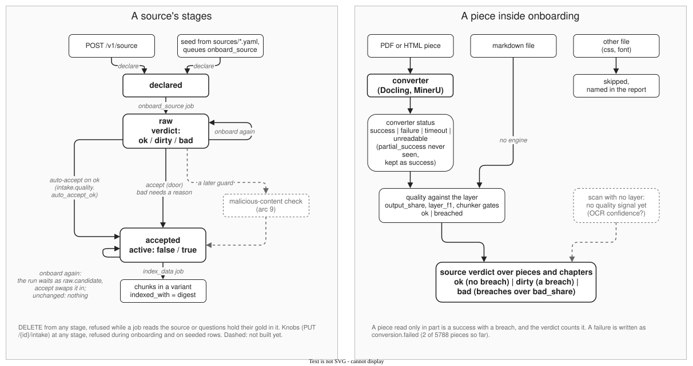

# Intake: from a book to markdown a RAG can cut

The intake converts books, papers, websites and other documents into markdown for chunking and retrieval. It also checks each file independently, without needing a reference copy. The intake does not parse PDFs itself: it sends each file to the more suitable converter, [Docling](https://github.com/docling-project/docling) or [MinerU](https://github.com/opendatalab/MinerU), then repairs common conversion errors.

## Why

A converter's output looks fine at a glance and breaks retrieval in places nobody reads. A shell session split by a page break, as Docling gives it:

````markdown
```
$ ssh-keygen -o Generating public/private rsa key pair. Enter file in which to save the key (/home/schacon/.ssh/id_rsa):
```

```
Created directory '/home/schacon/.ssh'. Enter passphrase (empty for no passphrase): Enter same passphrase again: ...
```
````

The same page through the intake:

```
$ ssh-keygen -o
Generating public/private rsa key pair.
Enter file in which to save the key (/home/schacon/.ssh/id_rsa):
Created directory '/home/schacon/.ssh'.
Enter passphrase (empty for no passphrase):
Enter same passphrase again:
```

The first version is two blocks, each on one line. A chunker cuts it anywhere, and a question about `ssh-keygen` finds half a command. In the books we tried, Docling put every code block on one line. The intake fixes this and the defects like it: tables cut by a page break, heading levels that start over in each piece of a long book.

## What it depends on

Docling and MinerU produce the text. Intake selects a converter for each file and cleans up its output. The quality checks use signals from the source itself, so they do not need a separate reference copy. For PDFs with a text layer, the report also compares the converted text with that layer. Both converters use a GPU. MinerU is the slower of the two per page.

| engine | version | licence |
|---|---|---|
| Docling (docling-slim, docling-parse, docling-core, docling-ibm-models) | 2.130.0, docling-parse 7.20.0 | MIT |
| MinerU | 4.0.7 | MinerU Open Source License: Apache 2.0 with added terms (a separate commercial licence above 100 million monthly users or USD 20 million monthly revenue, and an attribution duty for online services) |

docling-parse is pinned at 7.20.0: 7.21.0 glued the words of LaTeX and Sphinx books together. The licences are read from the package metadata in the images; the model weights the engines download carry their own terms, not covered here.

## Quick start

The whole path, with who decides at each step and what to do with a dirty source, is in [add_a_source.md](add_a_source.md). A source is declared, onboarded and accepted through the stand's API (full list in [api.md](api.md), the same doors in MCP, [mcp.md](mcp.md)):

```bash
# declare a folder of books
curl -X POST localhost:8000/v1/source -H 'content-type: application/json' \
  -d '{"name": "my-book", "language": "en", "licence": "CC BY 4.0", "folder": "datasets/inbox/books/my-book"}'
# convert it into a raw folder with a report
curl -X POST localhost:8000/v1/source/<id>/onboard -H 'content-type: application/json' -d '{}'
# read the report, then accept it into the corpus
curl localhost:8000/v1/source/<id>
curl -X POST localhost:8000/v1/source/<id>/accept -H 'content-type: application/json' -d '{}'
# index it and turn it on
curl -X POST localhost:8000/v1/job -H 'content-type: application/json' -d '{"type": "index_data", "options": {"source": "my-book"}}'
curl -X PUT localhost:8000/v1/source/<id> -H 'content-type: application/json' -d '{"active": true}'
```

For a shelf of books, `scripts/onboard_books.py` lays them out, declares them and queues their onboarding from one manifest.

## In and out

The engine is chosen by the file, never declared:

| file | read by |
|---|---|
| PDF with a text layer | Docling |
| PDF without one (a scan) | MinerU with OCR |
| image | MinerU |
| HTML, DOCX, PPTX, XLSX, ODT, RTF | Docling |
| markdown (`.md`, and `.mdx` with its imports, comments and component tags dropped), text | as it is |

A PDF has a *text layer* when the words are stored as text in the file, not only drawn as pictures of letters. The layer also records each letter's font and position, and most of what follows reads it. A book that mixes both kinds of pages is split by page kind: a run of scanned pages shorter than `intake.route.min_raster_run` stays with Docling, which reads it with OCR, and a longer run goes to MinerU; the report counts them.

The output goes to the source's raw folder. It contains one markdown file per input file, the intermediate pieces used to build it, and a report. A folder that holds documents does not read the pictures beside them: they are the pages' figures. The index reads only the files the folder's record names, and a run drops the markdown of a file it no longer reads, so a source whose origin moved from a folder to a link is not read twice. The source is not searchable until it is accepted, indexed and turned on.



## How a file is read

1. Pieces. A long PDF is converted 50 pages at a time, so one bad stretch does not cost the whole book.
2. Code from the text layer. Inside each code block Docling finds, the lines are rebuilt from the text layer: line breaks, indentation, and spaces counted by the width of the monospace font.
3. Code with no box. Docling sometimes misses a listing and gives it as a paragraph or a heading (a root prompt `#` becomes a top-level heading). A run of text set wholly in a monospace font is fenced and rebuilt the same way. A one-line heading in a code font, such as an API signature, stays a heading.
4. Joins over page breaks. A code block, a table or a paragraph that a page break cut in two is joined again, in Docling's reading order. Footnotes, running heads and margin notes between the halves are moved after the joined text; a figure, a heading or a list between them means the two are separate.
5. Heading levels from the outline. Each piece is converted on its own, and the converter starts its heading levels afresh in every piece. Where the PDF has an outline (bookmarks), each heading found in it takes its depth from there, the outline's shallowest level on `##`, the level where the chunker starts cutting. The top is the whole outline's, not the piece's, so a piece from the middle of a chapter puts its sections where the piece holding the chapter's title puts them.
6. A second reading. A piece whose words agree badly with its own text layer (word F1 under 0.95) is converted again with another Docling backend, and the better reading is kept, but never one that loses table cells.

The converter's reading of a piece is kept in `datasets/readings/`, out of git, keyed by the file's sha256, the pages, the settings' fields and the converter image's build stamp. A later run with the same key takes the kept reading and runs only the rules above, without the card; its record marks the piece `cached`, with `seconds: 0` and the reading's own time as `read_seconds`. Only a whole reading (`success`) is kept. A reading goes stale when the tool changes under the same build stamp, or when the stand's adapter (`app/engines/converter_tools.py`) changes what it keeps of the tool's answer; the key holds neither, so after such a change delete the folder. To read one piece again, delete its file there.

## How a file checks itself

The report of every source carries two records:

- `rules_fired`: how many times each step above changed something (blocks rebuilt, blocks fenced, joins, headings relevelled, pieces read twice and kept). A book where a rule never fired reads apart from one where it fired a hundred times.
- `self_check`: what the markdown says about itself: the share of the PDF's outline titles found as headings, fences left open, code blocks on one line, piece ends moved.

Each piece is also compared with its own text layer. The report records word F1, the share of text retained, and words that mix writing systems. The chunker's quality checks run on every chapter. A chapter that is a file's root alone has no heading under it, so the coverage gate is not read there; the report counts such chapters as `coverage_by_shape`. If the share of text that breaches a check exceeds the configured limit, the source is marked `bad` and the reasons are recorded. It can still be accepted, but the acceptance reason is saved with it.

## Knobs of a source

A source can set its own values over the stand's in `config/intake.yaml`, by `PUT /v1/source/{id}/intake`, the MCP tool `set_source_intake`, or an `intake:` block in its source file, which the seed writes onto its row (the door then refuses that row's knobs) and onboarding reads before the row, so a knob added to the file reaches the next onboarding. Each knob that is off by default exists because one or two books needed it. A knob is tried first on a few pages with the MCP tool `probe_intake`, which reads them with and without it and gives the checker's counts of both.

| knob | what it does | default | needed by |
|---|---|---|---|
| `settings` | a Docling or MinerU settings file of its own | the stand's | Erickson, PostgreSQL Internals and Cloud Native Docker and Kubernetes (Docling's default backend glues their Russian words) |
| `reread_settings`, `reread_below_layer_f1` | the second reading and its threshold | `docling/pypdfium2_cells`, 0.95 | |
| `reread_cells_slack` | the share of table cells the second reading may lose and still be taken | 0 | Coulouris (third chapter: a reading that lost two table cells read far closer to the layer) |
| `splice_tables` | a second reading refused for table cells alone keeps its prose and takes back, matched by page, the first reading's tables where they keep more cells and its formulas where they keep more operators; a second reading taken whole takes back those formulas too, each on its own line in reading order | on | a source whose second reading loses on cells (Coulouris, goalkicker, van Steen); van Steen's computer networks turns it off |
| `mono_faces`, `mono_spread` | what counts as a monospace font | a list of names, 0.1 | |
| `mono_by_step` | spaces by glyph positions, for a code font whose boxes are wider than its advance | off | Object Pascal Handbook |
| `listing_callouts` | callouts set in a text font inside a listing go after it | off | Redis in Action |
| `headings_by_number` | a heading's section number (`1.4.22`) decides its level over the outline | off | FreePascal reference |
| `man_page_titles` | each `NAME` section of a manual of man pages gets its page's title back from its first name | off | 4.3BSD reference scan |
| `outline_levels` | step 5 | on | |
| `code_row_rules` | which code row rules run: `run_on` (a row runs on to the line's end), `once` (a row is given once a page), `numbers` (a listing's line numbers go) | `[run_on, once]` | |
| `numbered_levels` | in a file with no outline, a numbered heading takes its level from its number | off | |
| `decode_entities` | `&lt;`, `&gt;`, `&amp;` decoded: before the code rules on the Docling path, after the reading on a path without them (MinerU) | on | |
| `drop_lone_pipes` | a paragraph that is only `\|` dropped | on | |
| `unescape_bullets` | a list marker MinerU escapes (`\- item`) unescaped | on | |
| `join_split_words` | a word the converter split with a space (a ligature `fi le`, a first letter apart) joined when the layer has it whole and one half is no word of the layer | on | |
| `picture_addresses` | a Docling picture's placeholder becomes ``, its page and place on the page, caption empty when it has none; a MinerU picture inlined as base64 becomes ``, by the piece's pages, since MinerU does not give a picture's page | on | |
| `formula_text` | a formula Docling could not decode (`<!-- formula-not-decoded -->`) gets the text the layer holds under it, flattened to one line, private-use glyphs of the math font dropped; searchable, not typeset | on | |
| `demote_caption_headings` | a heading that is a figure, listing or table caption (`Figure 2.6`, `Listing 2.4`, `Таблица 8.4`) goes back to a line of text, outside code fences, so it does not cut a section in two | on | |
| `drop_running_headings` | a running head Docling made a heading (`## 50 - 02: variables and data types`) is dropped from its second time on, in each piece and then over the file's whole markdown, where a head a later piece repeats first is seen too; a running head is a line standing first or last on three pages of the layer, so a scan with no layer keeps its own | on | |
| `unescape_underscores` | an underscore the converter escapes outside code (`AT\_STATX`) unescaped, so the identifier is found as printed | on | |
| `join_broken_words` | a word the converter left broken at its hyphenation joined when the layer has it whole | on | |
| `restore_dashes` | a dash the converter dropped at a line end put back from the layer | on | |
| `join_layer_hyphens` | a word the layer breaks with a hyphen mark at a line end joined for the word rules (dashes, broken words); the reread's layer F1 reads the layer as PDFium gives it | on | |
| `seam_window`, `seam_margin` | a piece's end moves off a page break that code runs over | window 0 (off) | |
| `html_one_title` | HTML chapter headings one level down under the page title | off | |
| `drop_inherited_members` | an inherited member a Sphinx autodoc site prints whole under every subclass keeps only its pointer to the parent; its docs and parameters go | off | sqlalchemy-docs |
| `drop_repeated_code` | a code block a page prints again word for word, as a tutorial's sample data in every live example, is kept once | off | react-docs |
| `epub_chapters` | an EPUB read as its chapters in reading order; off, the file is skipped and named in the report | off | Kubernetes Patterns (since removed) |
| `epub_skip` | EPUB page types skipped as front and back matter | none | |

## How a default is chosen

A fix seen on one or two books becomes a knob of those books. It becomes a default only after a run over the whole gate set shows no book worse on the declared columns, with every book that did get worse named and explained. The gate sets are sections cut from seven documents (six books and documentation sets in English and Russian, and one paper), each with a hand-checked reference text and labelled code, prose or table (`datasets/converter_gold/gold.json`); and the second chapter of every PDF document in the store (`datasets/converter_gold/chapter_set.yaml`). The full rule and its reasons are in [experiments.md](experiments.md#methodology).

## Limits

What is known today, each with a book that shows it:

- Scans: MinerU's heading levels in a scan do not follow the outline, and man pages lose the command name under `NAME` (the 4.3BSD reference, a scan). No knob.
- Two columns: whether a two-column paper reads better through MinerU is open: shown on one paper (ARES), not tested on a second.
- Formulas: Docling's formula enrichment is off, because it turned `psql` sessions and Russian code comments into formulas. The text around a formula is kept, but the formula itself is a placeholder.
- Levels at a piece boundary: in a file without an outline, heading levels restart in each 50-page piece.
- Piece ends: moving a piece's end off a page break that code runs over is off: never measured on its own.
- The second reading on long pieces: how often it fires on 50-page pieces is not known yet; it was tuned on 2 to 5 page sections, and it cost a heading on one of them (Baldin, a LaTeX book).
- Converter defects: Kafka's parameter names come as seventh-level headings, which the intake turns into bold lines; FreePascal's outline puts record types at the top level (knob `headings_by_number`); the Object Pascal Handbook sets code in a second font whose boxes are wider than its advance (knob `mono_by_step`).

This list will be replaced by one ranked by how many books show each defect, after every book in the store has been read on the current defaults.

## Measurements

Code rebuilt from the text layer, on the gold sections, against Docling alone (rescored on 27 September 2026, after the scorer stopped reading a `#` inside a code block as a heading): code blocks matching the reference exactly rose from 11 to 17 of 32 in English, 1 to 5 of 17 in Russian, 6 to 8 of 20 in the Russian PostgreSQL documentation, and Cyrillic comments in code survive. The run, its tables and the choice of engine per kind of file are in [which converter for each kind of document](experiments/2026-09-25_two-converters-one-per-regime.md). The intake as a whole gets its own entry after every book in the store has been read on the current defaults.

The thresholds come from files: the second reading's 0.95 from `datasets/converter_gold/reread_rule_20261002.json` (re-tuned on the readings with the layer rules applied first; the first tuning is `reread_rule.json`), the layer bounds of the report from `datasets/converter_gold/raw_band.json`.
