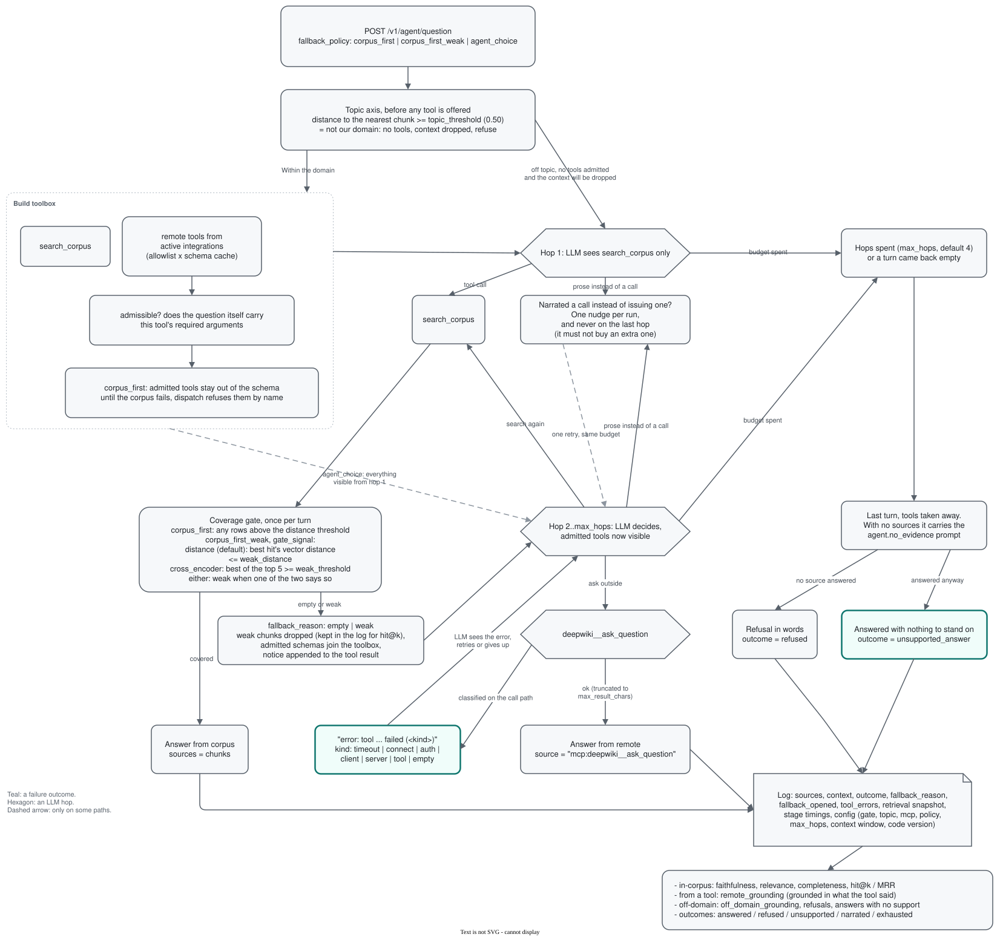
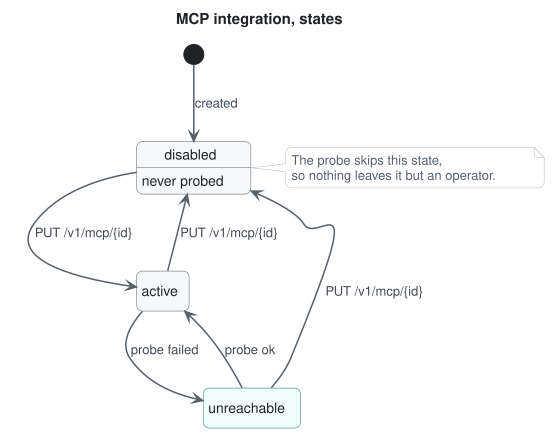

# MCP

An MCP (Model Context Protocol) server is mounted at `/mcp` (streamable HTTP), exposing the corpus to any MCP client (Claude Desktop, Cursor, IDE agents). Built on standalone `fastmcp` and reusing the same retrieval primitives as the REST/agent paths. Tools:
- `search_corpus(query, category?, sources?, version?)` - hybrid retrieval, returns chunks with `[source]` markers; optional filter by a label (a category of `config/categories.yaml`, a group of them, or a tag), by source names, and by a released version of the named category (its docs plus the category's sources of no version); without a version a versioned category answers from its newest.
- `answer_question(text, pipeline?, category?, sources?, version?, language?)` - full RAG answer, returns `{answer, retrieved, sources}` (`agent` or `single_shot`; the filters only with `single_shot`).
- `list_categories(category?, only_top?)` - the categories of `config/categories.yaml` with their group and chunk counts (`none` for chunks of no category), or totals per group; the filter takes a category, a group or a tag.
- `list_tags(limit?)` - the tags with chunk counts, most used first; each is a label the filter takes.

Connect: `claude mcp add --transport http rag-lab http://127.0.0.1:8000/mcp/`, or point the MCP Inspector at the same URL.

A second, separate ops server is mounted at `/mcp-ops` - an eval control plane kept off the product surface (an external client gets search/answer tools, not admin verbs):
- `run_metrics(run_name)` - aggregated eval metrics for one run (generation axes + retrieval hit@k/MRR) plus `debts`: how many rows still owe each axis, what the others are missing, what finishing the debt costs at this run's own measured price, and whether a replay can drive each row at all.
- `compare_runs(run_names)` - side-by-side metrics with an RRF composite ranking over the five judged-and-behavioural axes, retrieval excluded.
- `compare_pools(run_names)` - the same runs split by pool (in-corpus / out-of-corpus / off-domain) with gate firings, latency, outcome histogram and a paired Wilcoxon per pair of runs.
- `engines()` - who holds the GPU now and which models it has there, whether each vLLM on the GPU is asleep, and whether every registered engine answers; read from the servers, not from a table.
- `broker_balances()` - each cloud engine's balance as its broker reports it now; the balance belongs to the key, so anything else spent on that key lands in it too.
- `judge_correlation(run_name?)` - our judge against the standard's on the same rows: spearman, the overlap covariate, the partial correlation behind it, and the strata by code share.
- `question_sets(set_name?)` - what each question set holds and therefore which axes a run over it can be scored on: pools, languages, how many carry marked sources (the retrieval axes) and how many carry a reference answer (the two guest context axes).
- `questions(set_name?, language?, pool?, limit?, offset?)` - the rows of a set, for picking a run's `question_ids`; the pool is the rule `question_sets` counts with.
- `experiment_results(id, pair?)` - one experiment's report, whatever its kind: the arms with their n, the paired deltas per axis with interval and p, and whether each survives the correction over the family the record names.
- `agent_trace(run_name)` - what the agent recorded about its own hops and nodes: rows by the hop they finished on, rows and steps per node, what the gate said, how often the fallback opened or dropped context, failed hops, and the outcome against the hops spent. Rows with no trace are named rather than counted as zero.
- `add_source(declaration)` (the whole declaration as `POST /v1/source` takes it) / `source(name)` / `sources(stage?, limit?, offset?)` - declare a source to add and read one, or a page of them by name and stage (`declared`, `raw`, `accepted`), with what its raw conversion said.
- `onboard_source(name, settings?, fresh?)` / `raw_rows(name, breached_only?, kind?, limit?)` - turn a source into a raw one through the queue (an accepted source's new run waits beside it as `raw.candidate`), and read its report (of the run waiting for acceptance when there is one, as the list's `raw_verdict` is): `pieces` (the conversion a page range: agreement with the file's own text layer, share of the layer, mixed-script words, seconds) or `sections` (the chunker's gates a chapter of each file's whole markdown).
- `accept_source(name, reason?)` - raw to accepted, or an accepted source's waiting run to the accepted one, the owner's word that the conversion is fit to index; a bad raw verdict needs a reason, kept on the row; refused while an onboard of it waits, and a waiting run while an index reads it; the index reads only accepted rows.
- `set_source_active(name, active)` / `remove_source(name)` / `remove_variant(variant)` - take a source out of search and back, delete a source with its chunks in every variant and the stand's own folders of it (refused while a job reads it or questions have their gold in it), delete a variant's chunks (the searched variant refused).
- `probe_intake(name, pages, knobs, file?)` - try knobs on a few pages before setting them: a job reads the pages of the source's PDF with its own knobs and again with these over them, and the job's `result` (in `list_jobs`) holds the checker's defect counts of each side against the text layer; the source is not changed.
- `intake_board(variant?)` - the intake at a glance: sources by stage and verdict, the chunks a variant holds, and the sources that wait, grouped by who moves them next (a person, a door or the queue).
- `source_trail(name)` - one source in a screen: verdict and reasons, skipped files by suffix, chunks per variant, its last jobs with their result, and the step that waits next.
- `set_source_intake(name, intake)` - set a source's own intake knobs over `config/intake.yaml` (the knobs of [intake.md](intake.md#knobs-of-a-source)), read by its next onboarding; refused while its job runs or when a source file speaks for it.
- `remove_question_set(set_name)` - delete a question set with its questions, refused while the verdict names it, a job reads it, answer logs hold its questions, or another set is drawn from it.
- `list_jobs(status?, type?, run_name?, limit?)` / `cancel_job(id)` - job queue control, cancel takes the dependent judge down with the run.
- `queue_stats(window_minutes?)` - the queue in one screen: waiting jobs by type, what runs and for how long, what finished in the window, each type's mean seconds over the last day, and the waiting jobs priced at those means as the time the queue still needs.
- `holm_over(tests, family, alpha?)` - correct a family the reader declares rather than the one a single record happens to hold: give the p-values by name, get each with its Holm threshold and whether it survives. A report corrects over its own record, and reading arms from two experiments is a wider family.
- `language_cost(before, after, floor_against?)` - what our own axes charge when the answer comes back in the language it was asked in: two arms paired by question over the corpus pool, cut two ways (the cut declared from the record before the change, and the cut the outcome selected), with the drift floor and the comparability block beside them.
- `preregister(name, population, arms, closing, guards?, declared?, vetoes?)` / `preregistration(name)` / `close_preregistration(name, runs?, measurements?)` - what a run promises, written before its first row and never edited: the question sets, control and arm, the closing columns with the direction the arm should move them, guards with the direction they must not move, and vetoes that compare two columns inside one arm. Every column is a name from one registry, so it has one reading, and it is read either from a run's question logs (outcomes, judge scores) or from a recorded grader measurement (gold retained, strangers dropped, characters a strip removed by class). Closing computes only what was declared: the paired effect, the floor from a second control pass or a declared value, each guard as holds, broken, undecided or unreadable, each veto as fired, quiet, undecided (fewer rows than it declared) or unreadable, and `cleared` with its reason. A veto can be read on the measurements before the runs exist, and a fired one closes the promise. A run queued with `purpose: closing` must name a promise that exists, and closing reads only `purpose: closing` runs queued under the promise after it was written, in a role it declared, and a bar stays undecided while the arm has rows on fewer questions than the population declares; every try at closing an open promise is kept in `attempts`.

## MCP client: the agent consumes external servers

The lab is both sides of the protocol: its own MCP server above, and an MCP *client* below. External hosted MCP servers are registered as `McpIntegration` rows and their tools join the agent's toolbox next to `search_corpus`, namespaced `integration__tool` (e.g. `deepwiki__ask_question`). The agent decides per hop whether to look outside the corpus; a successful remote call is recorded as an `mcp:` source (provenance), a failed one degrades to an error string the agent can route around.

Diagram: Agent flow with remote fallback

This is the policy flow, the same for every implementation of the loop. What executes it is the graph, and its picture is generated from the compiled graph itself: see [the implementations](design.md#two-ways-to-run-the-same-agent-and-the-two-that-were-retired).

Registry lifecycle via `/v1/mcp_integration`:
- CRUD with filters; new integrations start `disabled`, a state machine (`disabled/active/unreachable`) separates operator intent from observed health (probes flip `active <-> unreachable`, never touch `disabled`).
- `POST /{id}/discover` - fetch the server's tool list, cache name/description/schema snapshots in the DB. The agent builds tools from this frozen cache (no network on run start, and a later description swap on the server side does not silently reach the LLM prompt - discover again to refresh).
- `POST /{id}/probe` - live ping writing `last_checked_at/last_error`; `GET /{id}/health` - cheap read of the stored state. A `check_mcp_health` job fires on every create/update (io queue lane, so it never waits behind GPU jobs).
- `allowed_tools` is an explicit allowlist: discovery shows the catalog, a human picks what the 8B model actually sees. Tool descriptions are truncated on cache; results are truncated to `max_result_chars`.

Diagram: McpIntegration state machine

Auth per integration is declared as `{"type": "bearer", "token_env": "HF_TOKEN"}` or `{"type": "header", "header": "...", "value_env": "..."}` - the DB stores only environment variable *names*; values come from the environment and only for variables allowlisted in `config.yaml` (`mcp_integrations.secret_env`).

Note on trust boundaries: anyone with API access can register an integration pointing anywhere, and allowlisted secrets will be sent to that URL (see the Quickstart note on authentication).

Seeded integrations (all disabled until you enable them): DeepWiki (no auth), Hugging Face (`HF_TOKEN`), Context7 (`CONTEXT7_API_KEY`).
