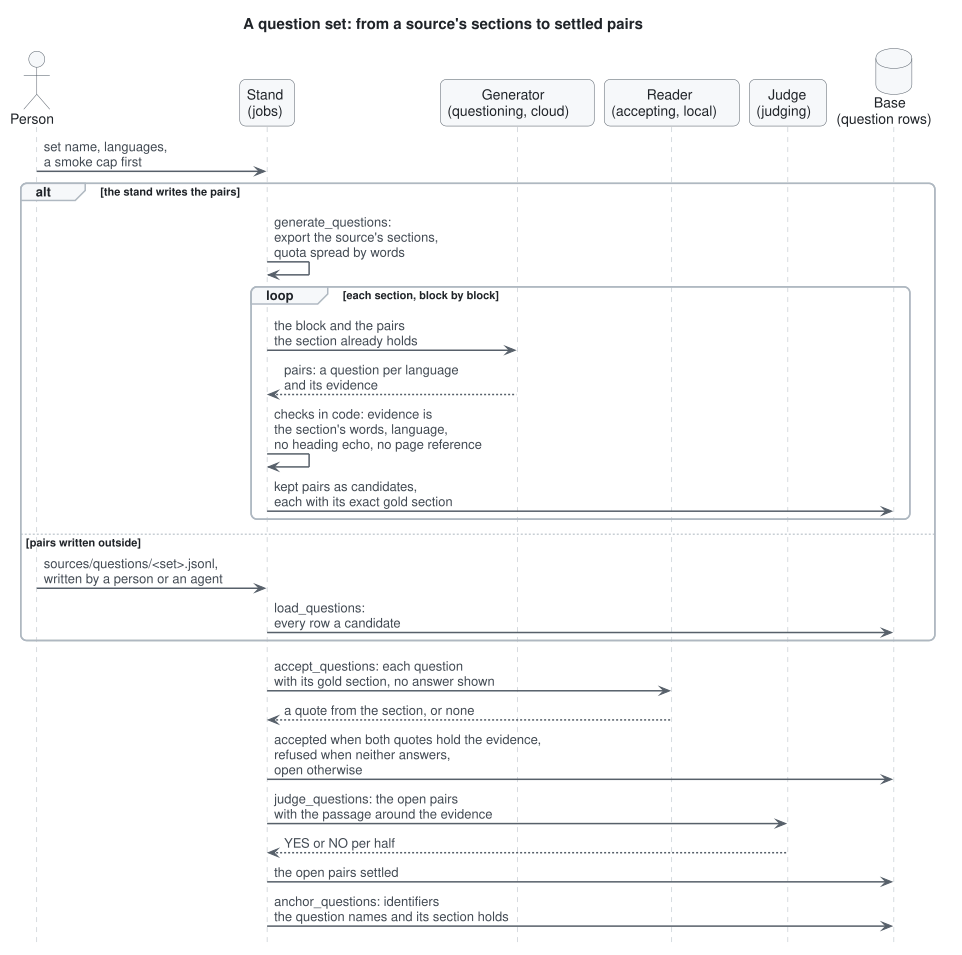

# Question sets

A question set is what a retrieval or answer measurement asks. Each question comes from one section of one source and keeps that section as its gold, so a run can say whether search found the place that holds the answer. Questions go in pairs, one per language of the set (`evals.question_set.languages` in `config/evals.yaml`), the same fact asked in each, so English and Russian are measured on the same material.

## Two ways in

**The stand writes the pairs.** `generate_questions` exports the source's sections from its index (`use_cases/section_export.py`), spreads the quota over chapters by their words (`evals.question_set`: per source, per chapter, the floor `min_pairs` under which the set's report names the source), and asks the `questioning` role section by section. A long section is asked block by block. The role is a cloud model outside the judge's family (`config/roles.yaml`), so no card is held. Each reply is checked in code, and a pair is refused when:

- its evidence is not the section's own words, or runs past `MAX_EVIDENCE_WORDS`;
- a question is not in the language of its place;
- a question repeats the section's heading, or another pair of the section;
- a question leans on the page it was written from ("in this listing", "on page 12"): a reader who never saw the page cannot tell what is meant.

Every refusal is counted by reason in the set's report under `datasets/measurements/`, and the generator's replies are kept, so `reparse_questions` reads them again under changed checks without asking anew.

**Pairs written outside.** A set written by hand or by an agent is a file `sources/questions/<set>.jsonl` (`save_questions` writes the same format from a generated set), poured in by `load_questions`. Each row names its gold section; a pair whose section the source no longer holds is counted, not written. `big_corpus_v1` came this way: Sonnet agents read each source's sections and wrote the pairs, then topped every source up toward twenty on the final cut (2225 pairs over 87 sources, up to 36 a source).

Either way, every row enters as a candidate and goes through the same sieve.

## The sieve: a reader answers from the section

`accept_questions` gives each question to the `accepting` role (a small local model) with its gold section and without the generator's answer, and asks for a quote that answers it. A long section is read in windows until one answers. A pair is:

- **accepted** when both halves' quotes hold enough of the evidence's words (`EVIDENCE_HELD` in `evals/question_acceptance.py`);
- **refused** when neither half finds an answer;
- **left open** otherwise.

The reader's own verdict stays on each row (`answerable_by_reader`, `acceptance_why`), whatever happens later.

## The judge: what the sieve left open

`judge_questions` shows each half of an open pair its question, its evidence and the passage around it (`AROUND_WORDS` in `evals/pair_judge.py`) and asks YES or NO. Both halves YES accepts the pair, both NO refuses it, a split stays open. A second judge can be asked over the role's own (`model`), a cloud one without the card.

A pair the judge accepts is not proof the question is fair: a question built on a premise the section never states can still be answered by a reader that trusts the premise. The stand does not catch those; the arc log records the share found by a blind read.

## Anchors and slices

`anchor_questions` gives each row the identifiers it names by their shape (`snake_case`, `dotted.names`, `call()`, `--flags`, backticks) that its gold section holds, with the number of the source's sections holding each. A question anchored by an identifier is easier for keyword search than one that is not, so `run_metrics` reports the closing columns split by `anchored_by_identifier`, `shares_heading_word` (a word of the gold heading in the question) and `reference_page` (the gold is a reference entry, such as one function's page), as well as by language.

A cleanup that renames a page's root (a title read from frontmatter, a declared book title) leaves the gold sections written before it unnamed by the index. `reanchor_questions` moves each such gold to the section of the same file with the same leaf heading that holds the question's evidence; where no leaf matches (a file read again spells its headings anew), the one section of the file holding the evidence takes it; a gold whose file left the index, whose leaf is gone, or whose leaf matches several sections is left as it was, counted and named with its question ids.

## Where to look

- `question_sets` (MCP): each set with its pools and languages and, for a generated set, accepted, refused and open pairs by language.
- `questions` (MCP): the rows themselves, filtered by set, language and pool.
- The set's report in `datasets/measurements/question_set_<set>_<source>_<date>.json` (a dash in a name reads as an underscore): sections asked, pairs kept and lost by reason, the replies.

The jobs and their options are in [api.md](api.md), the jobs table; adding the source a set is asked about is [add_a_source.md](add_a_source.md).
