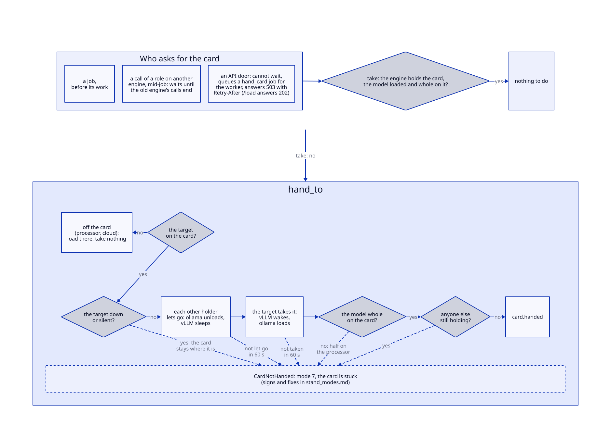
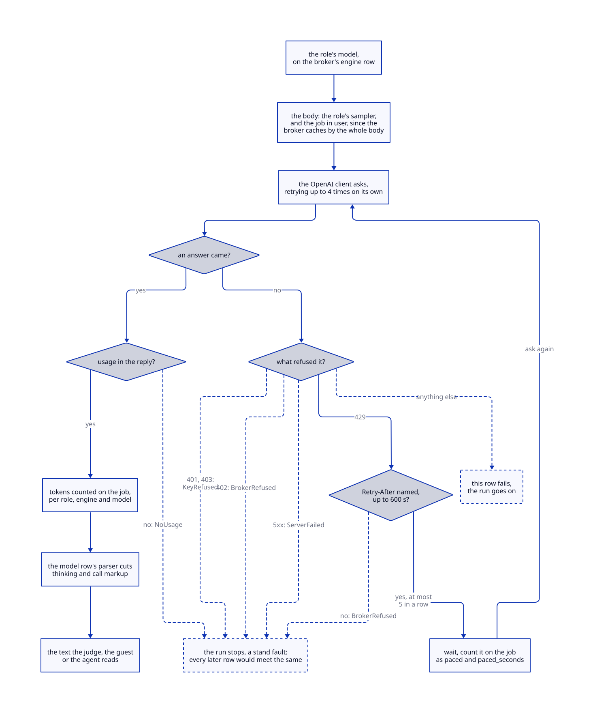

# Stand modes: how to switch the stand, and how to come back

This page holds one question: how to put the stand into a given layout of engines and roles, what
that costs, and how to leave it. Services and profiles are in the README table, variables with their
defaults in [`.env.example`](../.env.example); the scenarios in [use_cases.md](use_cases.md) run on a stand that is already up and point
here for the mode they need. Measured numbers live in the [experiment journal](experiments.md); this
page gives only the constants of the device and orders of magnitude.

| Mode | Up beyond postgres, API, worker | Holds the card | Where the roles sit |
|---|---|---|---|
| 1. Default | `ollama`, `ollama-cpu`, `vllm` | `vllm` for the judge, `ollama` for the rest, handed through the queue | generation, embedding, paraphrasing, ragas: `ollama`; judging: `vllm`; ragas_embedding: `ollama-cpu`; reranking seated, its service down |
| 2. With reranking | + `vllm-rerank`, 0.3 of the card | as 1, and the reranker for one scoring pass | reranking: `vllm-rerank`; the rest as 1 |
| 3. The embedder on vLLM | + `vllm-embed` | as 1, and `vllm-embed` for each embedding call; the chat answers 409 | embedding: `vllm-embed`, with its own corpus variant; the rest as 1 |
| 4. On the processor | + `vllm-cpu`, its whole model in host memory: `free` first | a role on the processor never takes it | the moved role: `vllm-cpu` or `ollama-cpu`; the rest as 1 |
| 5. Generation on vLLM | as 1 | `vllm`: generator and judge in one process; `ollama` for the embedder; the chat answers 409 | generation: `vllm`; the rest as 1 |
| 6. The judge on ollama | as 1 | `ollama`; the judge's residency restarts at every judging pass | judging: `qwen2.5:7b` on `ollama`; the rest as 1 |
| 8. Without a card | `ollama-cpu` only, no `ollama`, no `vllm` | nobody | every role on `ollama-cpu`; no reranker; a timeout of 600 s |
| A cloud engine | nothing: a remote broker | the cloud role never takes it | generation, judging or ragas on the broker; the rest as 1 |

Mode 7, the card is stuck, is a failure rather than a layout; its signs and fixes are in its section.

How the card moves between engines, in every mode that has one:

<details>
<summary>Diagram: how the card moves between engines</summary>



</details>

After a handover to a vLLM that serves the generator, the job also asks the woken server whether it returns tool calls; a failed probe is recorded as the probe's, not as a lost card.

**Where you are, read in this order, every time:** the ops MCP tool `engines` (who holds the card,
which vLLM is asleep, which engine answers), then `GET /v1/health/stand` (where each role's model
sits, which roles are down, the queue), then the preflight ([preflight.md](preflight.md)) before a
run that will be quoted.

```bash
curl -s localhost:8000/v1/health/stand | python3 -m json.tool
# ids for the commands below: one line per model, its engine and its role-relevant name
curl -s "localhost:8000/v1/model?limit=100" | python3 -c \
  'import json,sys; [print(m["id"], m["engine"], m["name"], m["status"]) for m in json.load(sys.stdin)]'
```

Two rules hold in every mode. The card is handed only through the queue (`hand_card`, or a job taking
it for its own call): a sleep or a wake sent to a server by hand is invisible to a pass in flight.
And a mode with a profile is left in the opposite order it was entered: seat the role back first,
then stop the service, or the role reads as down and `/readiness` turns `degraded`.

What the environment changes between modes: `LLM_TIMEOUT` holds in the default mode and `LLM_TIMEOUT_CPU`
replaces it in mode 8; the card share of each vLLM service is its own variable (`VLLM_GPU_UTIL`,
`VLLM_RERANK_GPU_UTIL`, `VLLM_EMBED_GPU_UTIL`) and matters only while its profile is up; `VLLM_CPU_*` sets vLLM on
the processor for the `cpu` profile. Every other variable is the same in every mode.

## 1. Default

```bash
scripts/up.sh
```

The generator (`llama3.1:8b`), the embedder (`bge-m3`) and the paraphraser (`gemma2:9b`) sit on
`ollama` on the card; the judge (`Qwen/Qwen2.5-7B-Instruct-AWQ`) on `vllm`, which takes the card first
at start and is put to sleep by the bootstrap before ollama loads a role. A run and its judging pass
hand the card between the two: to vLLM in about a second, back to ollama in a few seconds with the
load. The reranking role is seated on `vllm-rerank` but its service is down until mode 2; that is
not counted as a fault while no run asks for reranking.

What the record says: the judge's axes carry `engine_name: vllm` and a residency read off the
server's process start (`vllm /metrics process start`). Numbers judged this way compare with each
other; numbers judged before 2026-09-11 used another judge on another engine and compare only in mode 6.

## 2. With reranking

```bash
docker compose --profile rerank up -d vllm-rerank
```

The role is already seated by the bootstrap from `config.yaml`. A run asks for it with `"rerank":
true`, and the agent's gate uses it at `gate_signal: cross_encoder` or `either`. The server takes a
0.3 share of the card (`VLLM_RERANK_GPU_UTIL`); in a phased run the embedder answers first, the
reranker takes the card for one scoring pass, and the card goes back to ollama for generation.

What the record says: the run snapshot names the reranking role's engine among the engines per role.

Leave it: stop asking for reranking, then `docker compose stop vllm-rerank`.

## 3. The embedder on vLLM

```bash
docker compose --profile embed up -d vllm-embed
curl -sX POST localhost:8000/v1/model -H 'Content-Type: application/json' \
  -d '{"name":"BAAI/bge-m3","engine":"vllm-embed"}'
curl -sX PUT localhost:8000/v1/role/embedding -H 'Content-Type: application/json' -d '{"model_id": <id>}'
```

A vector remembers the embedder that made it (`embedded_by`, `model@engine`), and a search over a
variant holding another embedder's vectors is refused rather than answered from two geometries. So
this mode needs its own corpus variant, declared in `config.yaml` under `corpus.variants` and
indexed after the switch, and the questions embedded again:

```bash
curl -sX POST localhost:8000/v1/job -H 'Content-Type: application/json' \
  -d '{"type":"index_data","options":{"variant":"<the new variant>"}}'
curl -sX POST localhost:8000/v1/job -H 'Content-Type: application/json' \
  -d '{"type":"embed_questions","options":{}}'
```

With the embedder and the generator on two engines of the card, the chat answers 409: it does not
hand the card between them within one answer. A run does, one handover per call of the other role.

What the record says: every chunk and question carries `BAAI/bge-m3@vllm-embed`, and retrieval
numbers compare only between runs over the same embedder's vectors.

Leave it: seat `embedding` back on `bge-m3` on `ollama`, then `docker compose stop vllm-embed`. The
variant indexed by vLLM stays refused under ollama's embedder until it is removed or indexed again.

## 4. On the processor

`ollama-cpu` is always up; vLLM on the processor comes with its profile:

```bash
free -g && docker stats --no-stream
docker compose --profile cpu up -d vllm-cpu
```

A role on a processor engine never takes the card. The price is host memory, not the card:
`vllm-cpu` holds its whole model there (`Qwen/Qwen2.5-7B-Instruct` in fp16 is about 15 GB of
weights), and the sleeping judge keeps about 13 GB of host memory too. Before starting it, unload
the models of `ollama-cpu` and keep free at least twice the weights plus room for the desktop; a
start without that check once took the whole session down.

What the record says: the role's engine has `placement: cpu`, and its answers come from other
kernels than the card's, so they are a different instrument, not a slower copy of the same one.

Leave it: seat the roles back on their card engines, then `docker compose stop vllm-cpu`.

## 5. Generation on vLLM

```bash
curl -sX PUT localhost:8000/v1/role/generation -H 'Content-Type: application/json' \
  -d '{"model_id": <id of Qwen/Qwen2.5-7B-Instruct-AWQ on vllm>}'
```

The agent's generator must return tool calls, and `vllm` is started with a tool-call parser for it.
An asleep server has no probe to answer with, so the door answers 202 with a `hand_card` job that
wakes it, asks it once and seats the role; follow it with `GET /v1/job/{id}`. The generator and the
judge are then one process, and nothing is handed between answering and judging. The embedder stays
on ollama, so the chat answers 409 as in mode 3 and a run hands the card per call.

What the record says: the generator's engine is `vllm`, and its window is the server's
`max_model_len`, which refuses a longer prompt instead of cutting it.

Leave it: seat `generation` back on `llama3.1:8b` on `ollama`.

## 6. The judge on ollama: the ruler of the older journal entries

```bash
curl -sX PUT localhost:8000/v1/role/judging -H 'Content-Type: application/json' \
  -d '{"model_id": <id of qwen2.5:7b on ollama>}'
```

Every number judged before 2026-09-11 was judged by `qwen2.5:7b` on ollama, and this is the only mode
that reproduces them. The judge and the generator then share one ollama, so each run evicts the
judge and its residency starts again at every judging pass; its noise floor across reloads is in the
journal.

What the record says: `engine_name: ollama` and a residency read off `ollama /api/ps and the queue`.

Leave it: seat `judging` back on `Qwen/Qwen2.5-7B-Instruct-AWQ` on `vllm`.

## 7. The card is stuck

The one mode nobody enters on purpose. Signs: the chat answers 503 with `Retry-After` and keeps
answering it; a job ends with an error that names the card.

```bash
curl -s "localhost:8000/v1/job?type=hand_card&status=error&limit=5" | python3 -m json.tool
```

- `... did not let go of the card in 60s`: an engine kept a model on the card; `engines` names it.
- `... did not wake in 60s`: the vLLM could not take the card back, usually because something else
  still holds memory on it.
- `... is down; the card stays where it is`, `... is unknown; ...`: the target server is stopped or
  silent, and nothing was let go. `docker compose up -d <service>` for a stopped one; a silent one is
  restarted with `docker compose restart vllm`, and it comes back awake on the card.
- `... loaded on ollama, but not whole on the card`: the model landed half on the processor; the
  card is short of memory, and `engines` with `nvidia-smi` say who holds it.
- `nvidia-smi` inside a container answers `Failed to initialize NVML: Unknown Error`, and jobs end
  with `not whole on the card`, which `/readiness` names by role: the container lost the card. With the card given through CDI a
  `systemctl daemon-reload` no longer does this; if it happens anyway, `docker compose restart
  <service>` gives the card back, and `docker info` should list the NVIDIA CDI devices (README,
  Quickstart).
- `vllm` exits at start with `Free memory on device ... is less than desired GPU memory
  utilization`: the stack was recreated while ollama still held a model, since the ollama container
  is not recreated with it and keeps its models loaded. The rest of the stack comes up without the
  judge, and `/readiness` names it. Unload ollama's models through its own port (`curl
  localhost:11434/api/generate -d '{"model":"<name>","keep_alive":0}'` for each name in `curl
  localhost:11434/api/ps`), then `docker compose up -d vllm`. `scripts/up.sh` does
  this itself whenever `vllm` is about to start; a bare `docker compose up -d` does not.
- `vllm` neither dies nor turns healthy: the bootstrap waits for it up to its healthcheck's
  `start_period`, an hour (the first start downloads the weights); `docker compose logs vllm` says why.

Back to the default: `POST /v1/model/{id of the judge}/load` hands the card to the judge through the
queue, and the next job that needs ollama takes it back the same way.

## 8. Without a card

```bash
scripts/up.sh --cpu
```

`docker-compose.cpu.yml` goes over the main file: no service reserves the card, `ollama` and `vllm`
are left out, and the roles come from `config.cpu.yaml`, every one on `ollama-cpu`, with
`LLM_TIMEOUT_CPU` (600 s) as the timeout. `scripts/up.sh` without the flag checks `docker info` for
the card first, and on a host without one says why the stand would not start and gives this command.

A bare `docker compose` reads the main file alone, so `docker compose up -d worker` in this mode would
recreate the worker with the card and the two-minute timeout. Put
`COMPOSE_FILE=docker-compose.yml:docker-compose.cpu.yml` in `.env` while the stand runs this way.

The layer seats roles only on an empty database. A stand that already has roles keeps them, so seat
each one with `PUT /v1/role` on its model on `ollama-cpu`, by the ids the model list gives; a model
the list does not have there, as `llama3.1:8b` and `gemma2:9b`, comes first through `POST /v1/model`.
From a stand running on the card, `scripts/up.sh --cpu` stops `ollama` and `vllm` before it starts.

The `embedding` role moved to `ollama-cpu` is another embedder than the one the index and the questions
were built with: every search is refused until a variant is indexed with it, as section 3 does for
vLLM, and the next `up` re-embeds every question of every set in place, and again on the way back.

No reranker: ollama scores no pairs, so `"rerank": true` and the agent's gate at `gate_signal:
cross_encoder` or `either` do not work in this mode.

The first `up` builds the index on the processor: about 2 chunks a second against about 33 on the
card, so the index that takes about five minutes with a card takes about an hour and a half here.

A mode for running, not for measuring: `ollama-cpu` unloads a model after ten idle minutes
(`OLLAMA_CPU_KEEP_ALIVE`), so the judge's residency starts again often, and `compare` refuses a pair
against a run judged on the card. Numbers from this mode do not go to the journal.

What the record says: every role's engine is `ollama-cpu` with `placement: cpu`; `engines` says "no
engine holds the card", and `/readiness` answers `"status": "ok"`: it reads the roles' engines and
not the card's ollama, which this mode leaves out. On a host with a card it names a role whose card
engine is down and points here.

Checked on Linux with the card not given to the containers. A Mac is expected to behave the same and
is not checked: Docker Desktop passes no Metal into a container, so everything runs on the processor,
its virtual machine needs room for two 7-8b models and the embedder at once, and `vllm-cpu` is an x86
image that is not for it.

Leave it on a host with a card: `scripts/up.sh` first (drop `COMPOSE_FILE` from `.env`), then seat
each role back on its card engine with `PUT /v1/role`. The other order fails: with the card engines
not started the door refuses the seat with 503.

## A cloud engine

```bash
# in .env, one pair per engine row, named by its env_prefix; compose reads .env only on `up`
#   GONKA_BASE_URL=...   GONKA_API_KEY=...
docker compose up -d worker rag-lab
curl -sX POST localhost:8000/v1/engine -H 'Content-Type: application/json' \
  -d '{"name":"gonka","kind":"openai_compatible","env_prefix":"GONKA","placement":"remote"}'
curl -sX POST localhost:8000/v1/model -H 'Content-Type: application/json' \
  -d '{"name":"deepseek-ai/DeepSeek-V4-Flash-0731","engine":"gonka"}'
```

A model whose answers carry a thinking trace or call markup gets its parser on the model row,
`PATCH /v1/model/{id}` with `answer_parser`, one of the parsers the stand has. Then use it: seat a role
with `PUT /v1/role`, or name it in one arm only, as the generator of a `generation` arm, the `judge_model`
of a rejudge or the `guest_model` of a guest pass.

<details>
<summary>Diagram: a cloud call</summary>



</details>

A cloud role never takes the card, and a call answers in seconds. What differs from a local engine:

- The broker keeps a cache keyed by the whole request body, so every call carries its job in `user`: a
  second pass is a second job and a fresh answer, not a copy from the cache.
- Tokens are counted on every call, and a broker that sends no usage stops the run. Money is read from
  the broker: the ops MCP tool `broker_balances`, and each job's balance before and after. The balance
  belongs to the key, so anything else spent on that key lands in it too.
- A failure stops the run instead of failing one row: a refused key (401, 403), a quota or a rate limit
  (402, 429), a 5xx after the client's own four retries.
- At gonka a 429 has two causes. One is a daily cap counted by UTC (on 2026-09-13 it came after about 1.7
  million tokens on one key); the other is a throttle on the rate of calls, which came after about
  twenty calls on 2026-09-14 and did not care which key made them. A 429 that names its pause in
  `Retry-After` (up to 600 s) is waited and the call asked again, up to five times in a row, and the
  wait lands on the job as `paced` and `paced_seconds` beside its tokens. A 429 without a pause, with a
  longer one, or past the fifth wait stops the run; it is queued again by hand, after 00:00 UTC for
  the cap, and a guest pass queued again answers only the rows it still owes. Every 429 writes the
  broker's rate headers to the worker's log. On 2026-09-14 gonka's 429 named a pause of 5 s and sent no
  `x-ratelimit-*` headers: its throttle is a short pause, and the rule waits it out.
- The broker decides the weights, their precision and the node. A cloud judge moved 27% of its
  verdicts between two passes in different hours
  ([the entry](experiments/2026-09-14_a-cloud-judge-on-the-same-answers.md)), so a floor is measured in
  one window with the arms it is read against.

What the record says: the engine row has `placement: remote`, a remote judge has no residency and
`compare_pools` says so (`remote_judge: true`), and the run's tokens and the jobs' balances sit beside
its verdicts.

Leave it: seat the roles back on their local engines. The engine row can stay; `DELETE /v1/engine/{id}`
removes it once no model points at it.
